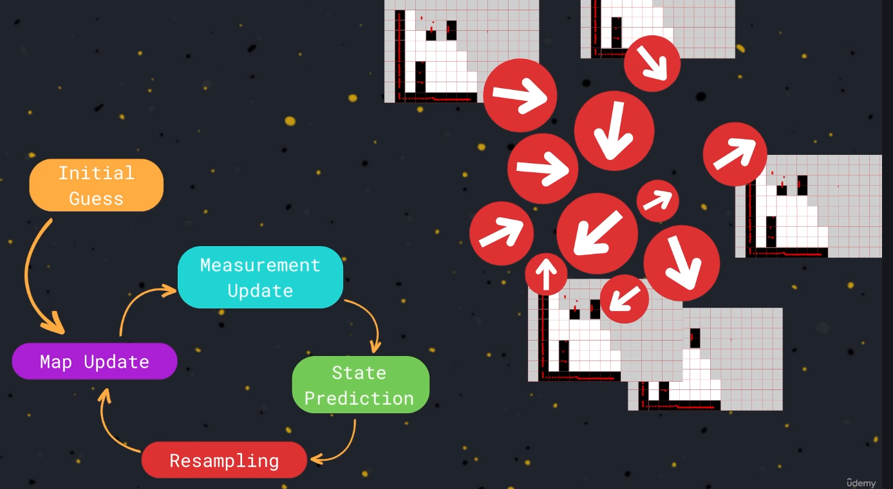
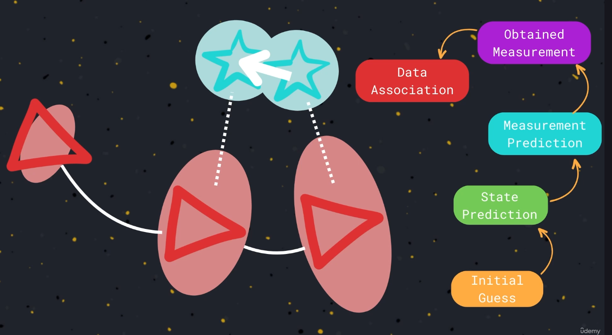
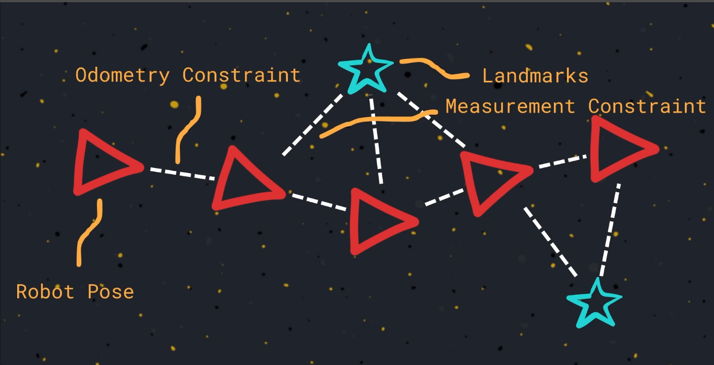
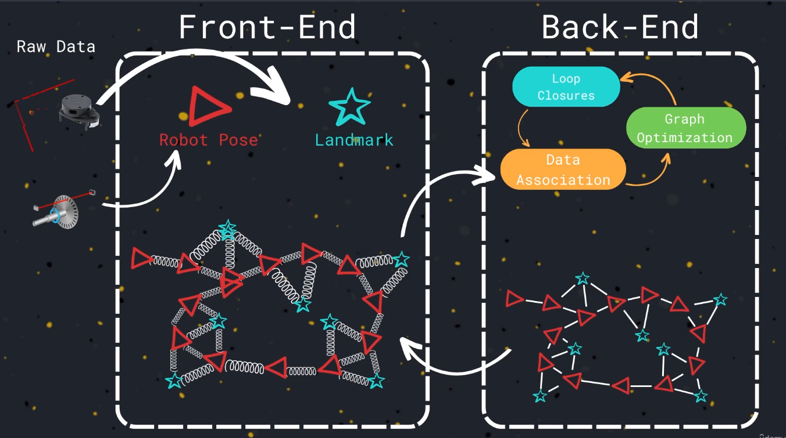

# Simuontinous Localization and map [SLAM]

**SLam: is the Problem of Maping with knowning the Poses, and Localization with knowning the map**
Start with Assuming you know the robot's odometry, we indecate this component with the letter U
  -Ut: indecate the robot odometry that provide by sensor readings at time t.

## Type OF SLAM

**1. Partical Filter SLAM**
  - Start with **Intial Gusess**, intial region of the map
  - start generate a map for theis partical after recieving the sensors readings that contain the scan of the environment
  - **map update**: each partical are different of other one depending on the sensor readings
  - **Measurement Update**: compare how the current map consistance with the privous map readings.
  - **predict Step**: move the partical by using the odometry data that came of robot's moving.
  - **Resample**: Particals with higher weigth  have a grate chance of Surviving the resampling step,and those with lower weigth are ulimanated

**For each Partical it's neccecary to create ,update,and maintain an  a different map of the environment so it's need large memory,and cost**

   

---
---

**2. Ekf SlAM**
Extended Kaliman Filter SLAM: to create a map of the environment,and in the same time to loclize the robot
  - 1. Start with Intial Guess
  - 2. State Prediction: Use Odometry in order to esstimate the movement of the robot, and calculate the new robot position'
  - 3. Measurement Prediction: estimate where we expect to see the same feture of the environment taking into to account the motion model
  - 4. Obtained Measurement: comapre with the actual data of the sensor reading that scan the environment when the robot in the new position
  - 5. Data Assoicate: the new future that seens by the sensor are the same with the privous feature, or there is anew one.
  - 6. Update : when we associte a two features are detected in different positions of the environment are the same feature.

   

---
---

## 3. Graph SLAM
  - 1. intial Pose guess: adding node for each pose of the robot
  - 2. odometry constraint: connect two nodes together
  - 3. landmarks: keypoints of the environment that are adding to the graph
  - 4. Measurement constraint: connect landmark with robot pose

     

---
---

## Front-End Back_End Of Graph SLAM

  

---
---

## SLAM  ToolBox
**The Most Common approach that commonlly use in the Robotecs to solve the problem of SLAM**

There are Several Packages, Several Implementation of this problem in Ros2, that can simply download and configurable for your robot,that can you use to map, and localize the robot

**One of Commonly Using is G Mapping: That use partical filtering SLAM**
**SLAM Carto, SLAM toolbox use for Graoh SLAM**

**In This Course we will use SLAM toolbox*: that can use to create a map, and localize the robot once the map environment has been created**
  **Feature that Support by this Package:**
   - Mapping
   - Localization
   - Map Marging
   - life long Mapping