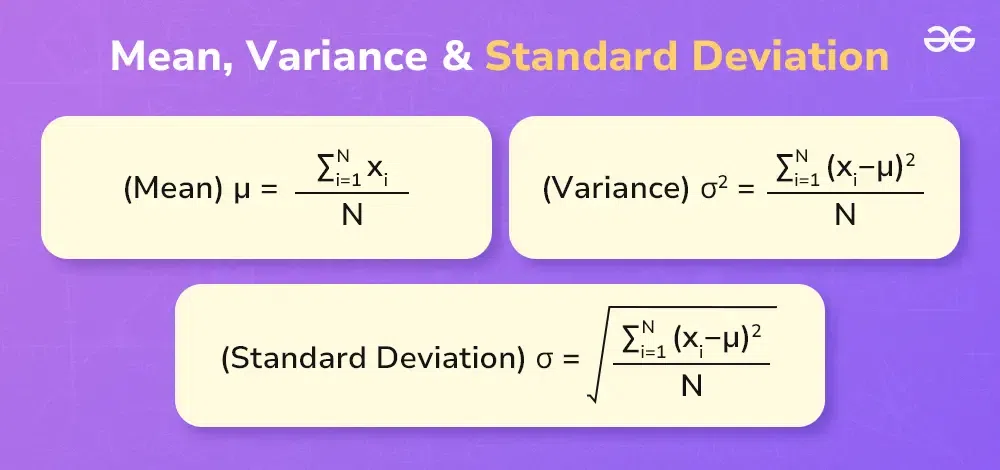
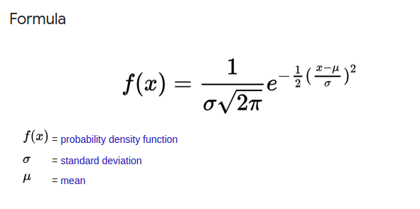
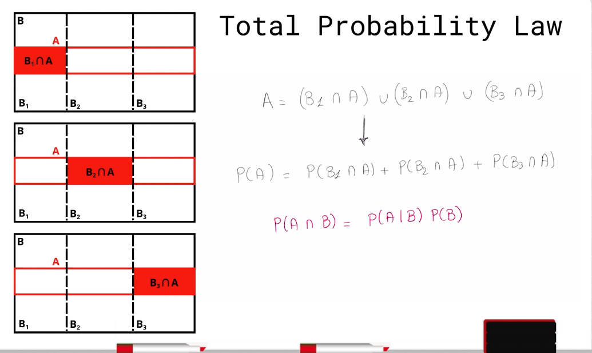
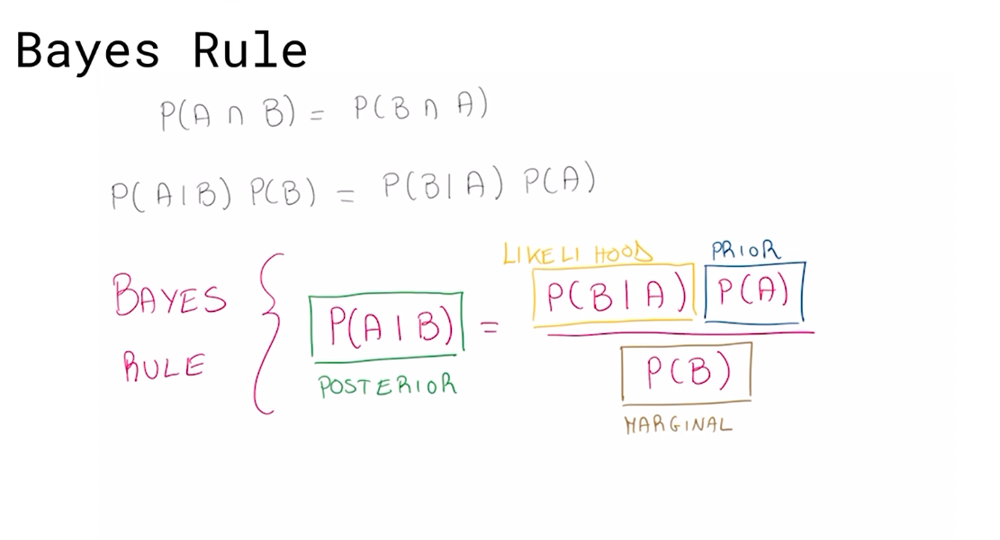

# Ros2 Communications

## Topic

1. Publisher: Node that Send Message 
2. Subscriber: Node that listen to the message 
3. message: the Data that send from Publisher to Subscriber
4. Topic: channel that arrive the message from publisher to subscriber

**Publisher can send to multi subsriber during multiple topics**

**Subscriber can recive to multi message from multiple topics**

**Node Can Work as a publisher and Subscriber**

---
## Service

 1. Service Node: Node that  do Spacific integral Calculation 
 2. Client Node: Node ask for the take.
 3. Request: the condition that send by client to the service to start it calculation
 4. Response: the condtion that send from subscriber to client to tell him that it  finish the calculation

---

## Action

 1. Action Client: Node that ask for a spacific proccess.
 2. Server Action: Node that offer a spacific calculation.
 3. Goal: the condtion send by the client that tell he need a calculation.
 4. Feedback: the message that send from server to client during calculation,include some information about it.
 5. Result: the  final calculation that done by server and send to client.
 6. Cancle: Option for client can do if he want to cancle the calculation that done by Server.

 **Client can execute another operation during the service calculate the goal, and recieve some feedbake from it.**

---

# Package Managements

**Package in ROS2 is the Container that Organize and include all code, and functionality about your robot.**

  - Use to make your code portable, can use in other robot without change any thing.
  - Each Package include multiple of Nodes can work to gether and related to same task.
  - your rebot include multiple of packages, and use package managment to manage them.

---

# Architecture of ROS2 Application
  1. WorkSpace: the folder which include your overlay, and underlay.
  2. Overlay:the folder in which to devolp your robot code, include new backages, and maybe some old packages that came from underlay.
  3. Underlay: the folder which install ROS2 ,that include all Standared packages

***thepackages in the overlay overwrite the oackages in underlay of there are found in the same workspace,and with the same name.**

---

# To Build Your WorkSpace and convert source code 
```bash
    colcon build
```

# To create a new package in Ros2
```bash
   ros2 pkg create --build-type ament_cpp package_name
```

# To activate your warkspace

  - you need to source file called setup.bash .
  - to source file you need to source it in a different terminal of one that build on it.
```bash
   . setup.bash
```

# To list your Packages 
```bash
   ros2 pkg list 
```

# To Run a ROS2 Node 
```bash
    ros2 run package_name exetable_name
```

# To Print the message send during the Topic from publisher
```bash
    ros2 topic echo /topic_name
```
# To have a complete Over view of a topic
```bash
  ros2 topic info /topic_name --verbose
```

# To calculate the frequance of the topic's message
```bash 
  ros2 topic hz /topic_name
```

# To Publish a new message during the topic 
```bash
ros2 topic pub /topic_name Intefacing_name "msg"
```
```cpp
// EX: ros2 topic pub /Chatter std_msgs_string "data: 'Hello Ros2 '"
```
---
---

# How to Create a Publisher node by Using C++

## Explain The Steps:
## 1. Including Libraries

**allows use of the most common elements of the ROS 2 system.**
```cpp
#include <rclcpp/rclcpp.hpp>
```

**include the standered message type that will send on your topic**
```cpp 
#include <std_msgs/msg/string.hpp>
#include <std_msgs/msg/bool.hpp>
#include <std_msgs/msg/int.hpp>
#include <std_msgs/msg/float.hpp>
```

**for Smart Pointer**
```cpp #include <memory>```

**dealing with string**
```cpp 
#include <string>
```

**Dealing with time measurements**
```cpp
#include <choron>
using namespace std::chrono_literals;
```
----
## 2. create a class of a publisher Node which inhertance from rclcpp class 
```cpp
  class SimplePublisher : public rclcpp::Node
  ```
**Inside Public Area create a constructor which intialize the Node**
   - the constructor take **the Name of Node** as aparameter
---

## 3.Create the Constractor which create, and intialize this Node
**the constructor take the name of node as a parameter**
**you can intialize the variable during creation the constructor**
```cpp
  SimplePublisher(): Node ("simple_publisher"),counter_(0)
  {

  }
```
## 4. Create a Publisher 
**from rclcpp define a shered pointer to publisher node**
```cpp
// rclcpp::Publisher<msg_type>::SharedPtr pub_;
rclcpp::Publisher<std_msgs::msg::String>::SharedPtr pub_;
```

### use create_Publisher templete function to create a publisher node
  - this function take the name of topic, and length as a parameter.
```cpp
// create_publisher<msg_type>(topic_nam,length)
pub_ = create_publisher<std_msgs::msg::String>("Chatter",10);
```
---
## 5. Create a timer, CallBack Function 
**from rclcpp define a shered pointer to timer node**
```cpp
rclcpp::TimerBase::SharedPtr time_;
```

### use create_wall_ _timer templete function to create a timer node
```cpp
//timer_ = create_wall_timer(time,call back function)
timer_ = create_wall_timer(1s,std::bind(&SimplePublisher::TimerCallBack,this));
```

## 6. Define TimerCallBack Function
**You need to create a varaible for the publisher message from the same data type**
```cpp
auto msg = std_msgs::msg::String();
```
**store the data that you need in this variable at data par**
```cpp
msg.data = "Hello ROS2 - Counter: "+std::to_string(counter_);
```
**Send data to the publisher node by using pointer how menstion to it.
```cpp
pub_ ->publish(msg);
```
## 7. Implement the Main Function
**Inside the main you will call the node you want to start**
```cpp
int main(int argv,char *argc[])
{
  rclcpp::init(argv,argc);
  /*init an object of your class*/
  auto node = std::make_shared<SimplePublisher>();
  /*call the publisher node*/
  rclcpp::spin(node);
  /*shut down the execution of the node*/
  rclcpp::shutdown();

  return(0);
}
```
---
---

**This is an example of a simple Publisher**
```cpp
  #include <rclcpp/rclcpp.hpp>
  #include <std_msgs/msg/string.hpp> // include the type of message 
  #include <chrono>

  using namespace std::chrono_literals;

  class SimplePublisher : public rclcpp :: Node
  {
      public:
          SimplePublisher() : Node("Simple_publisher") /* (name of node) */,counter_(0)
          {
              pub_ = create_publisher<std_msgs::msg::String>("Chatter",10); // templete function take the Type of msg . topic name
              timer_ = create_wall_timer(1s,std::bind(&SimplePublisher::TimerCallBack,this));

              RCLCPP_INFO(get_logger(),"Publishing at 1HZ ");
          }

      private:

      unsigned int counter_; // to count number of message that publishe
      rclcpp::Publisher<std_msgs::msg::String>::SharedPtr pub_;
      rclcpp::TimerBase::SharedPtr timer_;

      void TimerCallBack()
      {
          auto msg = std_msgs::msg::String();
          msg.data = "Hello Ros2 - counter: "+ std::to_string(counter_++);

          pub_ ->publish(msg);
      }
  };

  int main(int argc, char* argv[])
  {
      rclcpp::init(argc,argv);
      auto node = std::make_shared<SimplePublisher>();
      rclcpp::spin(node);
      rclcpp::shutdown();

      return(0);
  }
```
---
---

# How To Create a Subscriper Node by using C++
## Same steps you make at Publisher node

   **1. include Built in Libraries.**

   **2. inharet aclass of rclcpp Node.**

   **3. create a subscriber Node.**

   **4. intial a Call back function whic execute when you recive a new message.**
   
   **5. call the Node insude main function.**

# This is an Example of Simple_Subscriber Node 
```cpp
  #include <rclcpp/rclcpp.hpp>
  #include <std_msgs/msg/string.hpp>
  #include<memory>
  #include<string>

  // mention to the function need one parameter
  using std::placeholders::_1;

  class SimpleSubscriber : public rclcpp :: Node
  {
      public:
          SimpleSubscriber() : Node("simple_subscriber")
          {
              // topic_name, size, function will be execute whatever a new message is recived
              sub_ = create_subscription<std_msgs::msg::String>("Chatter",10,
                                        std::bind(&SimpleSubscriber::MsgCallback,this,_1));
          }
      private:
      rclcpp::Subscription<std_msgs::msg::String>::SharedPtr sub_;

      void MsgCallback(const std_msgs::msg::String &msg) const
      {
          RCLCPP_INFO_STREAM(get_logger(),"I header: "<< msg.data.c_str());
      }
  };

  int main(int argv, char* argc[])
  {
      rclcpp::init(argv,argc);
      auto node = std::make_shared<SimpleSubscriber>();
      rclcpp::spin(node);
      rclcpp::shutdown();

      return(0);
  }

```
---
---
---
# Probapility of Robot
**The Advantage of using probapilty approach is that as we recieve new informatio, new Sensor Reading, we have more accurate, and less noisy view of the environment and thus can make more accurate and better assumption on how words look like, and where the robot are**
---
---

# Random Variable

**Coin: Tail, or Heads**
**Dice: 1, 2, 3, 4, 5, 6**

- Ex: **x = {Head,Tail"}**
  * p(x = Tail) = ? 1/2 = 0.5
  * p(x = Head) = ? 1/2 = 0.5

- **p(T) + p(H) = 1**

# Note
  - **p(X=x) >=0**

  - **p(X=x) <=1**

  - p(X=x) = 0 is **Impossiple**
  - p(X=x) = 1 is **Certaine**
### So
##  0<= p(X=x) <= 1

### Example1:
x = {Head,Tail}, & ,p(x= Head) = 0.6 .... which is the P(x= Tail)= ??

............................................................................................................................................

### Answer: 
p(x= Head) + p(X = Tail) = 1
**So**
  - p(X= Tail) = 1 - p(X=Head)
  - p(x= Tail) = 1 - 0.6 = 0.4 #

..............................................................................................................................................

..............................................................................................................................................

### Example2:
X = {H,T}, Y={1,2,3,4,5,6},

### Ask 
  - 1. P(X=H, Y=2) = ?

### Answer
  - 1. (1/2) * (1/6) = (1/12) #

---
---
# Conditional Probability

### assum we have two positions **A**, and **B**
### This two events are independentaly.

## Example1:

 ### X = {Head,Tail}
 ### Y = {Yes, No} //Dependt on whether if the sensor detacte any rock or not.
 ### p(X= Head) = 0.5
 ### p(X= Tail) = (1 - p(X=Head)) = 0.5

 **Assume two Events are Independants**

 **P(Y=Yes Give X=Head) = p(Yes | Head) = 0.8** 

 ..............................................................................................................................................

## Ask:
  **P(Y= Yes and X=Head) = ??**

 ..............................................................................................................................................

## Answer
**P(Y=Yes and X= Head) = P(X) ^ P(Y) = P(X) . P(Y) = 0.5 * 0.8 = 0.4**


## Important Note .... What about if the Two Events are Dependants??

  **P(X ^ Y) = p(X) . P(Y|X)** // And , Entersection between two Events

  **P(Y|X) = P(X ^ Y) / P(X)** // Given
---
---

# Probability Distrpution



**Uniform Distripution: All Possiple outcomes assign the same Value of probabilty, which use in robotics as a starting point,whether you still unkown what is the events that is less lickyand other not, when you have no idea where the robot is.**

 ..............................................................................................................................................
 ## First Probability, you need to calculate is **Mean** or Expected Value, 

   **Mean = Sum[X . p(x)]
### Example1:

X={1,2,3,4,5,6}, Y= {1,2,3,4,5,6}
### Ask Mean = ??
### Answer: 

Mean = (2*(1/36)) + (3*(2/36)) + (4 * (3/36)) + (5 * (4/36)) + (6 * (5/36)) + (7 * (6/36)) + (8 * (5/36)) + (9 * (4/36)) + (10 * (3/36)) + (11 * (2/36)) + (12 * (1/36)) 
Mean = (252 / 36) = 7 #

---
## Second Probability, You need to Calculate the **Standared Devision** = Sqrt(&^2)

### **(& ^ 2) = Sum[(x - Mean)^2 * P(X) ] **Called Variance**

### Example1:
X={1,2,3,4,5,6}, Y= {1,2,3,4,5,6}
### Ask :
Standared Devision = ?? & Variance

### Answer: 
Mean = 7

(& ^ 2) = [(2 -7)*(1/36)] + [(3-7) * (2/36)] + [(4-7) * (3/36)] + [(5-7) * (4/36)] + [(6-7) * (5/36)] + [(7-7) * (6/36)] + [(8-7) * (5/36)] + [(9-7)*(4/36)] = [(10-7) * (3/36)] + [(11-7) * (2/36)] + [(12-7) * (1/36)]
(& ^2) = (210/36) = 5.83 #1

So (&) = sqrt(& ^ 2) = sqrt(5.83) = 2.4 #2

---

## Gaussion Distribution



----
----

# Total Probability Theorm
**Lets Assum the localization of robot is in the park,where there are several Element**
  A: the Path that the robot localate at.
  B: Any where in the Park, all the possible position of the Robot in the Park.

  **Lets Splits the park in three regains**
  - 1. B1: Playground Area.
  - 2. B2: Lake Area.
  - 3. B3: Three Area.

### The Total Theory of the Robot answer the Question of where are the robot on the path,and subsut A.
### Given that the sensor detected that the robot is one of this three areas B1,B2,B3.



### P(A) = [P(A|B1)P(B1) + P(A|B2)P(B2) + P(A|B3)P(B3)]

---
---
# Bayes Theorm
**Commonly Use in the Localization of Self_Driving Vechels**
**This Theorm describe Step by step, how to update the probability of certian event, after gaining new knowledge.**



**Posterior p(A|B): the updating probability of the event A ** 
**Prior_Probability P(A): the intial Guess**

**Margianal_Probability p(B): Overall Probability of observing the event B**

**Likilood P(B|A): Te Probability of Event B, assuming avent A is OCCured**

---
---