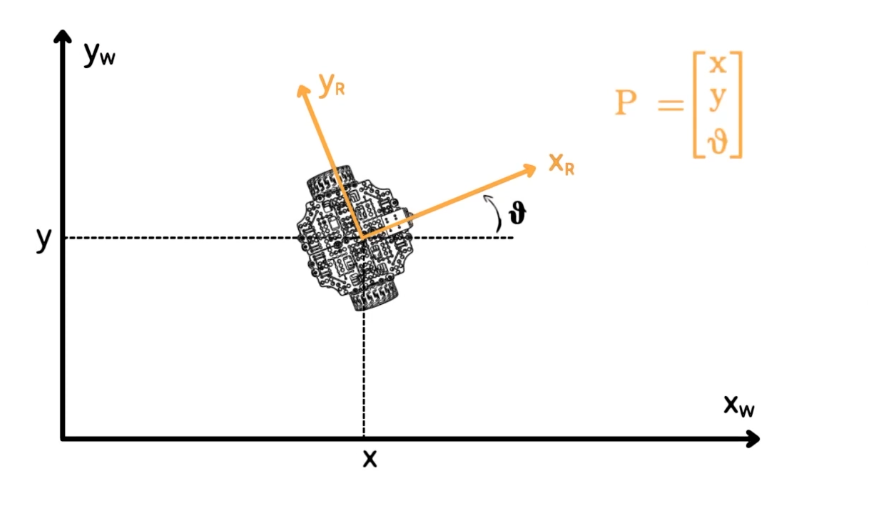
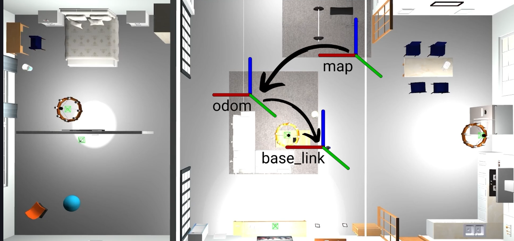
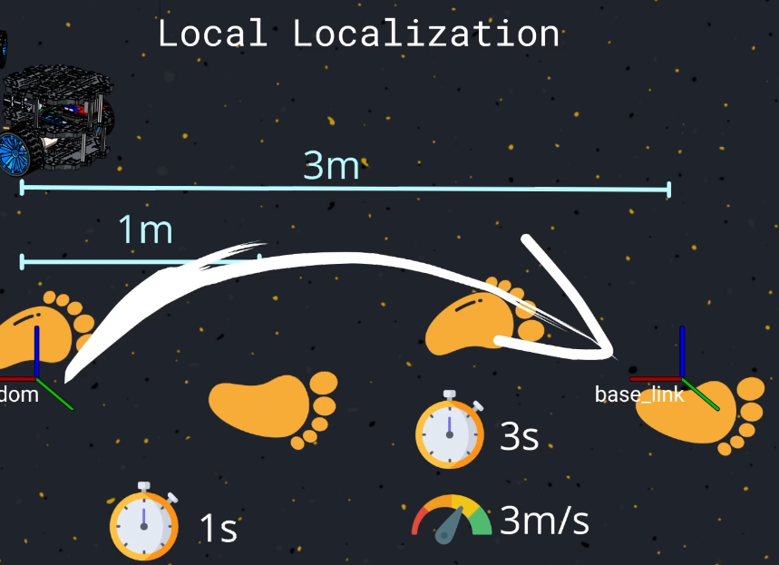
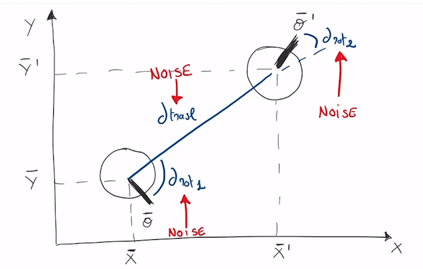
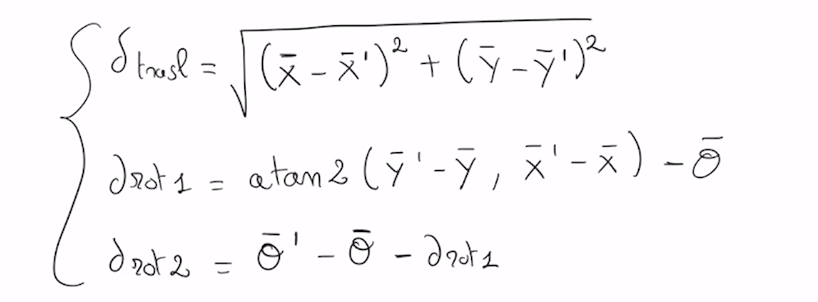
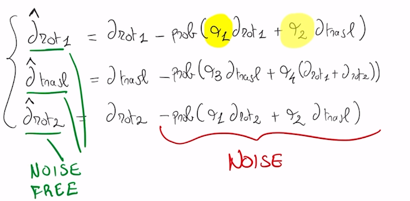
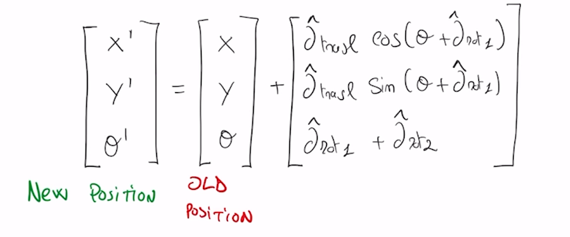

# Robot Localization
**It is the Robot ability to establish it's own position and oriantation whithin the frame of reference.**
   
   The Localization hase two Factors:
   1. The Referance Frame: Is a Point against in which we express our position ,namlythe origin.
   2. The Position or Orintation.

**Pose: is the latitude, and longitude = position, and oriantation**
   - latitude: is the angular distance of point,from the equator.
   - longitude: is the angular distance of point from the greenwhich meridian

**If the referance frame is fixed, and the robot is two dimention**

**if the Robot is different and work at difference frame as Drone work in three dimention So:**
   - Coordinate:  X,Y,Z
   - Angle : Three orintation angle

---
---

## In Robotics to Get the Localization, you need to configure some things:
### 1: **Map**: The First  Fixed Referance Frame Define a global Referance Frame.

### 2:  **Odom**: The Seconde Refrance Fram, this referance fram indecate to the point where the robot movement start,when it is turned one.
  - it express about the intial position of the robot before any movements

### 3: **Base_Link**: The Last Fram, is the mobile referance frame atteched to the robot,and move as long with it.
   - it can be attached any where on the robot,it is the center of rotation.
   - it must move as the robot moves.

**There are a containous transformation between the frame model,and frame base_link**

---

### The Localization problem Simple Translate to a simple translates into calculating the transformation matrix between **Map,Odom,Base_link** 

---

**You can use Gazibo as a simulation to test the Robots Behavior in Viruos Situation**
**We will use in the course the iconc office environment of williw Garage**

 **The Localization Problem Seperate to two Parts:**
   - Gloabal Loclization
   - Local Localization
---

## Local Localization.. Odometry
 **The Local Localization challanging is to track the local movements and measure it's velocity ,acceleration, and distance travel.**

 So We try to esstimate the current pose of the robot to the odom fram.

 **Local Loclization; Calculate the Transformation betwwen the ODOM, Base_Link Frames**

 ### Odometry: refer to understanding where you are starting from a known position using velocity, direction, and time.

 **Calculting Odomtry is equavilant to counting Steps,while we are working to estimate our position and Speed.**
 * if you kwon the time of each steps
 * if you know the distance at one steps
 * know the intial position 
 * count number of steps untile the curent position 

 **So it will be is to get the transformation between base_link, and odom frames**
  current position = (distance_of_one_Steps) * number_of_steps
 **To Calculate the Speed Of Moveing:**
  Velocity = time_of_steps * distance_of_one_step * number_of_steps**

### So at any time you can calculate the new positon and new velocity
   

The Same Concept are using to calculate the odometry of robot

---
### Examples: Wheel Odometry
   1. Need to know the reduis of the wheel [r]
   2. each rotation of the wheel can calculated by: 2πr
   3. number of rotation 

---

## Global Localization : Calculating the robot position on the map
   calculate the transform between fixed frame map, and frame base link
   to know the relation between the current position of the robot and 

### if you depend only on the local localization that send by sensors to get the current position of intial position, the error is exactly happed.

**Hopfully, robot can using maps, and this is the goal of global localization,to use global information such as a map of environment to correct the local localization or to correct odometry errors**

---
---
## Odometry Motion Model

