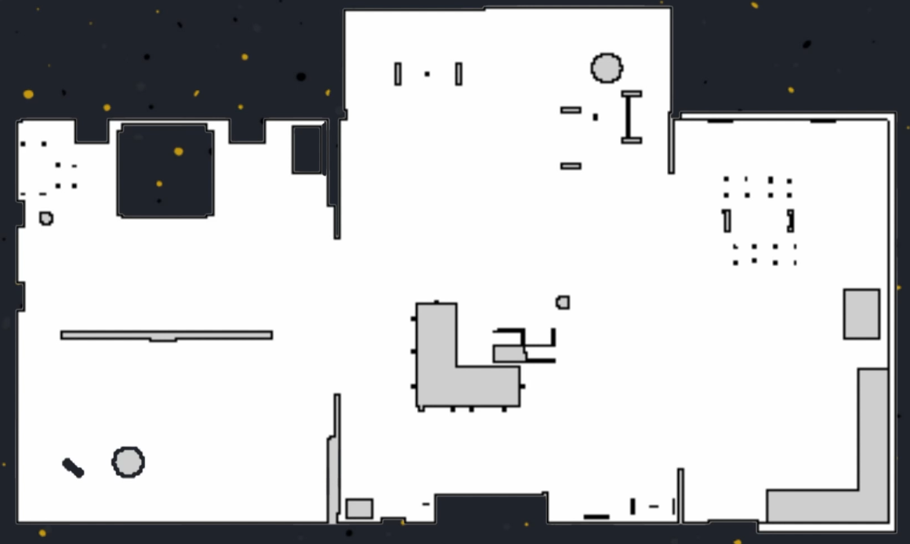
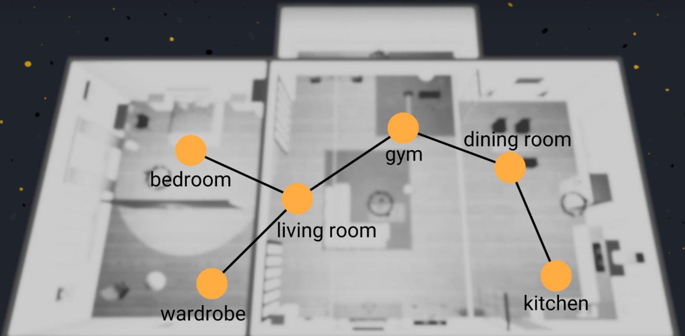
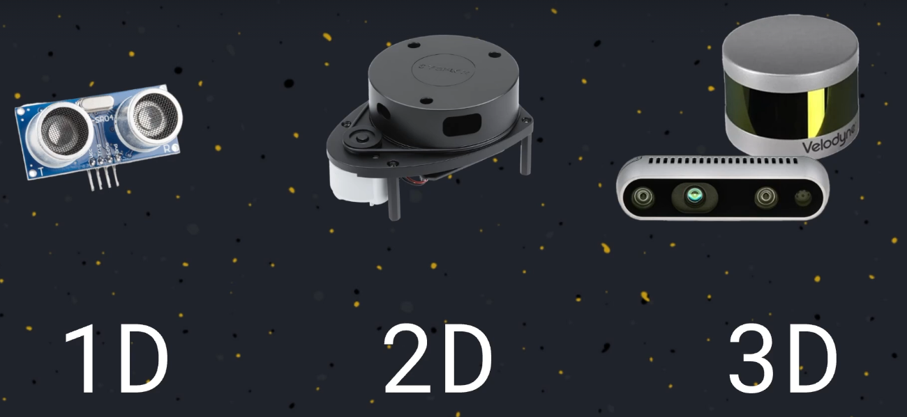
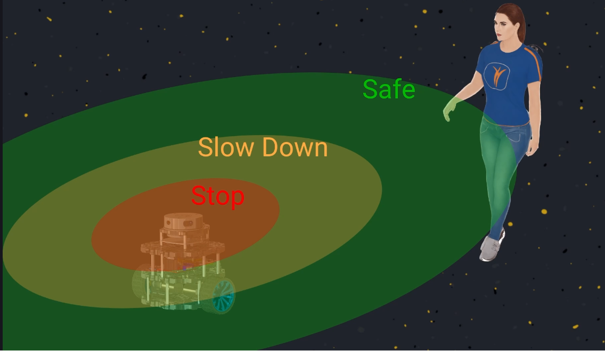
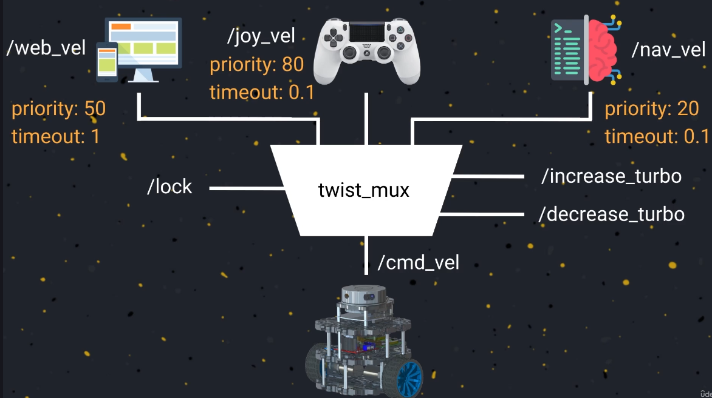
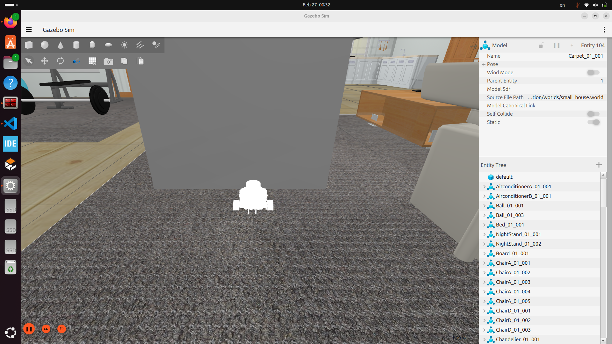
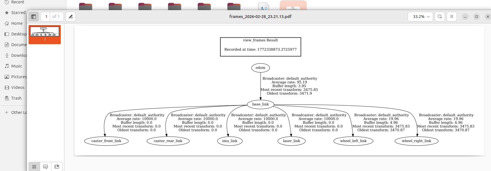
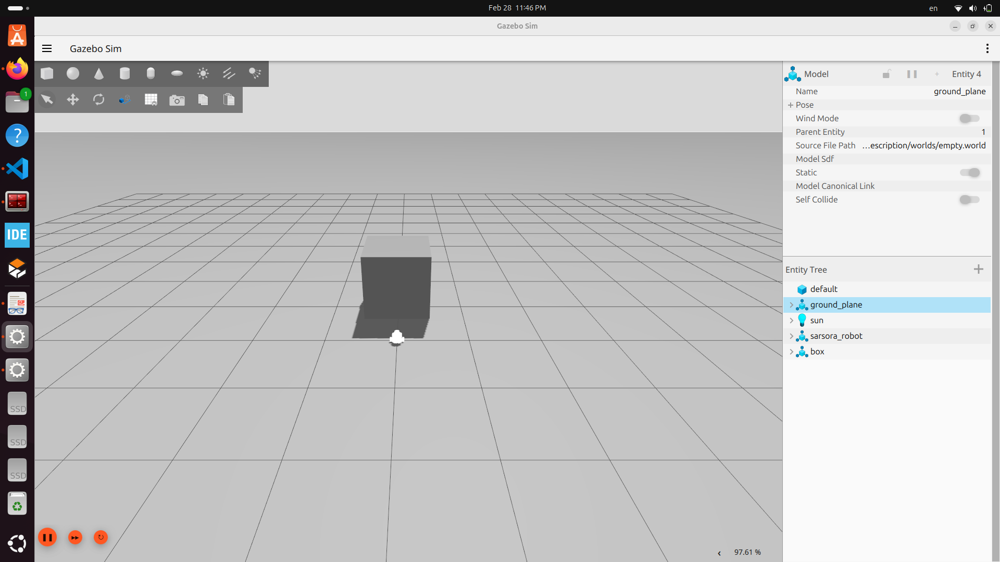
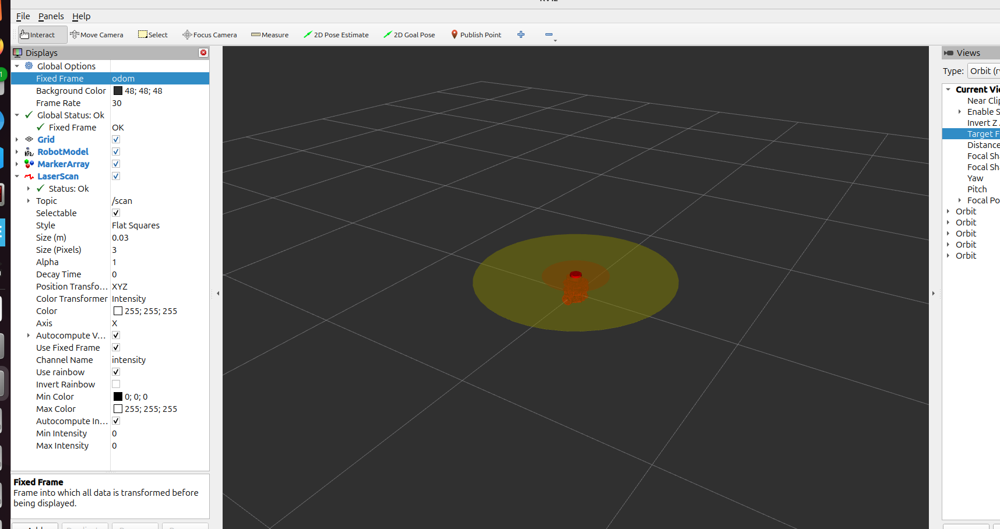
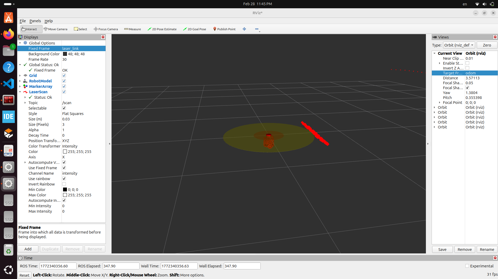

# Mapping

**There are a relation between Localization and Mapping...**
**The Robot need the map to localization it's position, and correct odometry error**

## What is the Map:
### map is a model of environment, So it can find different models, different possible 

## There are different types of Maps can use with your robot:

**1. fir mobile robot which work at two dimention:**
   - Black_Part: mention to the position of Obsticals.
   - white_part: Free Areas.
   - Gray_part : Unkown Areas.

**2. Topological maps: that are based in graph**
   - Connected of few nodes, and few edges connected them.

---
---
## Sensors for self Driving Robot
**The most common used Sensor are seperat to 3 categries depending on the formate of the output:**

   **1. 1_D[mono dimention sensors]: the output give you one information which it distance:**
      - it used to locate and measure the distance

      - normal these sensors are used in very cheap robots

      - these are not suitable to create a map, there are more useful for claculte the distance from the obstacles to avoid collisions.

     - EX: Ulterasonic Sensors.

   **2. 2_D Sensors: provide the distance as 1D , and also provide the direction**

     - it's provid the angle of the horzontal plan.

     - work on the bidimential plan.

     - use for create 2-D maping, and also for localization.

     - Ex: Cameras.

   **3. 3_D Sensors: provide information consist of three variables:**

     - first: distance measured from the object.

     - second: angle in the horizontal plane.

     - third: angle in the vertical plane. 
   **these sensors allowing you to know the distance from all object around the sensor** 

     - these sensors suitable for indoor and outdoor environment.

     - EX: Lidars

   
---
---
## 3_D Sensors like 3_D Lidar that known as depth Cameras
  Also work as the 2_D lidar that calculate the distance from the object all around the robot.
  But there they perform colmpletely scan of the environment using multi planes essentially 3 dimential scan by emmite ligth beams accreoss several planes

  **can measure three things:**
  - distance 
  - horizontal angle
  - vertical angle
---

## Speed and Seperation Montoring: 
The first application will use is develop a subscriber and use the lidar reading  as an implementation od speed and montoring.

**The Purpose of these is dynamically controll the robot speed based on the distance from it and the obstacles**
   - As the robotis closer of the obstacls  as apply more reducing speed, in order to avoid collision

there are three threshold of ranges around the robot if the lidar detect an obstacles at one of them the speed will daynamically redue depend on the range.

**1. Safe Range**
   - the obstacles are far enough of the robot.
   - the robot can move with it's normal speed, without any change.

**2. Second Range - first threshold**
   - define by the thrshol that indicate the reduis of the reduced speed area around the robot.
   -  if the lidar detect an obstacles in this zone the robot **speed will reduce to the half**

**3. Third Range_Second Threshold**
   - the danger zone that may cause an immedaitly collision.
   - if the lidar detect an obstical in this zone, **the robot will be immeditaly stoped**

### To apply this Motoring you need to part
1. Ladar to measure the distance from the obsticals.
2. System to daynamic change the robot speed depend on the lidar readings.

---
---

## Twist_Mux or twist maltipluxer
- Software pakage avaliable in ros2 to manage the velocity commands that comming from different sources,anf send these message to move the robot

- As the software of your robot become more and more complex with many application,that could be multible sources, that need to send velocity command to the robot 

-EX: 
  1. The Auotonomus navigation systems
  2. web interface that use to contol the robot remotlly or mobile application.
  3. joy_vel

- the twist_Mux manage these  multiple velocity that came from different sources,and decide which one of these avaliable source can control the robot at any given moment,and send the velocity command the move the robot.

- These massage are twisted message that define at the Geometry message package

**To do this the twist_mux assosiate a priority, and time out for each source with each incoming velocity topic**

   - Periority: number that indecait the important and critical of this certain velocity topic, the one hase max periority will chose by the twist_mux to controllthe robot speed.

   - Time_out: The maximum allowed period for the certain topic, when the time out is done the source stop sending the velocity message, and the twist_mux stop use it to controll the robot speed even it has the lower periority.

### The twist_mux also provide two interested features that support it's work:

**1. The ability of create lock**
   - is an other ros2 topic that can simple send boolean message 
   - if the boolean message is False: the twist_mux contain with classic operation that it saw[if there are a new message publish ].
   - if it became true: the twist_mux immedatilly stopes it's output , and stop the robot.

**2. Trubo**
   - is an interface for increase or decrease the maximum velocity of the robot.
   - allow you to change the maximum allowed velocity of the robot depending on the obstacals tha detect in the environment.

# Pictures Of Section6 Labs

---

---

---

---

---