# Maping Representation
---

## Maping Types [depending on the dimential]
**Tepological Maps: is an attempt to represent the continous space in the discrete areas**
   - As all maps: each erea is represent as a discrete node,and these node are connected together through eadges that link these node.

   - EX: Subway maps : give you a quick way to plane our route to reach the  certain distination.

   - give you the infromation about how to reach to any node of this graph,other node we eill move through to reach without any information about if the  distance between them is long or short.

   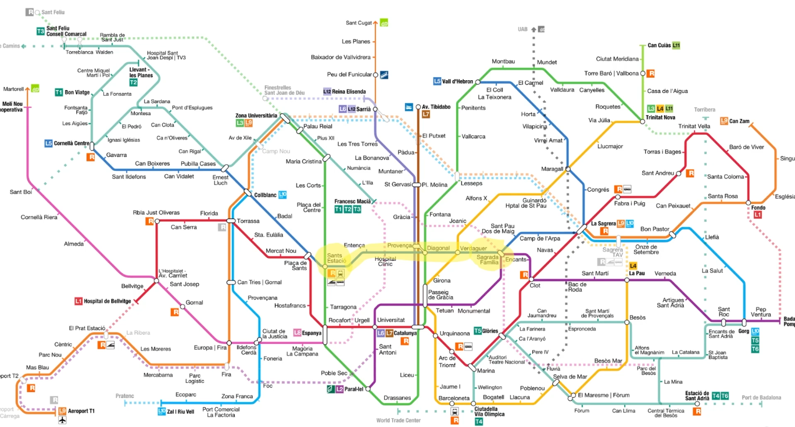

   **You only now where we are in the graph**

- in robotics the tpology map that use to get the localization of the robot is very simmillar, an dallow to discrate the environment to different node and identify them by name or id.

- Ex: for the domistic environment it know by define a node for each node of a house and the connection between different room reflect to the connection between each node

- so Localization simpley define in which of this noode to in which of this room the robot are located
- this tepology representation also provid a navigation and path planning.

   - allow locating  to the  distnastion that you want to reach.
   - plane a trajectory that takes the robot from the start position to the requirement position.
   - explain the knowledge of that will move throw and there node connection.

**- if you use this tepology the only challange is in which room the robot are located.**
  - in this case the approch that used is to introduce a marker that identify each room.

**Beacon: is any device that have the ability to esstimate the elctromagnatic wave, and can be install in spacific erea of the house in oredr to uniquly identify it**

**When arobot with a reciever for electromagnitic wave recieves a message from beacon,and it's able to know it's ID's,by assoisate each room with Beacon with a different ID.
If you do that the robot will be has the ability to identify in which room the robot are locate, and also in which node of the graph**

---
---

## Environment Two Dimention Map 
Two Dimentional  Map = Bidimentioal Map = occupancy grids


**Occupance gids : is a model of the environment that simple representation the featire of the environment**
   - this reperesnt three feature of the environment that most robot need two know
      - occupied area = where are the obsticals
      - free area = where are the free
      - unknown area = navigable areas that unkwon yet to be explored

**Each area reperesent as a cell of multi meters and represent as a square**
**So the bidemantional map is identify is a group of cells explain the environment feture, each cell include group of bytes, each byte repesent by number which is express the probability of this cell to be occured**

  - Cells that will be occuperd : include probabilty of 100
  - cells that free : include probabilty of 0
  - cells without any information: include probabilty of -1

**this map provide two axis x,u in order to identify the position of your ronot in the map**
**Also avoid a framwork for apath planningin,and obstacls avoiding aolgorthims**
**So in addition to reperesent the robot position in the map, you can represent any other object or goal position**


   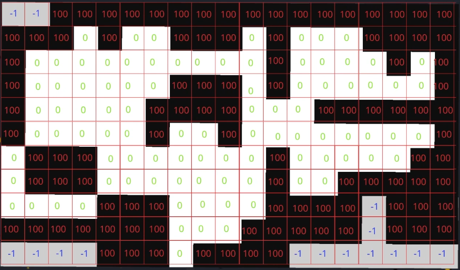

---

### How these maps stor in the memory of ros2
   - this grades are not saved as aplain of matrices or not store as a 2D structure
   - it stores as aplain long vectors
   - so to store in memory you need to take the first raw,and append two the second vectore, and do this for all raws  raw by raw.

   - so you can do that two store it in the memory as long vector,as a one dimential

   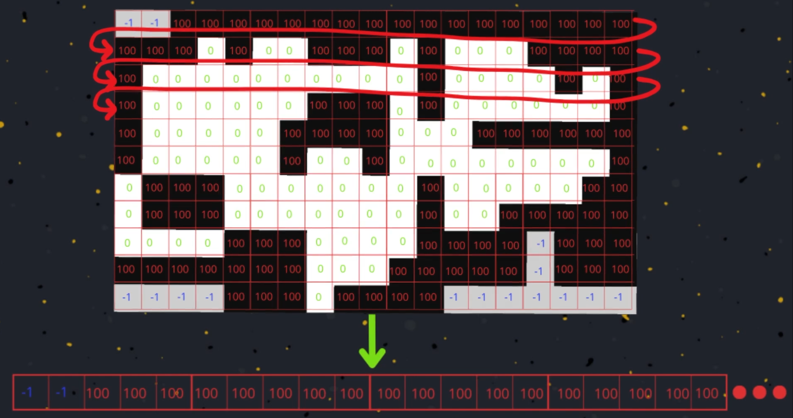


**In Ros2 this data are reperesent navs_msgs/OccupncyGrid.msg**
   - this message reperesent all the cells of the map as a one long vector

---
---

## 3-D map
* In 2D each cell is reperesent as a picel,each picel have a color that reperesnt that repesent the state of the cell

**But in 3D maping: each cell reperesnt as a voxel[volomatric pixel]**
   - In 3D the basic unit is also a 3D unit.
   - 3D map : reperesent as a set of voxel.
   - these Voxels can have different sizes and different resolutions.
   - voxels provide a more detailed reperesentations of  the environment.
   - the small voxel provide much more details of the environment.
   - the lasge voxels provide much lower level of details about the environment.
   - But it a causes more cost, because each small voxel need a much more memory to store.

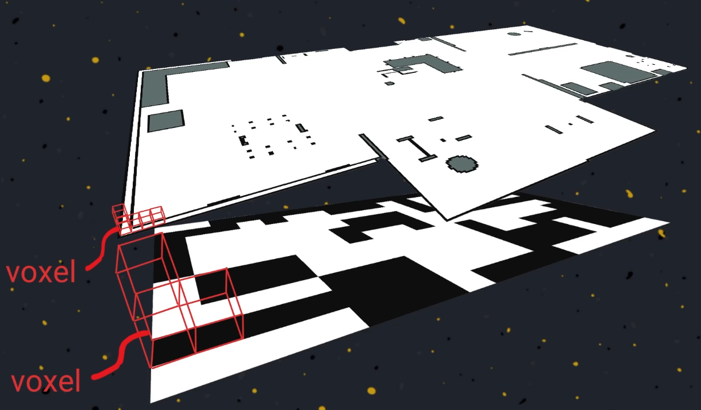

**But whe need to get a trade of between the Resolution[cost] and the level of details.**
- Because if tou need to reperesent 10m,10m,10m map you need **8 million voxel**,and it's a hige number of such a small map, So this solution is fail at 3D map.

---

## Octo Tree

 **Its a structure use to intial the 3d graph engine, and used in robotics to reperesent the 3D maps of the environment'octo map'**

### How Octo tree Work?
 
   - it devide the area into 4 areas,all of them with same size
   - identify each area with a number [1,2,3,4]
   - no we can use ocot tree to represent the map, now you have a tree with 4 children
   - the alograthim start to analyze these four macros area
      - if we analyze these part we will get :
         - Area number 1 is completely free so it will  marked  it as a free branch.
         - Area number 3 is completely occured so it will marked it as a occured branch
         - after analyze other branches and include free and occured part it will repert the process and make a tree for this branch and seperate to small 4 branches, and identify them with numbes.
        - then repeate thesame sequence of the analyze 
            
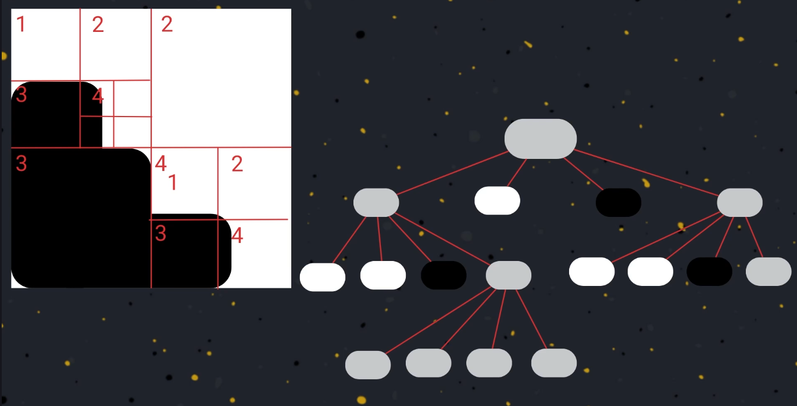

---
---

# Ros2 Navigation Stack 
**Nav2: is a framwork reperesent the set of open source package, and it has agoal to provide an autonomus navigation capability for any robot**

**he Goal of navigation tool is to autonomsely provide a navigate to the robot from point A to point B during avoiding the obstacles**

**This problem require different models,and component:**
   - need to know the position of the robot to solve the localization problem.
   - need a map of the environment and path planning model that use the to plan trajectories,and aloow the robot to reach the goal with most effective way.
   - we need obosticals avoidance model.


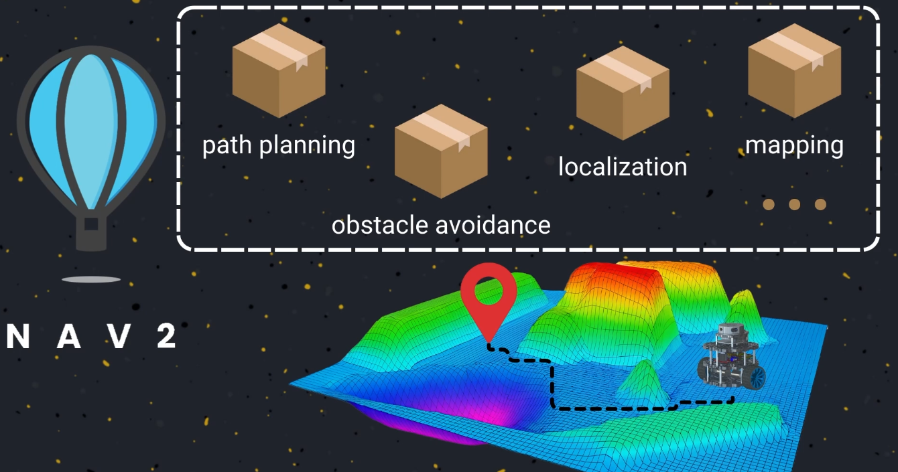

---
# In this Section of course we will use a a tool of nav2 ibarary Called MapServer
**MapServerL node that responsible for reading a map and publish an occupance gride message in ROS2**

To Understanding how it work, before you neec to know what are  the life Cycle nodes at ROS2, and how are work.

---

## Life Cycles Nodes in ROS2

**Life cycle node is a four states [Unconfigured,Inactive,Active,Finalize]with several transition that allow the node to change this state**

**The node can't be in two state at the same time**
   - Ex: if the node is in unconfigured state, it can't be in active state at the same time

**If you want to change the node state from state to another one there are different event, or tranjection to change.**
**Ineach one of this state the node perform different operation that start when the certian state is active**

**1. Unconfigured State: in this state node don't know any information, or data.**
   - while you are in the Unconfigured state there are only two transition :
      * Shut down: the node termeniated with the shutdown function and  end up in the finalized state.
      * Configure: the node we push up to the Inactive state , and the node doesn't perform any action or result.

**2. Inactive State: in this node there are three active transition.**
   - active: convert to the active mean state of the node.
   - shut down: endup to the finlize state.
   - clean up: return to the nconfigured state.

**3. Active State: in this state there are onlt two transition are avilable:**
   - deactive: convet the node state to active state.
   - shut down: endup to the finlize state.

**4. Finalize State: there are only one transition in this state.**
   - destroy: lets the node to be destroyed

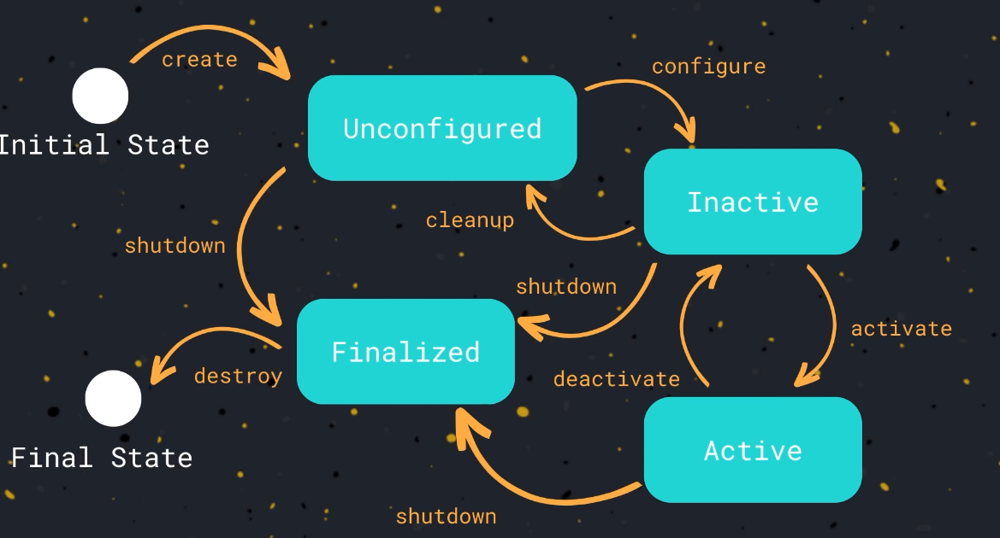

---
---

# Lab1 Command [[simple_lifecycle node]]
```bash
ros2 run my_cpp_pkg simple_lifecycle_node 
```
```bash
ros2 lifecycle nodes
```

```bash
ros2 lifecycle get /simple_lifecycle_node 
```

```bash
ros2_ws$ ros2 lifecycle list /simple_lifecycle_node 
```

```bash
 ros2 lifecycle set /simple_lifecycle_node 1
```

```bash
ros2 topic list 
```

```bash
 ros2 topic pub /chatter std_msgs/msg/String "data: 'Hi'"
```

```bash
ros2 lifecycle list /simple_lifecycle_node 
```

```bash
ros2 lifecycle set /simple_lifecycle_node 3
==
ros2 lifecycle set /simple_lifecycle_node activate
```

```bash
 ros2 topic pub /chatter std_msgs/msg/String "data: 'Hi'"
```

```bash
ros2 lifecycle list /simple_lifecycle_node 
```

```bash
ros2 lifecycle set /simple_lifecycle_node 7
==
ros2 lifecycle set /simple_lifecycle_node shutdown
```

---
---

# Nav2 Tools 
**The first navigation tool that we will use in this course is a Map Server**
   - map server provide a server that is has the response of hosting a map, for host an accupance grid for all the application that may need,for the path planning node or obstace avoidings or any other node.

   1. provide a tool for read a map of the file system,that has been created and saved at the pc, and converted it to an occupance grid message.
   2. map serever host the converted msg to all node that might needed
   3. it also offer ROS2 topic where the occurpance grid publish his message.
   4. provide ROS2 srvice interface called **/map**, that other ROS2 application can use to recive a copy of a occurpance grid.
   5. offer other interface called load map allows changing the current map that hosted by the map server

# Bash Command to run global localization launch file

```bash
ros2 launch my_robot_localization global_localization.launch.py 
```

```bash
ros2 lifecycle nodes 
```

```bash
ros2 lifecycle get /map_server 
```

```bash
ros2 service list
```

```bash
 ros2 lifecycle set /map_server 1
```

```bash
 ros2 lifecycle set /map_server 3
```

```bash
ros2 topic echo /map
```

```bash
rviz2
```
---
---

## Quality of Service

### What is the DDS
   - it is a communication protocol used in ros2 to exchange the message between different  nodes among viruos application running in the robot.
   - provide a node functionality ,message serualization, transport ,definition of certain quality of service

**To use the DDS ros2 has an interface called  middle ware ,then the ros2 core libarary,user that provide to empliment different nodes**

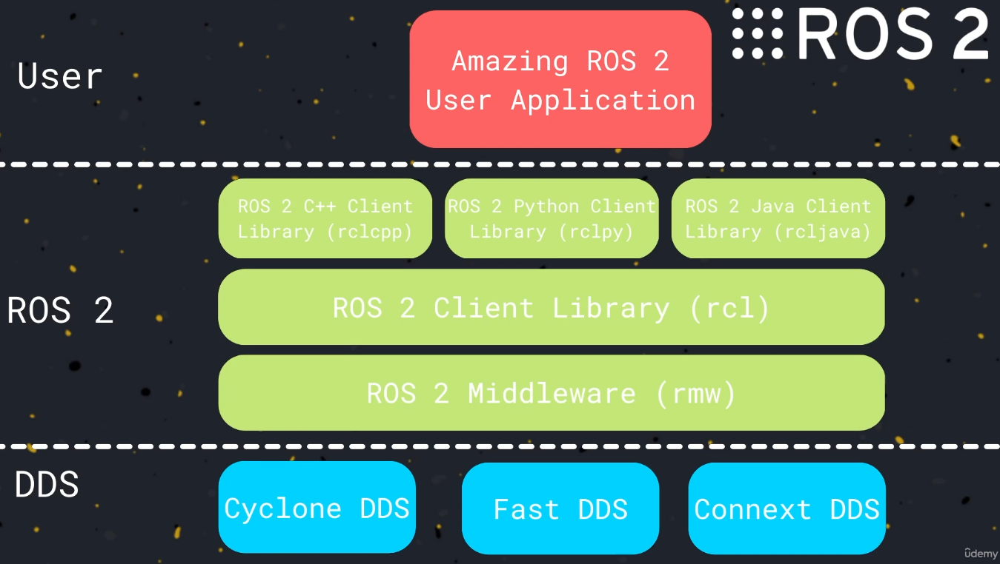

---
## Quality of Service Policices

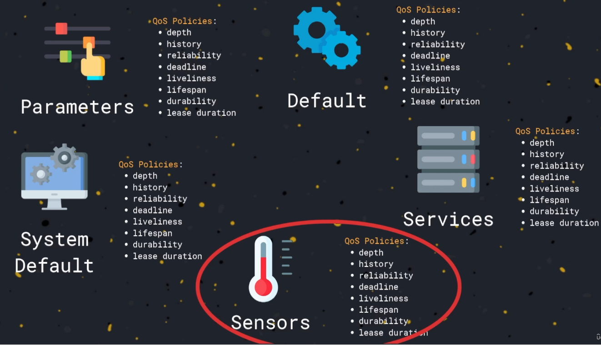

---

## Bash Command of Quality of system lab 

**Compatibility between reliability and durability of Qos**
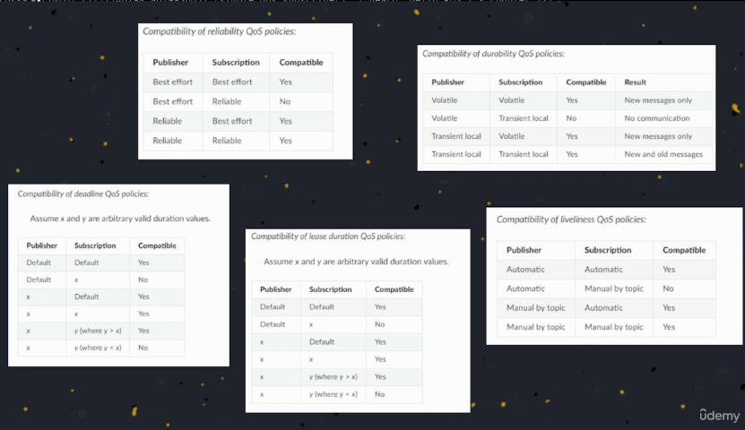

```bash
ros2_ws$ ros2 run my_cpp_pkg simple_qos_publisher 
```

```bash
ros2_ws$ ros2 topic info /chatter --verbose 
```
```bash
ros2 run my_cpp_pkg simple_qos_subscriber --ros-args -p reliability:=best_effort
```

```bash
ros2 run my_cpp_pkg simple_qos_publisher --ros-args -p reliability:=best_effort
```

```bash
ros2 run my_cpp_pkg simple_qos_subscriber --ros-args -p reliability:=best_effort

```

```bash
ros2_ws$ ros2 topic info /chatter --verbose 
```

# Image of lab2 on rviz2
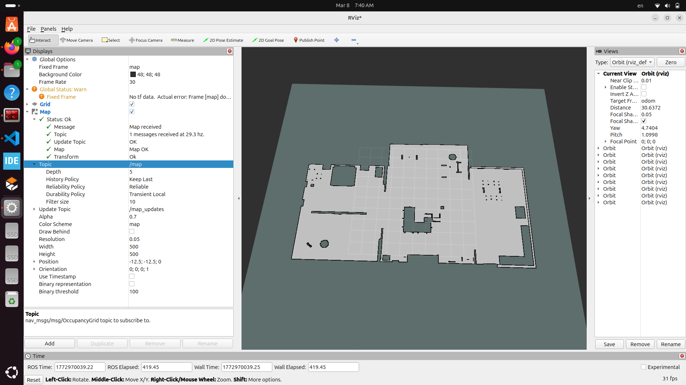

---
---

## Lifecycle Manager
**node that is use to takes care of execution of several lifecycle nodes, it takes an list of lifecycle nodes that need to manage**

  1. convert all node to the configured state.
  2. after all node are configured, start to convert all node to active state.
  3. try to save all nodes in the active state during it's execution.
  4. if one of node being deactivate, it convert to active state again untile it finish it's execution.
  5. if it fail to reactive one of node, non of nodes will be execute and all nodes will go to the shutdown state.