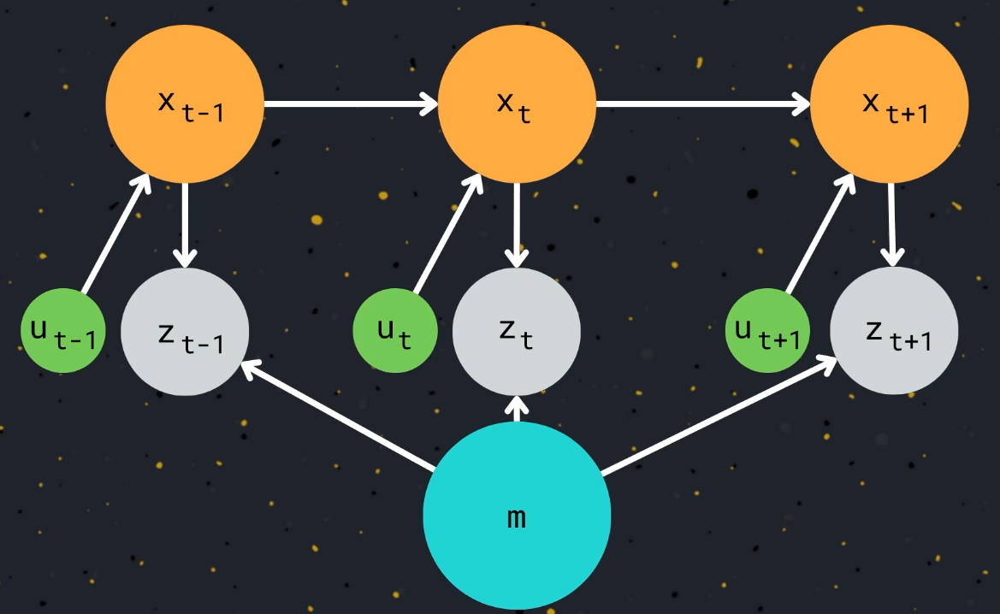
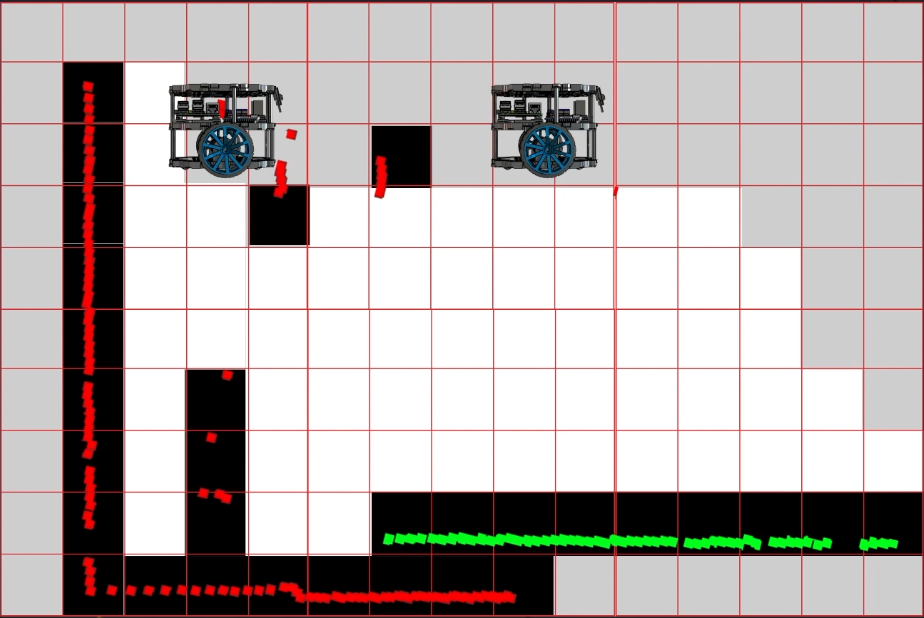
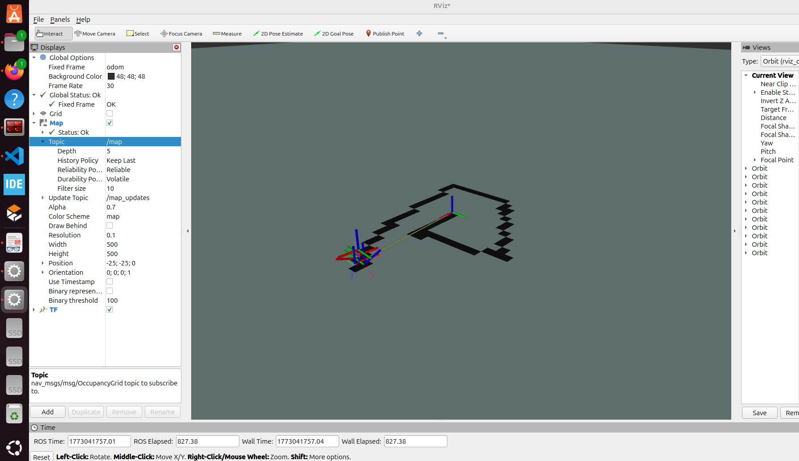
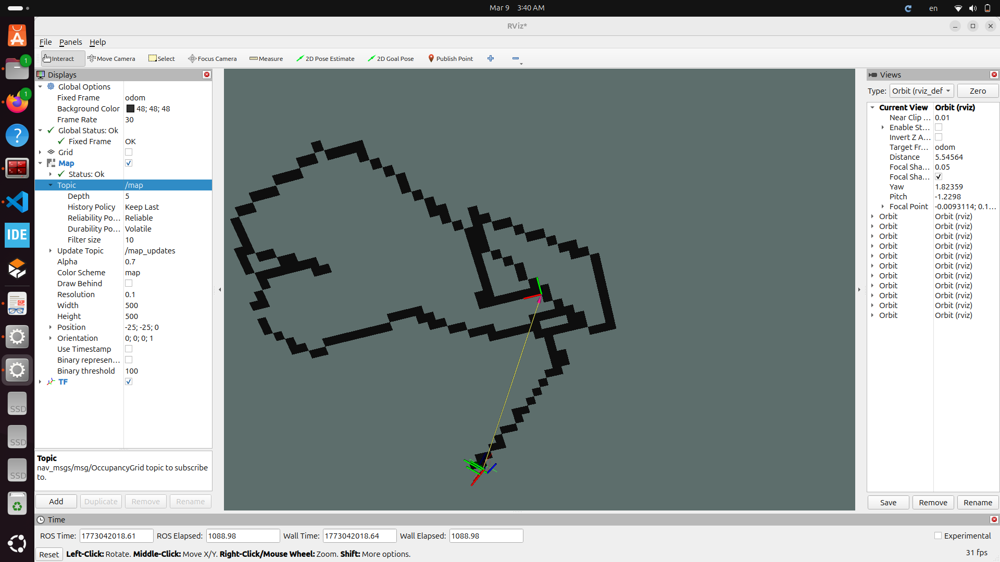
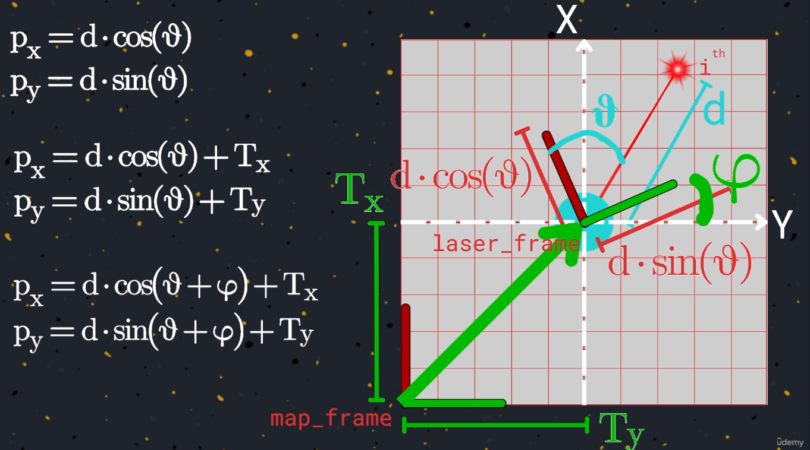
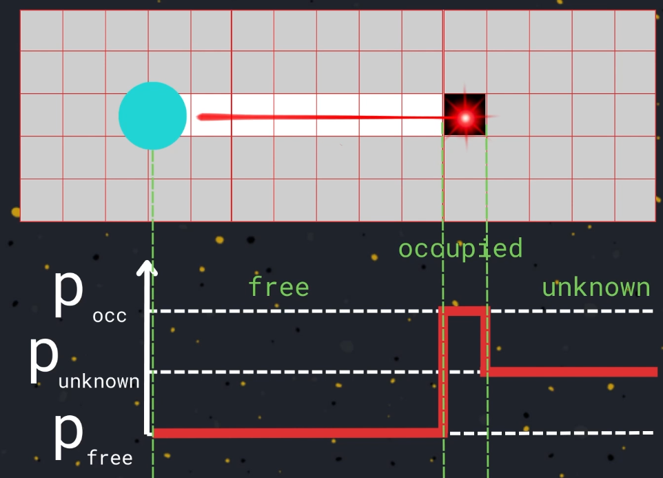
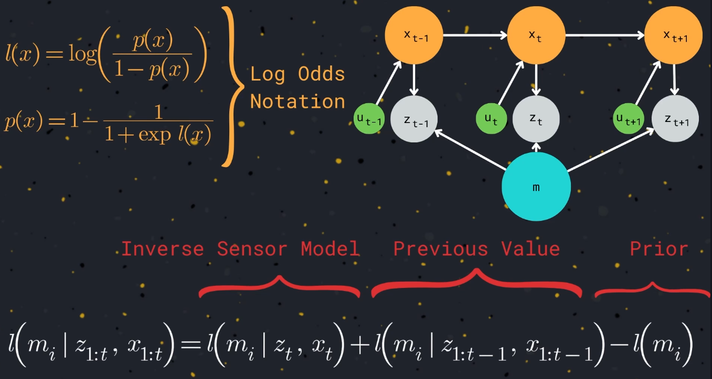
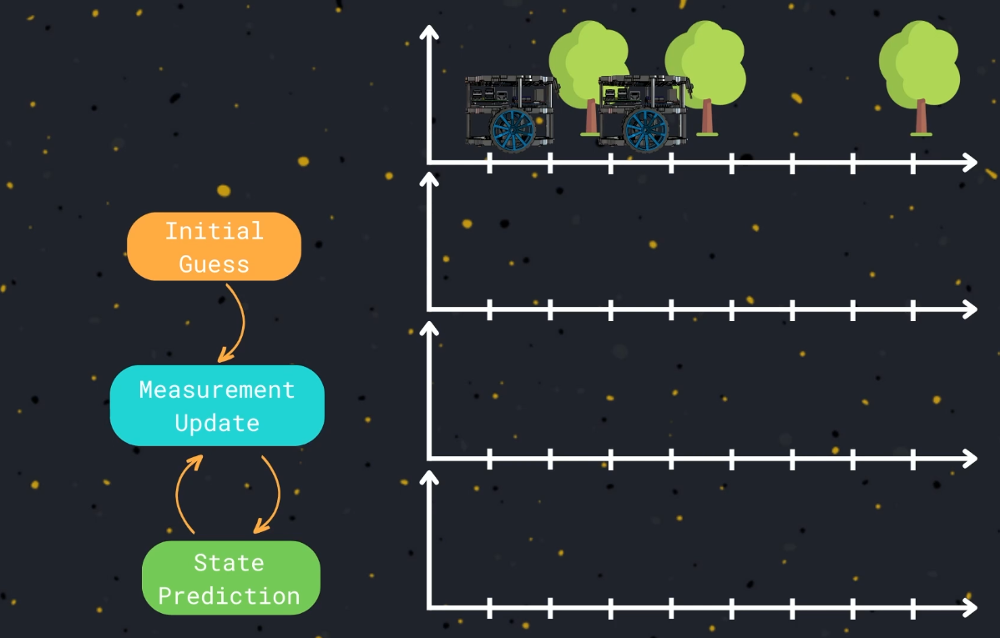
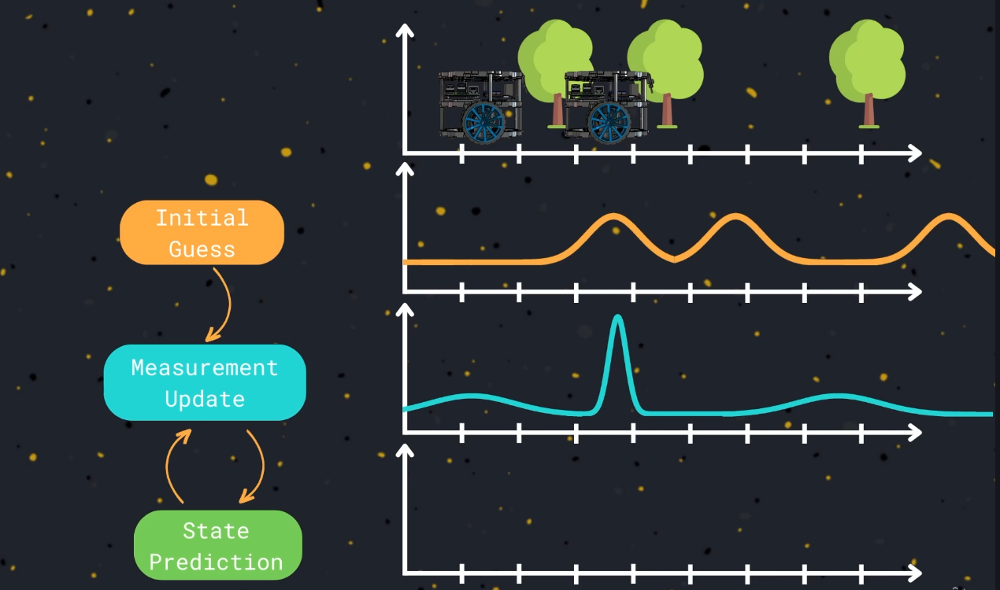
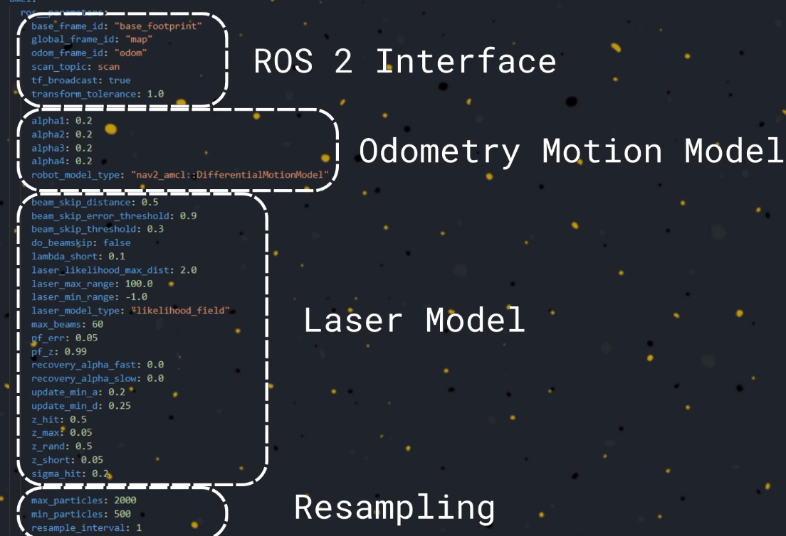

# Maping with Knowing pose

in this section of course we will assume we know the position of the robot by know it's odometry.
Current position => xt
previouse position => xt-1
next position => xt+1

**You can create any type of map by given the robot odometry, position, and sensor reading**




**The 2D lidar perform a scan of the environment ,and provide us with scan message that contain the distance that robot detect from it and the obsticals**
  - So we can use this information to update the knowledge of the environment, and also we can update the occupance grade.
  - the cells were last written obsticals can be marked as an occupied.
  - the celles that are view in the field of laser,and without obstacles can marked as a freed area.
  - all other cells that not are in the range of the laser scan marked as unknown.



# Command to Move the robot from the Keyboard 

```bash
ros2 run teleop_twist_keyboard teleop_twist_keyboard \
  --ros-args \
  -r /cmd_vel:=/ros2_controller/cmd_vel_unstamped
  ```
---

# Images og the First Lab Practises 



---



----
----
## Understanding Laser Scan Message
- the message contain a vector called ranges with distance from the obstacls
   - angle min: which represent the start angle of the laser
   -angle max:represent the last one between min and max angle
   - angle increment: the anglur distance between the first and second beam

**The laser scan message:provide us with to pices of information:**
   1. the distance between the obstacles and the beam.
   2. angle thete af the beam that measured this distance

  d = ranges[i]
  theta = angle_min + (angle_increment * i)

**If we defined x,y coordinates centered in the laser you can use to reperesent the cartsian coordinates**
   px = d.cos(theta)
   py = d. sin(theta)

**o creat static map, we need to translate these coordinates so px,py to global referance frame**
   px = d.cos(theta) + Tx
   py = d.sin(theta) + Ty

  **In the general case the robot not only move linearly but also can rotate**
     - So you must add also an oriantation angle called phi
     px = d.cos(theta+ phi) + Tx
     py = d.sin(theta+ phi) + Ty



---

## Laser Model 


---
---

## occupancy Grid probability and log Odds Notaton



---
---

## Map Based Localization
**Sensor Based Map Consist of three elements:**
   - Intial Pose: it's neccassery to have an intial guess of the robot position.
   - State Peridiction Phase: Calculating the new Position of the Robot follwing the Movement.
   - Measurement Update: Calculating the distance from know obstacles in the map to improve the position accuracy.

**Single hypothesis localization: consider a one probability distribution to indecate the current position of the robot on the map**
**Multiple hypothesis: the robot tracks it's movements relative to infinte possible positions**
**Markov Localization: assign a hypothesis to each cell of the map**





**Marcove Localization solve the problem of Global Localization without any needing to the intil information about the robot position**

**The Marcov Localiztion not olny need to track the two Dimention [x,y], also need to track the robot's oriantation.**

---
---

## Monto Carlo Localization [Partical Filter]
one of the most common algorithm for global localization of autonomus robot.
Use randomize Sampling Technice for inhance the speed, efficiency.

**This algorthim consider a simple subset of the robot's poses**
**This algorthim has some limettition:**
   - need an intial guss of the robot position.

**The Open Source provide an implementation to the monto Carlo Localization at Nav2 libarary**
  -This package Called **Nav2 AMCL**
  - Implement three Basic Fundamentation that we use:
     * odometry Motion Model
     * Sensor Model
     * Map



