# Path Planning
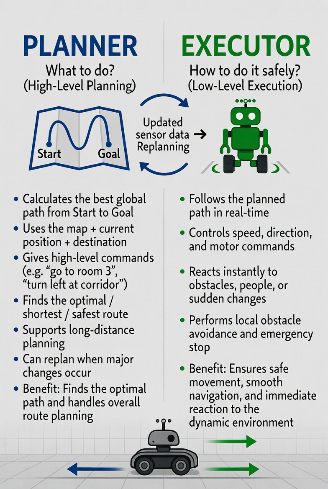
**To allow a robot (or any computer) to plan a path on a map, we first need to simplify the problem and turn it into something that can be solved mathematically.**

## Step 1: Simplify the Map
  **we create a simplified version of the map called the Workspace (also called the Physical Space).**
  In the workspace:
   - White areas = Free space where the robot can move.
   - Black areas = Obstacles that the robot cannot touch.

**This creates a clean, binary (black & white) map that the planner can easily work with.**

**Here’s how a typical workspace looks for an indoor mobile robot:**

  - Obstacles (walls, tables, columns, etc.) are shown in black.
  - Free areas where the robot can drive are shown in white.
  - The planner will then find a safe path through the white areas.

## Step 2: Represent the Robot

We don’t need to model every small part of the robot. Instead, we represent the robot as a simple polygon (or shape) called the **Robot Footprint**.

**The robot footprint is the area that the robot occupies on the map.**

## Why is this important?
**The planner uses the robot’s footprint to make sure the entire robot stays away from obstacles.**
If the planner only thinks about the center of the robot, parts of the robot (like its edges or corners) might still hit a wall or object. Using the footprint prevents collisions.

## Summary (Simple Version):

   **Workspace = Simplified map**
   → Only free space (white) and obstacles (black)
   **Robot Footprint = Simple shape (circle, polygon, etc.) that represents the space the robot occupies**
   **The planner’s job is to find a path in the white area such that the whole footprint of the robot never touches the black obstacles.**

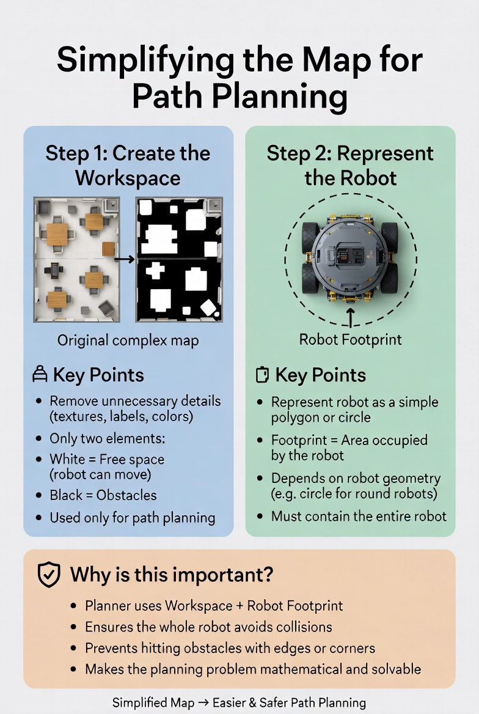

---
---

## From Path Planning to Graph Search

**Using the Configuration Space, we have already made the path planning problem much simpler.**
**So now we work with a special representation (an “artifact”) that shows all possible positions where the robot can be without colliding with any obstacles.**
**This makes the problem much closer to something a computer algorithm can solve.**

## What is Discretization?
**Discretization means converting a continuous space into a discrete (step-by-step) one by taking samples at regular intervals.**

**Why do we need discretization?**
   - A continuous space has infinite possible positions (because space is continuous). Storing infinite positions would require infinite memory — which is impossible.

   **So We select specific points at regular intervals and keep only those points.**
    - The smaller the interval (more samples) → Higher accuracy, but uses more memory and processing power.
    - The larger the interval (fewer samples) → Less memory, but lower accuracy and more approximation errors.

## How do we discretize the Configuration Space?
   - We transform the Configuration Space into a Graph 
   - Graph one of the most powerful and commonly used data structures in computer science.

**What is a Graph?**
A graph is very simple but extremely flexible. It consists of:
   - Vertices (Nodes): Points or positions.
   - Edges: Connections between the vertices or possible movements between those positions.

**We can also assign weights to the edges. These weights can represent:**

   - Distance (in meters or kilometers)
   - Time (in seconds or minutes)
   - Energy consumption
   - Cost
   - any other property we care about

## Final Result:
After discretization, the path planning problem becomes:
**Find a path in the graph from the starting node to the goal node by moving through a series of edges**
**This is now something a computer can easily understand, store in memory, and solve using algorithms**

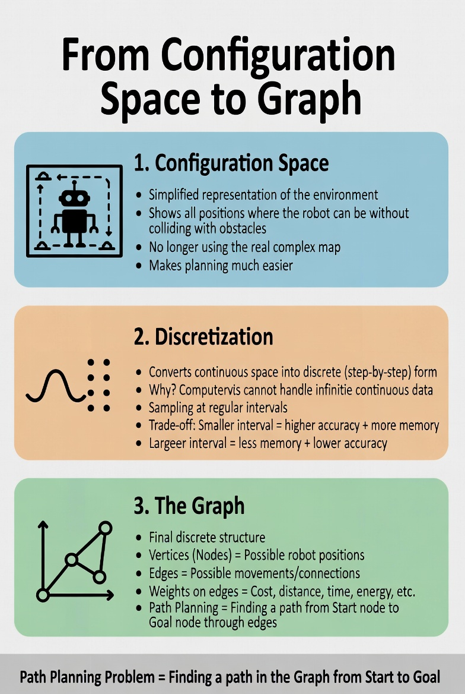

---
---

# Types Of Graph Data Structure 
Now that we know we need a Graph to solve the path planning problem, the next big question is:
**How do we build this graph from the map of the environment?**
  - There are three common algorithms used in mobile robotics to convert the Configuration Space into a graph:
    1. Visibility Graph
    2. Voronoi Diagram
    3. Cell Decomposition

All three have the same goal to create a graph, but they work differently and produce different types of graphs.

## 1. Visibility Graph
   **How it works:**

   - Add nodes for: Start position (A), Goal position (B), and every corner (vertex) of all obstacles.
   - Connect two nodes with an edge only if you can draw a straight line between them without crossing any obstacle.
   - Result: A graph made of straight lines that connect visible points.

   **Limitations:**

   - The path goes very close to obstacles (dangerous for real robots).
   → Solution: grow the obstacles first to add a safety margin.

   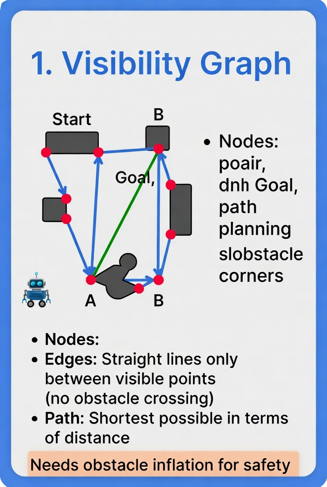
---

## 2. Voronoi Diagram

   **How it works:**
   - It tries to stay as far as possible from all obstacles.
   - For every point in the free space (white area), it calculates the distance to the nearest obstacle.
   - If a point is equidistant from two or more obstacles, it becomes a node.
   - Edges connect these nodes, forming paths that stay in the middle between obstacles.

   **Result: The path is not the shortest, but it is the safest because it maximizes distance from obstacles.**

   **Best use case:**
   - When safety is more important than shortest path.

   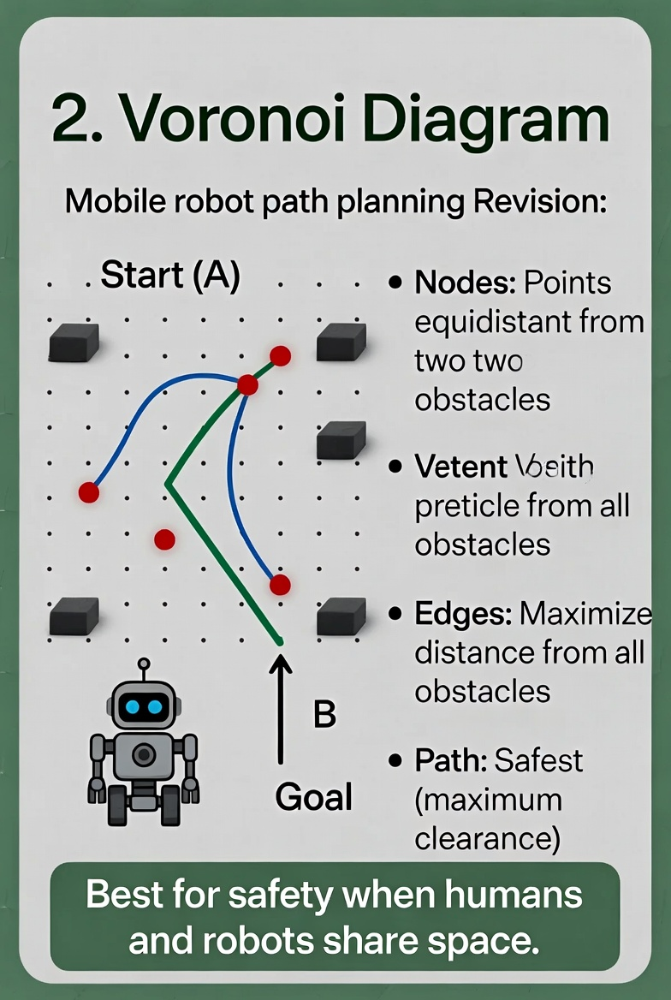
---

## 3. Cell Decomposition (Grid-based)

   **How it works:**
   - Divide the entire environment into small equal-sized cells (like a chessboard or grid).
   - Each cell is marked as:
      - Free (white) → if it has no obstacle
      - Occupied (black) → if it contains an obstacle
   - Assign a node to every free cell.
   - Connect nodes that are next to each other (adjacent cells).

   **Result: The planner finds the shortest path by counting the number of cells.**

  **Advantages:**
   - Very simple to understand and implement.
   - Matches perfectly with Occupancy Grid Maps used in ROS2.

   **Limitations:**
   - Smaller cells = better accuracy, but the graph becomes huge (more memory and slower).
   - Does not scale well for very large environments or 3D maps.

   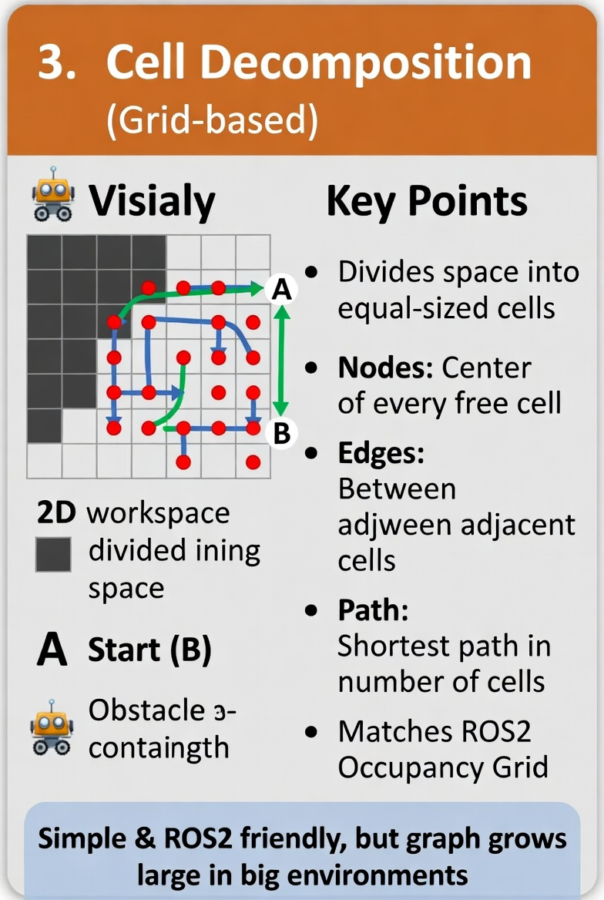

**The course will use Cell Decomposition (the grid method).**
---

## What is Nav2?
**Nav2 (Navigation2) is a complete open-source framework in ROS2.**
Its main goal is to give any robot the ability to navigate autonomously from point A to point B while avoiding obstacles.

   **This is a very complex task. It requires many different modules working together:**
   - Localization: Knowing exactly where the robot is.
   - Mapping: Having a map of the environment.
   - Path Planning: Calculating the best route from A to B.
   - Obstacle Avoidance: Reacting to unexpected objects.
   - Trajectory Following: Making the robot actually follow the planned path.
   - Recovery Behaviors: What to do if the robot gets stuck.

   **Building all of this from scratch would be extremely difficult for one person or even one company.**
---

## The Tool We Will Use: Map Server
we will use one specific tool from the Nav2 stack called Map Server.

**What does Map Server do?**
   - It is a ROS2 node.
   - It reads a map file from the computer’s file system.
   - It publishes this map as an Occupancy Grid message on a ROS2 topic.
   - Other nodes (like path planning or localization) can then subscribe to this message and use the map.

**In short: Map Server loads the map and makes it available to the rest of the navigation system.**

**What We Need to Learn First؟**
   - Before we can properly use the Map Server, we must first understand Lifecycle Nodes in ROS2 and how they work.

   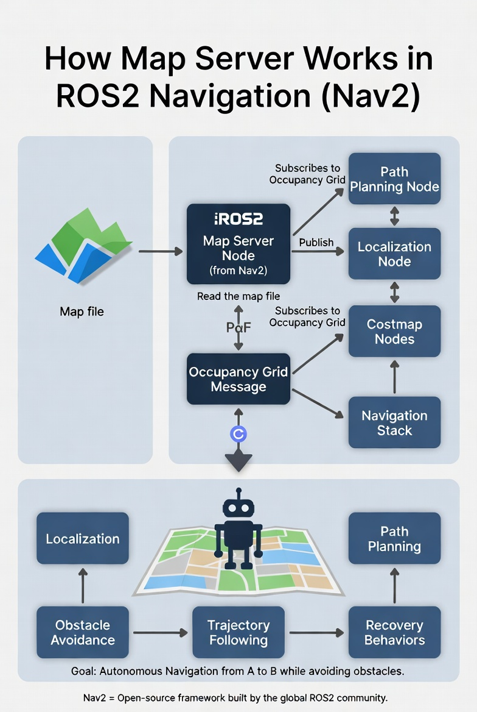   

---

## Lifecycle Nodes
**OS2 introduced Lifecycle Nodes to give developers better control over the node’s behavior and state.**

**A Lifecycle Node works like a state machine. It can only be in one state at a time, and it moves between states using specific transitions.**


## The 4 Main States of a Lifecycle Node:

**1. Unconfigured (Initial State)**
   The node is created but has no configuration yet.
   No resources are allocated.
   - Only two transitions possible:
       * Shutdown → goes to Finalized
       * Configure → goes to Inactive

    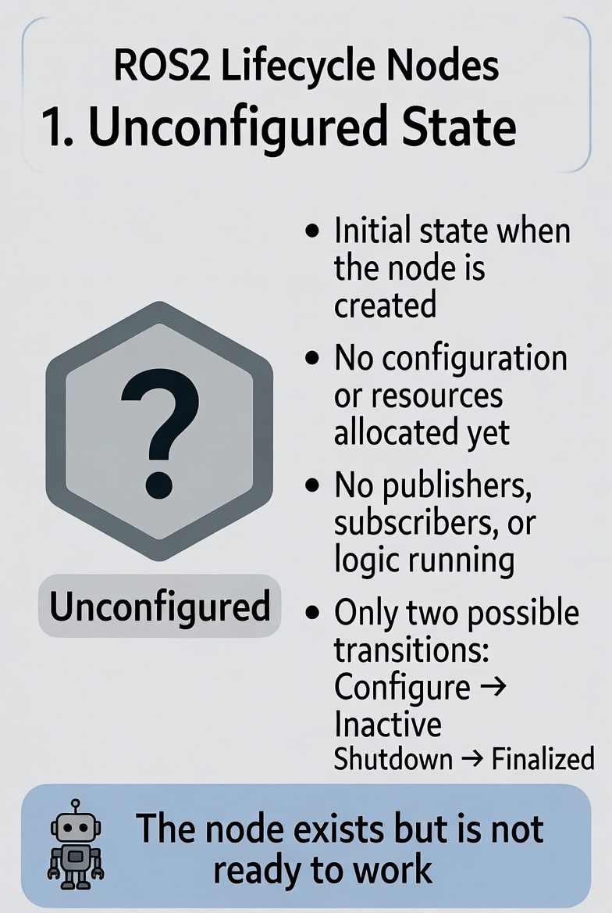  

---

**2. Inactive**
   The node is configured parameters are set, publishers/subscribers are created, but it is not yet running its main logic.
   - Good for reconfiguration without affecting behavior.
   - Transitions:
      * Shutdown → Finalized
      * Cleanup → back to Unconfigured (reset)
      * Activate → Active

   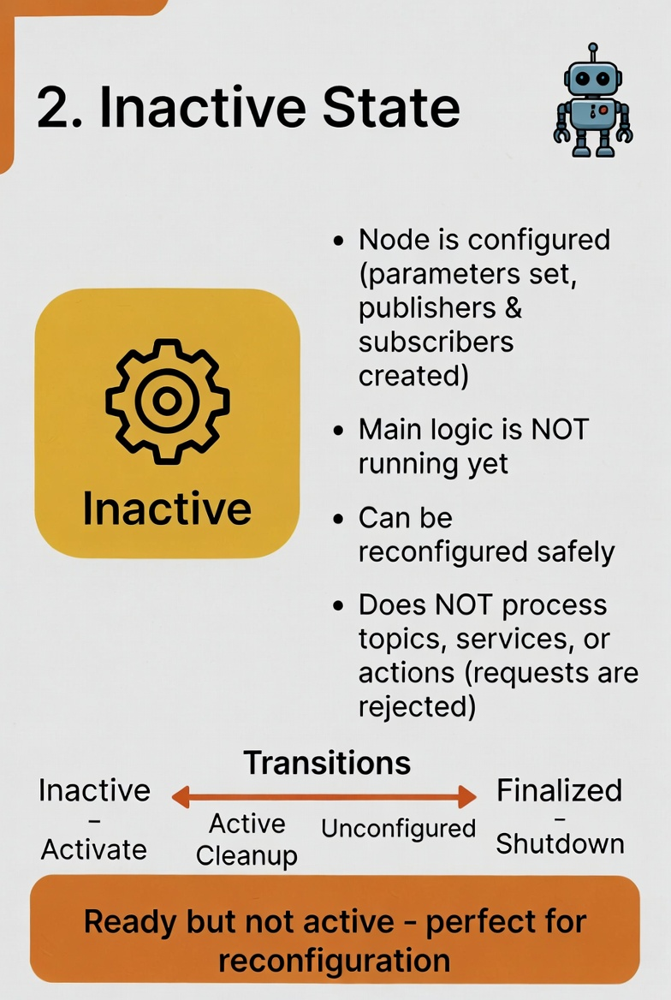 

---

**3. Active state**
   This is where the real work happens.
   - The node processes topics, services, actions, and runs its main logic.
   - Transitions:
     * Deactivate → back to Inactive
     * Shutdown → Finalized

   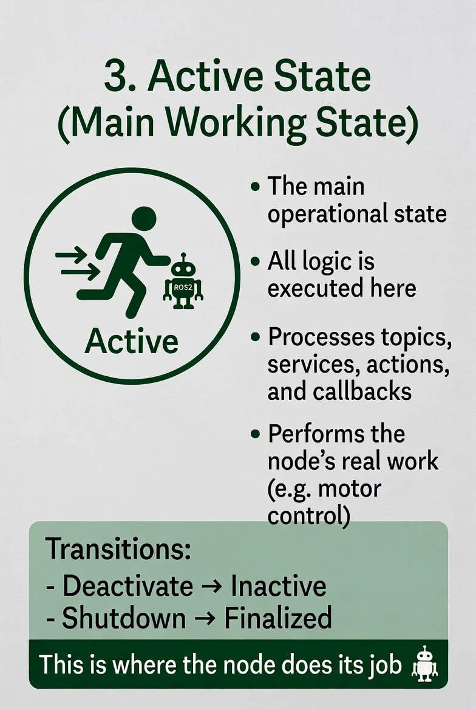 

---

**4. Finalized**
   The node is about to be destroyed.
   - Used mainly for debugging (you can still see the node if it failed).
   - No more operations.

   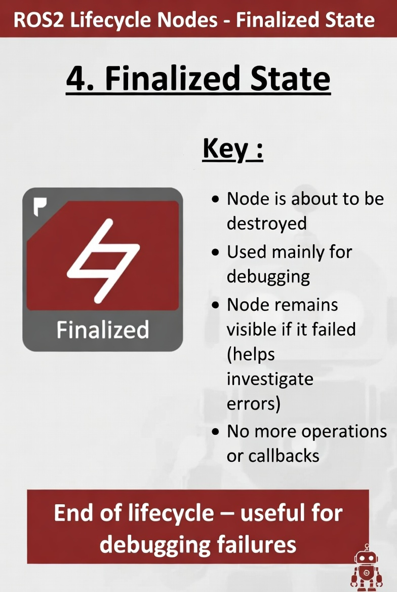

---

## Why Lifecycle Nodes Are Better?
   * You can see and control the current state of the node.
   * You can give feedback to the user (e.g., “Configuring…”, “Starting up…”).
   * You can safely reconfigure the node without restarting everything.
   * Better error handling and debugging.
   * More predictable and manageable behavior — especially important for hardware drivers.

---
---

# Explanation of the Demo (Step by Step)

## 1.Starting the Node
   - They run the simple_lifecycle_node from the My_cpp_example Pkg.
   - At startup, the node does almost nothing — it just initializes as a Lifecycle Node.
   - It starts in the Unconfigured state.
**Command**
```bash
   ros2 run my_cpp_example simple_lifecycle_node
``` 
---

## 2.Checking the Node Status
   **Command1: Shows all lifecycle nodes currently running → only simple_lifecycle_node appears.**
```bash
   ros2 lifecycle nodes
```
   **Command2: Confirms it is in Unconfigured state.**
```bash
   ros2 lifecycle get /simple_lifecycle_node
```
---

## 3.Listing Available Transitions
   **Command: In Unconfigured state → only two transitions are available:**
   - configure (usually transition #1)
   - shutdown (usually transition #7 or similar)
```bash
   ros2 lifecycle list /simple_lifecycle_node
```
---

## 4.Configuring the Node
   **Command: This calls the on_configure() callback inside the node.**
```bash
   ros2 lifecycle set /simple_lifecycle_node configure 1
```
   - After configuration:
      - The node moves to Inactive state.
      - It creates the /chatter topic (you can see it with ros2 topic list).

---

## 5.Testing While Inactive
   **Even though the /chatter topic now exists, publishing messages to it does not trigger any processing.**
   **Reason: The node is in Inactive state → callbacks are not active yet.**

## 6.Activating the Node
   **Command: This calls the on_activate() callback.**
```bash
   ros2 lifecycle set /simple_lifecycle_node activate 3
```
   - Node moves to Active state.
   - Now, when you publish messages to /chatter (using ros2 topic pub), the node receives and prints them.

---

## 7.Shutting Down the Node
   **Command:This calls the on_shutdown() callback.**
```bash
   ros2 lifecycle set /simple_lifecycle_node shutdown 7
```
   - The node moves to Finalized state and is destroyed.
   - The /chatter topic disappears (verified with ros2 topic list).

---

## What is the Map Server and Why Do We Need It?

   **The Map Server is a dedicated ROS 2 node that:**
   1. Loads a pre-created map of the environment from disk.
   2. Converts that map into a standard ROS 2 message type.
   3. Makes the map available to all other nodes in the system.


   **Real-world use cases:**
   1. AMCL (Adaptive Monte Carlo Localization) needs the map to compare laser scans against it.
   2. Nav2 Planner needs the map to find a global path.
   3. Costmap layers need the map to mark permanent obstacles.

   **Without the Map Server, every node would have to load the map file itself — which is inefficient.**

---
## ROS2 Interfaces Provided by the Map Server
   **The Map Server does not just load the map silently — it actively offers three standard ways for other nodes to access it:**
```table
   ------------------------------------------------------------------------------------------------------------------
   Interface Type       Name                 Message/Service Type          Purpose
   ------------------------------------------------------------------------------------------------------------------
   Topic               /map                  nav_msgs/msg/OccupancyGrid    Continuous publishing of the current map.
   Service             /map                  nav_msgs/srv/GetMap           On-demand request for a copy of the map
   Service             /map_server/load_map  nav2_msgs/srv/LoadMap         Dynamically load a different map at runtime
   ------------------------------------------------------------------------------------------------------------------
```

**It is a Lifecycle Node, so you have to configure + activate it before it becomes useful.**
**It supports dynamic map switching via the LoadMap service.**

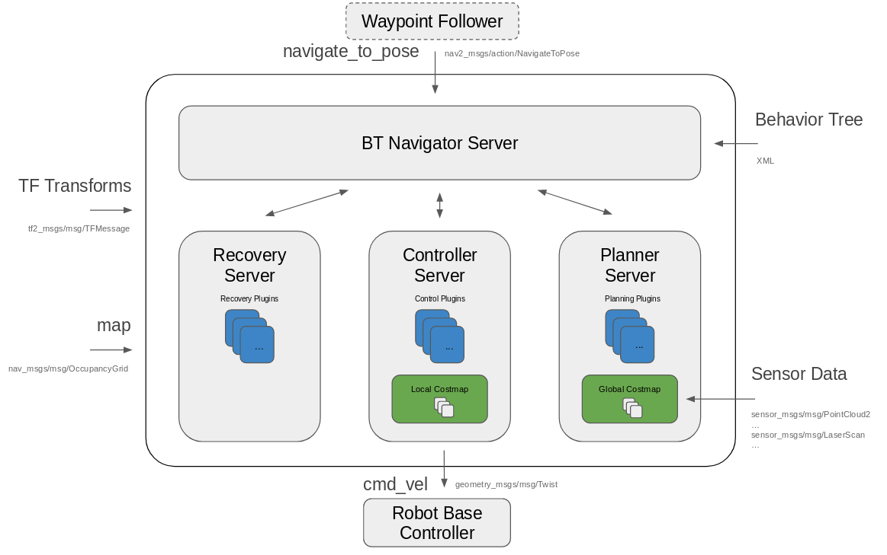

---
---

# Step-by-Step How to Turn on Map_ Server

## 1.Launching the Map Server
   **Command used:**
```bash
ros2 run nav2_map_server map_server --ros-args -p yaml_filename:=/path/to/bumperbot_mapping/maps/small_house/map.yaml
```
## 2. Lifecycle Node Behavior
   **Command used:**
```bash
ros2 lifecycle Nodes
ros2 lifecycle get /map_Server
ros2 lifecycle list /map_Server
ros2 lifecycle set /map Server 1
ros2 lifecycle set /map Server 3
ros2 topic echo /map --once
```

---
---

# Core Problem Being Addressed
**why you sometimes cannot visualize a map published by nav2_map_server in RViz**
**Reason: Incompatibility between the map publisher and the RViz subscriber on the /map topic.**

## What is DDS and Why It Matters in ROS 2

**DDS[Data Distribution Service]: is a communication protocol in Ros2 use for all inter-node messaging**
-It is the "backbone" of ROS 2 — every message exchanged between nodes (applications) on your robot goes through DDS.

**DDS handles:**
   1. Node discovery (finding other nodes automatically).
   2. Message serialization/deserialization
   3. Transport (UDP, shared memory, etc.)
   4. Quality of Service **(QoS) policies** — configurable rules for how messages should be delivered.


## What Are QoS Policies?
**DDS lets you fine-tune communication with several policies**
The most important ones mentioned:
   **1. Reliability**
   - 
      - Reliable: Guarantees delivery (like TCP)
        - The publisher will retry until the subscriber acknowledges receipt.
        - No losses allowed.

      - Best Effort:Sends once (like UDP).
        - Faster.
        -  messages can be lost if the network is congested or unreliable.

   **2. Durability (very relevant for maps)**
   - 
      - Volatile: Only new messages after the subscriber connects.
        - Late-joining subscribers get nothing from the past.

      - Transient Local:The publisher keeps a history of messages and sends them to late-joining subscribers.
        - if RViz starts after the map_server.

**To connect to different DDS implementations (Fast DDS, Cyclone DDS, RTI Connext, etc.), ROS 2 uses RMW (ROS Middleware Interface).**

- As developers, we usually write code in Python (rclpy) or C++ (rclcpp). These libraries talk to the RCL, which then talks to DDS via RMW.

## The actual problem (the core reason you couldn't see the map)
**QoS incompatibility happens when the publisher and the subscriber request incompatible QoS settings**
**Rule: The subscriber’s requested QoS must be equal or weaker than what the publisher offers.**

## How to check/fix it?
  **Common fix for map visualization:**
  1. Force RViz to use a compatible QoS (e.g., sensor_data or transient_local + Best Effort).
  Or
  2. configure the map_server to publish with stronger QoS (Reliable + Transient Local is often used for maps/    occupancy grids).

  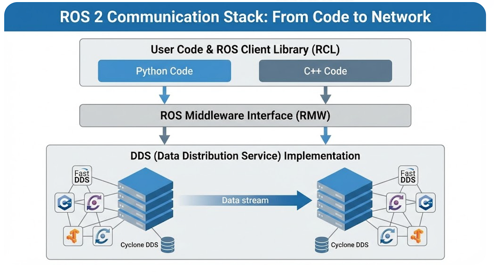
---
## Simple Way Two Create Two Nodes Depends on QOS
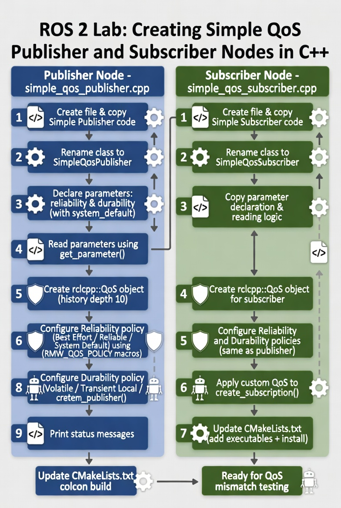

---

## Summary For This Part 

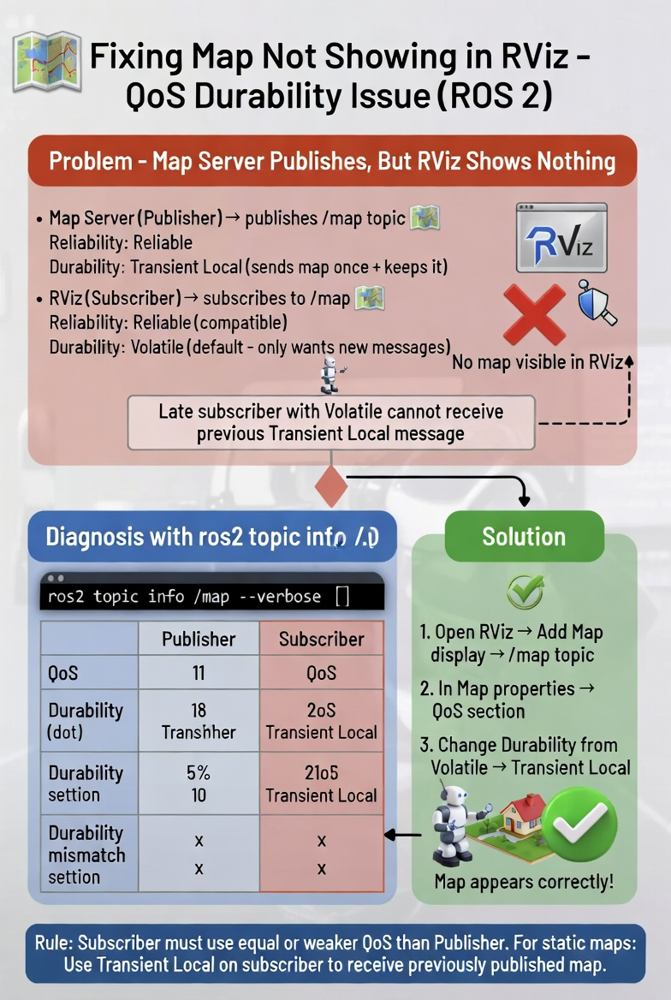

---
---

# Path Planning as Graph Search..

**The goal is to find the best path — an optimal sequence of nodes that connects the start position to the goal position.**

## The Key Concept: “Best Path”
   **Common criteria in robotics:**
   1. Shortest distance (minimize travel length).
   2. Shortest time (minimize execution time).
   3. Lowest energy / fuel consumption.
   4. Highest coverage (e.g., cleaning robot).
   5. Maximum safety (maximize distance from people or dynamic obstacles).
---

**Algorithms You Will Study & Implement**
   - Breadth-First Search (BFS).
   - Depth-First Search (DFS).
   - Dijkstra’s Algorithm.
   - A (A-Star).

---
---

# 1.Breadth-First Search (BFS) [Qeue]
**BFS is one of the two fundamental ways to traverse (or search) a graph.**

**It is called“breadth-first”because it explores the graph layer by layer, horizontally, before moving deeper,vertically**

**This behaviour comes directly from using a queue (FIFO = First-In, First-Out).**

## Core Idea

   - Start at a source node.
   - Put it in a queue.
   - While the queue is not empty:
      - Take the node at the front of the queue (this is the next node to visit).
      - Mark it as visited (so we never process it again).
      - Add all its unvisited neighbours to the back of the queue.

   - Because of the queue, nodes at the same “distance” (same level) are always processed before nodes that are farther away.

---

## Why BFS Finds the Shortest Path?
   - Because it explores level by level, the first time any node is dequeued, it must have been reached via the smallest possible number of edges.

## What Happens When Edges Have Different Costs[weights]?
   - BFS has no knowledge of weights. It only cares about the number of edges.

   **Therefore, in weighted graphs you must use Dijkstra’s algorithm (or A* if you have a heuristic) instead of plain BFS.**
---

## Common Real-World Uses of BFS:
   1. Finding shortest path in unweighted graphs.
   2. Social networks: “friends of friends” (distance-2 suggestions).
   3. Web crawlers / search engines.
   4. Finding the minimum number of moves in puzzles .
   5. Level-order traversal of trees (a special case of graphs).

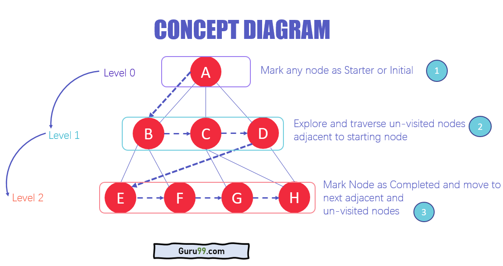  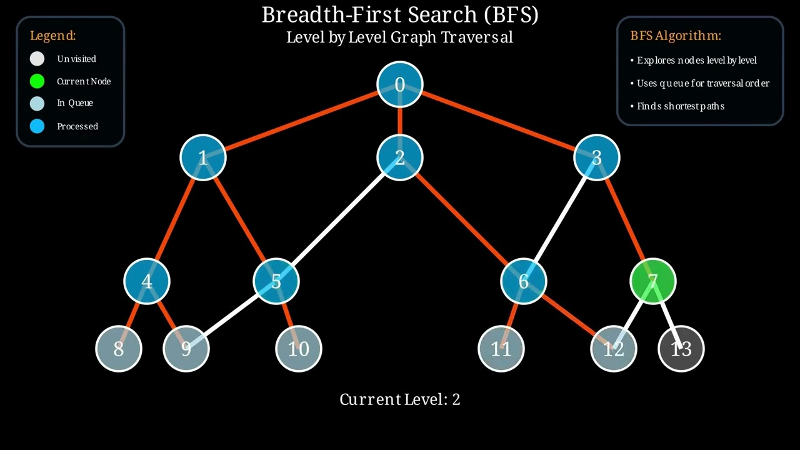

---
---

# 2.Depth first Search (DFS) [Stack]
**DFS is the other fundamental graph traversal algorithm.**

**While BFS explores horizontally, DFS explores vertically (as deep as possible along one path before backtracking).**

**DFS uses a stack (Last-In, First-Out → LIFO)**
---

## Core Idea:
   - Start at node A.
   - Push it onto the stack.
   - While the stack is not empty:
      - Pop the node from the top of the stack (this is the next node to visit).
      - Mark it as visited.
      - Push all its unvisited neighbors onto the stack.
      - The algorithm goes as far as possible down one path until it reaches a dead end, then backtracks (pops) to try another branch.

---

## Properties of the Path Found by DFS:
   - DFS finds a path, but not necessarily the shortest (in number of edges or total cost).
   - t stops at the first valid path it discovers — it does not explore all possibilities.
---

## BFS vs DFS – Quick Comparison Table
```table
------------------------------------------------------------------------------------------------------------------
Feature                    BFS (Queue)                            DFS (Stack)
------------------------------------------------------------------------------------------------------------------
Exploration order          Level by level (horizontal)            Deep along one path first (vertical)
Data structure             Queue (FIFO)                           Stack (LIFO)
Guarantees shortest path?  Yes (in unweighted graphs)              No
Memory usage               Higher (stores wide levels)            Usually lower
Good for                   "Shortest path closest nodes"          "Path existence, maze solving, topology"
Stops at first solution    Yes                                    Yes
------------------------------------------------------------------------------------------------------------------
```

---

## . Common Real-World Uses of DFS:
   1. Maze solving (going deep until you hit a wall, then backtrack).
   2. Detecting cycles in graphs.
   3. Topological sorting (course prerequisites).
   4. Finding connected components.
   5. Solving puzzles or games that need to explore all possibilities.

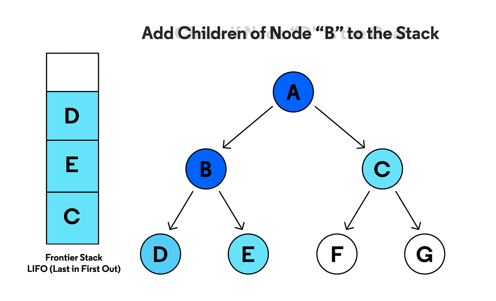  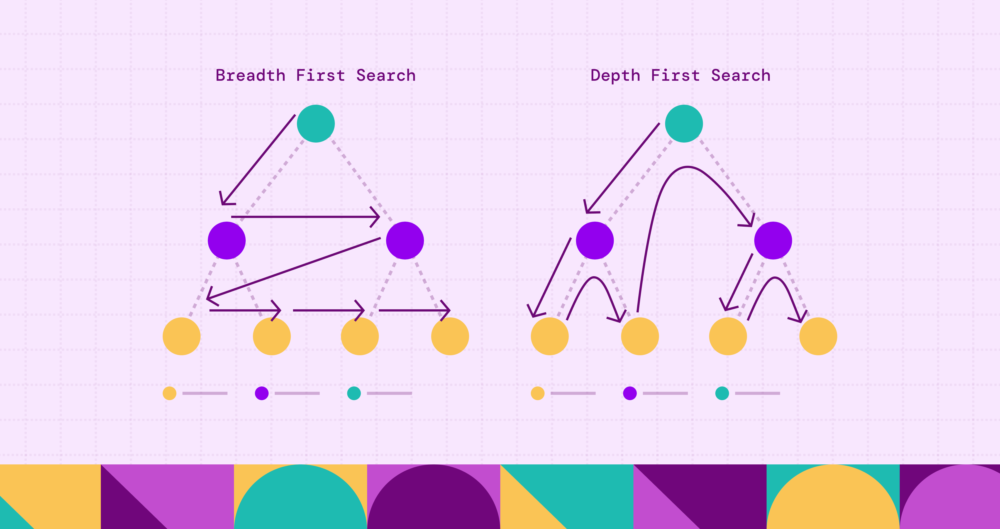

---
---

# 3.Dijkstra's Algorithm – The "Holy Grail" of Graph Search
**Dijkstra's algorithm is widely considered the gold standard for finding the shortest path in a graph with non-negative edge weights (costs).**
**The goal is still to go from A to I, but this time we want the cheapest path, not just the one with the fewest hops.**
---

## Key Data Structure: Priority Queue
   - FS uses a normal queue (FIFO – First In, First Out).
   - DFS uses a stack (LIFO – Last In, First Out).
   - Dijkstra uses a priority queue (also called a min-heap).

**In a priority queue, nodes are automatically reordered so the one with the smallest current total cost from the start is always at the front**

---

## Important Properties:
   1. It works only with non-negative edge weights (no negative costs).
   2. It is a greedy algorithm: it makes the locally best choice at each step.
   3. When all edge weights are equal to 1, Dijkstra behaves exactly like BFS.

---

## Detailed Step-by-Step Walkthrough:

  **1. Initialization**
   - Start at node A with cost = 0.
   - Put (A, 0) into the priority queue.
   - All other nodes start with distance = infinity (unknown).

   **2. Visit A (cost 0)**
    - Mark A as visited (its distance is finalized).
    - Look at its neighbors: B, C, D.
    - Add them to the priority queue with their cumulative costs from A:
      - B with its edge cost from A (lowest among the three).
      - D with its edge cost.
      - C with the highest edge cost from A.

   **3. Next: Visit the cheapest so far → Node B**
     - B has the smallest total cost so far.
     - Mark B visited.
     - Its only neighbor is E.
     - Calculate total cost to E = cost to B + edge B→E (script says total = 7).
     - Add (E, 7) to the priority queue.

   **4. Next: Visit D (now the cheapest in the queue)**
     - Mark D visited.
     - Neighbor: G.
     - Total cost to G = cost to D + edge D→G = 6.
     - Add (G, 6) to the queue.

   **5. Next: Visit C**
     - Mark C visited.
     - Neighbor: F.
     - Total cost to F via C = 11.
     - Add (F, 11).

   **6. Next: Visit G (cost 6)**
     - Mark G visited.
     - Neighbor: F (with a cheap edge cost of 1).
     - New total cost to F via G = cost to G + 1 = 7.
     - This is better than the previous 11 via C, so update F's distance to 7 and re-insert the improved (F, 7) into the priority queue.

   **7. Next: Visit E (cost 7)**
     - No new neighbors → just mark visited and remove.

   **8. Next: Visit the improved F (now cost 7)**
     - Mark F visited (with final low cost).
     - Neighbor: H with edge cost 3.
     - Total to H = 7 + 3 = 10.
     - Add (H, 10) — it becomes the new cheapest.

   --9. Next: Visit H (cost 10)**
     - Neighbor: I (destination).
     - Total cost to I via H = 10 + edge H→I.
     - Since I is the goal and we reached it with the current lowest-cost frontier, this is the optimal path.

---
```table
----------------------------------------------------------------------------------------------------------------------------------------------------------
Algorithm       Data Structure       Considers Edge Weights?        Guarantees ShortPath?                            Best For
----------------------------------------------------------------------------------------------------------------------------------------------------------
BFS             Queue (FIFO)         No (assumes all = 1)           "Yes, in unweighted or unit-weight graphs"       Minimum hops / levels
DFS             Stack (LIFO)         No                             No,"Just finding any path                        backtracking"
Dijkstra        Priority Queue       Yes                            Yes (lowest total cost),"Real-world weighted     shortest paths (GPS, networks, etc.)"
----------------------------------------------------------------------------------------------------------------------------------------------------------
```

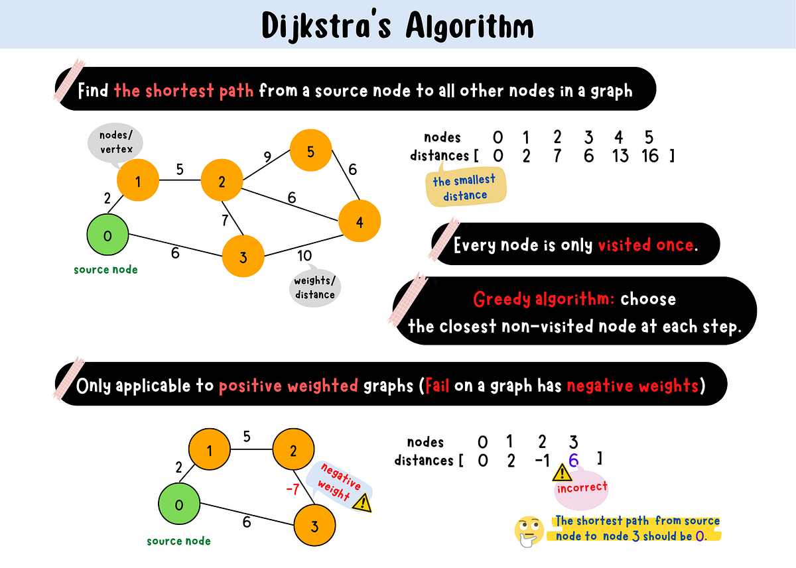 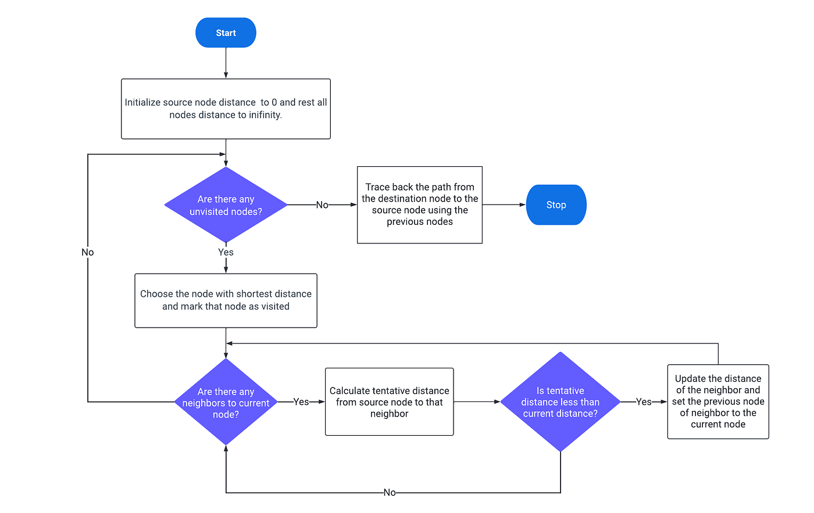 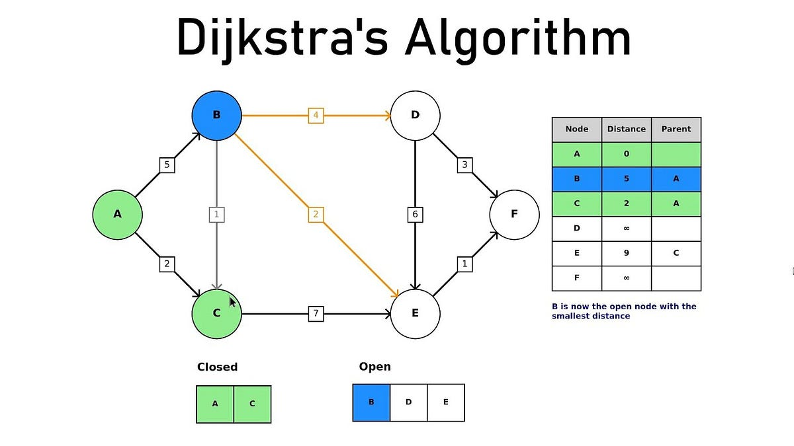

---
---

# A Star Algorthim

**he A* (A-star) algorithm is the backbone of modern robotic navigation, especially in ROS 2**

**A* is "informed"—it uses a compass to head toward the goal, making it significantly faster for a patrolling robot or an autonomous vehicle.**

## 1.The Core Equation
**he secret to A* is how it calculates the "cost" of moving to a specific node. It uses a combined value, f(n), to decide which path to explore next:**
   - f(n)=g(n)+h(n)

   - g(n) (The Past Cost): The actual cost (distance, time, or battery) it took to get from the starting point to the current node.

   - h(n) (Future Cost): An educated guess of the remaining distance to the goal.

**By combining these, A* prioritizes nodes that are both cheap to reach and look like they are heading in the right direction.**

---

## 2.Choosing a Heuristic: Euclidean vs. Manhattan

**The "guess" (h(n)) needs to be calculated mathematically. The two most common methods are:**

   **Euclidean Distance**
   - t uses the Pythagorean theorem to find the straight-line distance between two points (x1​,y1​) and (x2​,y2​):
   - d=rout((x2​−x1​)2+(y2​−y1​)2​)
   - Best for: Robots that can move in any direction (omnidirectional) or at any angle.

   **Manhattan Distance**
   - This calculates the distance as if you were walking on a city grid (only moving up, down, left, or right).
   - d=∣x2​−x1​∣+∣y2​−y1​∣
   - Best for: Robots restricted to grid-based movement (common in many ROS 2 costmap configurations).

---

## 3. The "Admissible" Rule

**For A* to work correctly, the heuristic must be admissible. This means it must never overestimate the actual cost.**
   - If your guess is too "optimistic" (underestimating), A* will eventually find the shortest path.
   - f your guess is too "pessimistic" (overestimating), the algorithm might skip the best path because it thought it looked too expensive.

---

## 4. How the Algorithm Operates

   1. Start: Put the starting node in the queue.

   2. Evaluate: Pick the node with the lowest f(n).
   
   3. Expand: Look at its neighbors. Calculate their g(n) and h(n).
    
   4. Update: If a neighbor hasn't been visited, or if you found a cheaper way to get to it, put it in the queue.
   
   5. Repeat: Do this until you reach the goal node.

---

## 5. A* in ROS 2 (Nav2)
```table
Feature              Dijkstra                            A*
Speed                Slower (Explores everywhere)        Faster (Directional)
Optimality           Always finds the shortest path      Finds shortest path if heuristic is admissible
Resource Usage       High Memory/CPU                     Lower Memory/CPU
```

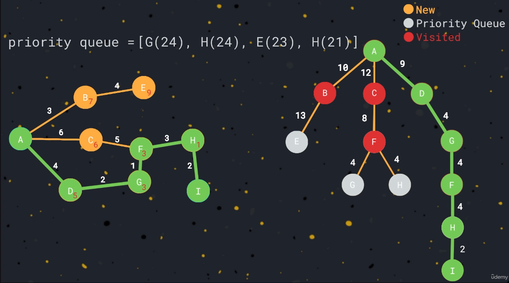  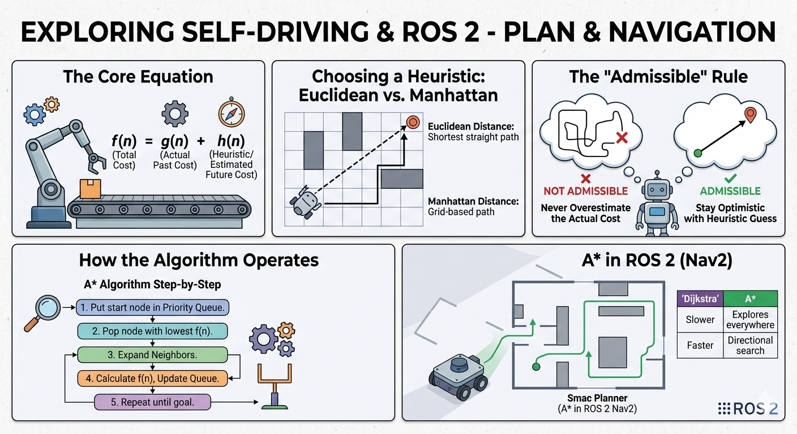

---
---