# Motion Planning

**The relationship between Path Planning and Motion Planning as the difference between a GPS Map and a Driver’s Reflexes.**

**The GPS gives you the route (the path), but the driver turns the wheel to avoid a sudden pothole or a pedestrian (the motion).**

## The Two-Loop System
**The process is split into two distinct cycles that work at different speeds to balance "thinking" and "reacting."**

**1. The Inner Loop: The Motion Planner (The "Reflex")**
  - Frequency: Fast (10–100+ times per second).
  - Role: This is the Executor. It doesn't care about the final destination miles away; it only cares about the next few meters.
  - Data Source: Uses real-time sensors (LiDAR, Cameras, Ultrasound).
  - Function: It adjusts the robot's velocity and steering angle to stay on the path while dodging things the map didn't know about—like a person walking by or a chair that someone moved.

**2. The Outer Loop: The Path Planner (The "Strategist")**
   - Frequency: Slower (a few times per second).
   - Role: This is the Global Planner. It looks at the big picture and the entire map.
   - Data Source: Uses a static map (the "snapshot") updated with information fed back from the sensors.
   - Function: If the Motion Planner realizes a hallway is completely blocked by a new wall, it tells the Path Planner: "Hey, the old route is impossible." The Path Planner then crunches the numbers to find a brand-new route to the goal.

---

##  Key Challenges Addressed

``` table 
---------------------------------------------------------------------------------------------------------------------
Challenge           Why it happens                                         How the system fixes it
---------------------------------------------------------------------------------------------------------------------
Dynamic Obstacles   People, pets, or other robots are moving.           "The Motion Planner reacts instantly to "    "swerve" around them.
---------------------------------------------------------------------------------------------------------------------
Outdated Maps       Environments change(a new pallet in a warehouse)    "The Path Planner recalculates a new global route once the sensors see the change.
---------------------------------------------------------------------------------------------------------------------
```

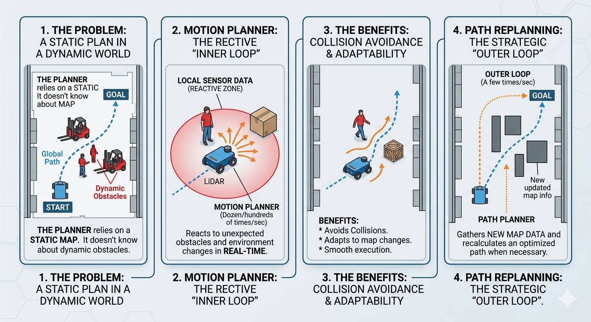

---
# The gap between high-level path planning and the low-level physics of moving a robot.

## 1. The Inputs and Outputs (The Interface)
**To build a motion planner, you must first understand what data flows in and out of it.**

   - The Goal (Input): The Path provided by the global planner.
      - Think of this as a series of (x,y) coordinates (waypoints) that lead to the final destination.

   - The Feedback (Input): The Current Position, derived from Odometry (wheel encoders) and Localization (SLAM, AMCL, or GPS).

   - The Command (Output): A Velocity Command. In ROS 2, this is typically a geometry_msgs/msg/Twist message containing:

       - Linear Velocity (v): How fast to move forward/backward.

       - Angular Velocity (ω): How fast to turn.

---

## 2.The Core Logic: Error Minimization
**The motion planner acts as a "bridge" between where the robot is and where the path says it should be.**

   - **Comparison**: The algorithm looks at the robot's current coordinates and the next point on the planned path.
   - **The Error** : It calculates the distance and angle difference (the error) between these two points.
   - **Correction**: It generates a velocity command specifically designed to reduce that error.
       - If the robot is too far to the left of the path, the planner commands a right turn.
       - If the robot is far from the next waypoint, it increases linear speed.

---

## 3. Dealing with "Real World" Imperfections
**Execution Error**: Motors aren't perfect, and wheels can slip on the floor. If you tell a robot to move 1 meter, it might actually move 0.98 meters!?

**The Solution**: This is why the loop runs hundreds of times per second (Hz). Because it constantly recalculates based on the actual position rather than just assuming the command was executed perfectly, it can "fix" its own mistakes in real-time.

**Why call it a Controller?**
   > In the ROS 2 Navigation Stack (Nav2), the "Motion Planner" is explicitly called the Controller Server. Its job is to "control" the robot so it sticks to the path while reacting to dynamic obstacles (like a person walking by) using local sensors like LiDAR.

---


```table
---------------------------------------------------------------------------------------------------
Feature     Path Planner (Global)                   Motion Planner (Local/Controller)
---------------------------------------------------------------------------------------------------
Goal        Find a valid route to the destination.  Follow the route and avoid collisions.
---------------------------------------------------------------------------------------------------
Output      A list of waypoints (The Path).         "Velocity commands (v,ω)."
---------------------------------------------------------------------------------------------------
Speed       Slow (once or every few seconds).       Fast (20Hz - 100Hz).
---------------------------------------------------------------------------------------------------
Awareness   Knows the static map.                   Knows the robot's immediate surroundings.
---------------------------------------------------------------------------------------------------

```

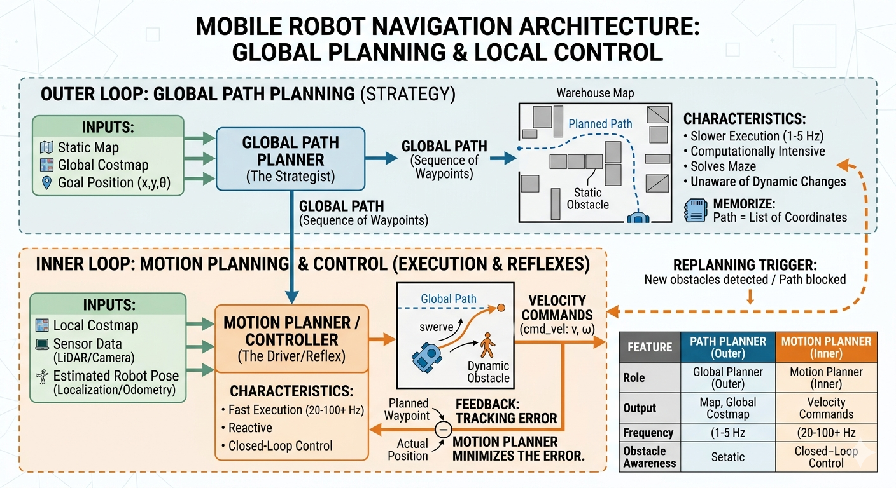

---
---

# Path Tracking - Trajectory tracking
**It shows why the same algorithms can be used for both planning a route and controlling the robot to stay on that route**

## 1. Why can we use the same algorithms for motion planning and control?

   **- Motion planners calculate where the robot should go**

  **- Controllers calculate how the robot should move (velocity commands: linear speed + angular speed) to actually reach those points.**

**ANS: Because you use The very first algorithm [PID](Proportional-Integral-Derivative), which comes straight from control theory.**
**When used for navigation, the PID becomes a path tracker — it constantly steers the robot so it hugs the path the planner just calculated.**

---

## WHat is The Path Tracking?
**It’s basically the same as a line-following robot (but invisible)**

   **The path-tracking algorithm in this course works exactly the same way, except:**
   - Instead of a visible black line → you use the virtual path calculated by the motion planner.
   - The “line” is invisible (just data in memory), but the control math is identical. 

---

## How the path-tracking algorithm actually works
**Imagine a robot moving on a flat plane, We use a global reference frame (fixed X-Y coordinates on the map).**

  **1. Look ahead on the path**
  - The planner has already given us a full path (a list of points).
  - The tracker picks a single point P on that path that is:
    - In the direction of the final goal
    - Exactly a fixed look-ahead distance ahead of the robot
    - This point P has coordinates (xₚ, yₚ) in the global frame.

   **2. Calculate the error**
   - robot’s current pose: (x, y, θ)
   - Desired point: (xₚ, yₚ)
   - The tracker computes three error components:
     - Longitudinal error (along the robot’s forward axis, usually X in robot frame)
     - Lateral error (sideways offset, usually Y in robot frame)
     - Orientation (heading) error (difference between robot’s current θ and the direction toward P)
  
  **3. PID computes velocity commands**
   - The PID controller takes those three errors and outputs:
     - v = linear velocity (forward/backward speed)
     - ω = angular velocity (turning speed)

  **4. Robot moves & loop repeats**
   - The velocity command is sent to the robot (in ROS 2 this usually goes to the /cmd_vel topic).
   - The robot moves a tiny bit.
   - Then the whole process repeats: new position → new point P ahead on the path → new errors → new velocities.

---

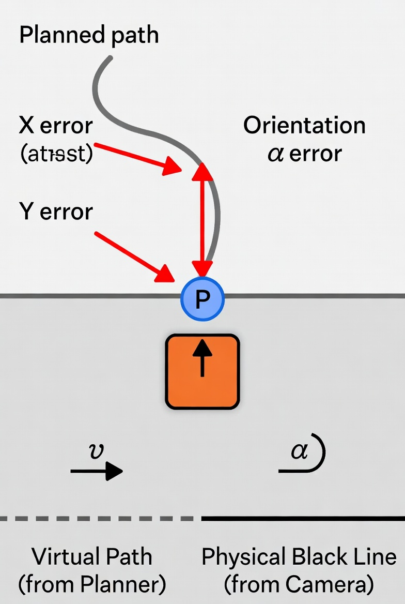 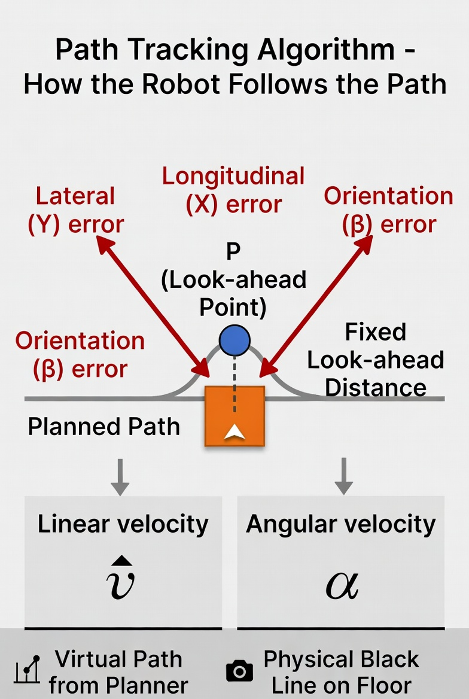

---
---

# Using PID Controller for Path Tracking

**how the path tracking algorithm actually works!?**
**Ans: by using the PID controller from control theory to minimize the error between the robot’s current position/orientation and the desired look-ahead point P on the planned path.**

**PID is the core “brain” that turns the calculated errors (X, Y, and θ) into proper velocity commands (linear speed v and angular speed ω).**

---

## Why PID is Called the “Holy Grail” of Control!?
   - Extremely flexible and easy to implement
   - Used everywhere: line-following robots, motor speed control, self-balancing robots, cruise control in cars, thermostats, hydraulic systems, even rocket tracking
   - In previous course, you already used PID to control motors with Arduino
   - Now you will reuse it in ROS 2 to make the robot follow a planned path smoothl

---

## Basic Idea of PID
**Goal: Control one motor to reach and maintain a desired speed (e.g., 1 rad/s).**

   **- Key Variables:**
   - r(t) = Setpoint (desired speed) → what we want
   - y(t) = Current speed (measured by encoders) → what we have now
   - e(t) = Error = r(t) − y(t) → how far we are from the target
   - u(t) = Control command (e.g., motor power from 0 to 255) → what we send to the motor

   **How PID works in practice!?**
   - Motor is stopped (y = 0), desired speed = 1 → Error e = 1 → PID sends maximum command (255) → motor accelerates fast.
   - Speed becomes 0.5 → Error e = 0.5 → PID reduces command → motor accelerates more gently.
   - Speed becomes 0.8 → Error e = 0.2 → PID reduces command even more → smooth approach.
   - Speed reaches 1.0 → Error e = 0 → PID keeps sending a small constant command to maintain speed (especially if load changes).

**The controller runs continuously in a loop, constantly recalculating the error and adjusting the command so the system reaches the target quickly without overshooting.**

---

## The Three Parts of PID
```table
-----------------------------------------------------------------------------------------------------------------------------------
Component   What it looks at        What it does                                    Role in minimizing error
-----------------------------------------------------------------------------------------------------------------------------------
P           Present (current)       Proportional to current error                   Reacts immediately to big errors
-----------------------------------------------------------------------------------------------------------------------------------
I           Past                    Integral = sum of all past errors over time     Eliminates steady-state (lingering) error
-----------------------------------------------------------------------------------------------------------------------------------
D           Future                  Derivative = rate of change of error            Predicts and dampens overshoot
-----------------------------------------------------------------------------------------------------------------------------------
```

**Mathematical Equation**
   **- u(t) = Kp × e(t) + Ki × ∫e(t) dt + Kd × (de/dt)**
   - Kp = Proportional gain (how strongly to react to current error)
   - Ki = Integral gain (how strongly to correct accumulated past errors)
   - Kd = Derivative gain (how strongly to react to how fast the error is changing)

---

## Quick Memorization Summary

**Calculate Errors**
   → Difference between robot and look-ahead point P (X, Y, θ)

**Feed errors into PID**
   u = Kp·e + Ki·∫e + Kd·(de/dt)

**PID outputs velocity commands**
   → v and ω sent to robot

**Robot moves → new position → new errors**
   → Loop repeats at high frequency

---

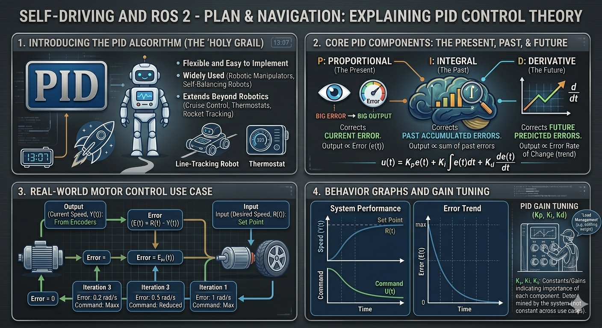

---
---

# Robot Localizaton and Referance Frame

**What is the robot Localization!?**
   - Robot localization is the ability of a robot to determine its own position and orientation (its pose) within a given reference frame.
   - "Where am I, and in which direction am I facing?" — relative to some fixed coordinate system.

## 2. Two Key Actors in Localization:
   **- A. Reference Frame**
   - A reference frame is a fixed coordinate system defined by:
      - An origin (the point (0,0) — the "zero" point)
      - Directions (usually x-axis and y-axis)

   **We can create many different reference frames — some global, some local, some very specific to a room or a map.**

   **B. Robot's Pose**
   - The pose describes where the robot is and how it is oriented.
   - For a robot moving on a flat surface (2D environment, like a self-driving car or warehouse robot), the pose is defined by three values:
      - x: position along the x-axis
      - y: position along the y-axis
      - θ (theta): orientation angle (how much the robot is rotated relative to the x-axis)

   **his is often written as a vector:**
   Pose = [x, y, θ]

---
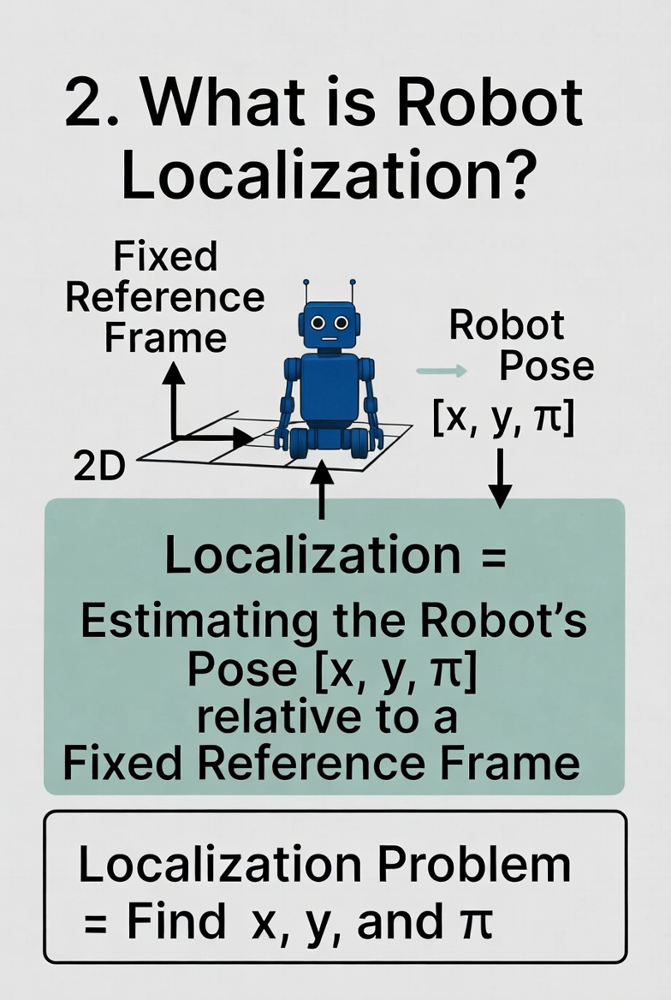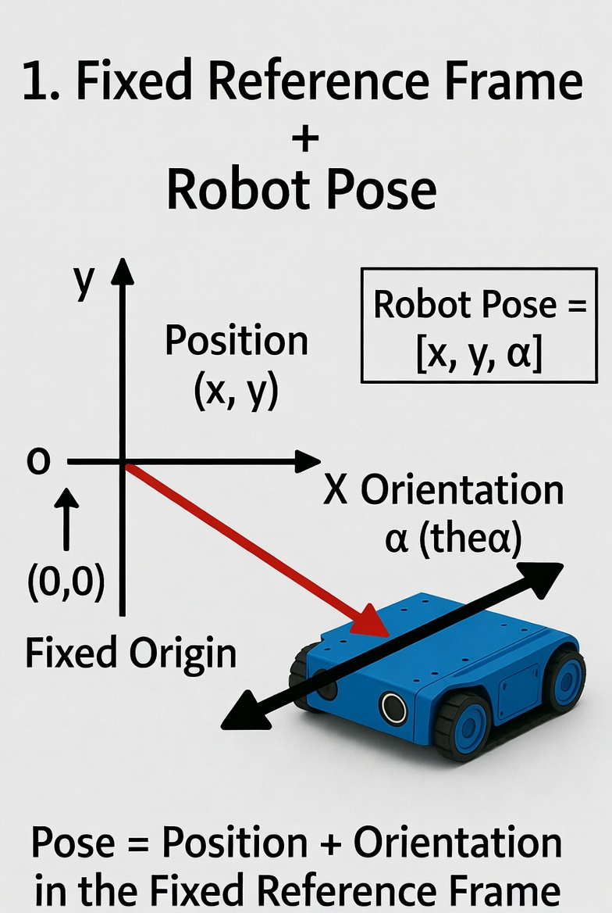

---
---
# Standard Reference Frames in Robotics

**In robotics, especially in ROS 2 for navigation and self-driving systems, we don’t use just one reference frame. Instead, we use three important reference frames that everyone must follow by convention.**

## The Three Standard Reference Frames

**1. Map Frame (Global & Fixed)**
   - This is the fixed reference frame in the world.
   - It never moves.
   - It represents a stable, permanent coordinate system (like the Earth’s geographical coordinates).
   - Where you place the origin (0,0) doesn’t really matter, but once fixed, it must never change.
   - In self-driving cars or warehouse robots, this frame usually comes from a pre-built map of the environment.

**2. Odom Frame (Odometry – Starting Point)**
   - Short for Odometry.
   - This frame is created at the moment the robot is turned on.
   - It marks the initial position and orientation of the robot when it starts moving.
   - It is also fixed after startup, but it is not the same as the Map frame.
   - It helps track how far the robot has traveled using wheel encoders or other motion sensors.

**3. Base Link Frame (Robot’s Body)**
   - This is a moving reference frame that is physically attached to the robot.
   - It moves and rotates exactly with the robot.
   - Usually placed at the center of the robot (center of rotation).
   - This frame represents "where the robot is right now" from its own perspective.

---

## Why These Three Frames Matter

**Specifically, we need to continuously calculate:**

  - How the Base Link (robot) is positioned relative to the Odom frame.
  - How the Odom frame relates to the Map frame.

**This allows the robot to know:**

   - Its exact position on the fixed map (Map → Base Link)
   - How much it has moved since startup (Odom → Base Link)

**Localization = Continuously calculating the transformations between:**
    **Map → Odom → Base Link**

---

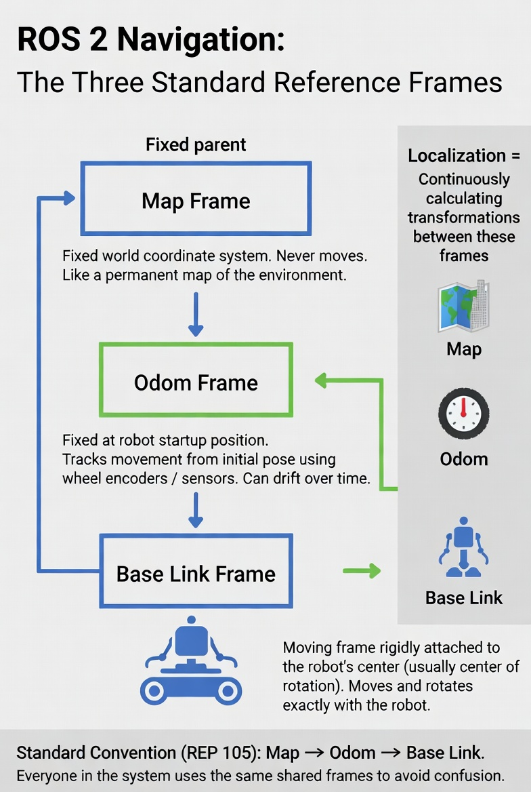

---
---

## Why we need a naming convention for reference frames in ROS 2:
**ROS 2 is built on open-source collaboration — many independent teams contribute different robotic capabilities (navigation, perception, manipulation, etc.).**

**For these modules to work together, they must share the same language about positions and locations.**

**Without a common convention, coordinates from one module (e.g., “human at 3,7”) become meaningless to another module.**

**So, A shared standard (like the Map → Odom → Base Link convention) acts as a common language, allowing different software to combine and create complex, useful applications.**

---
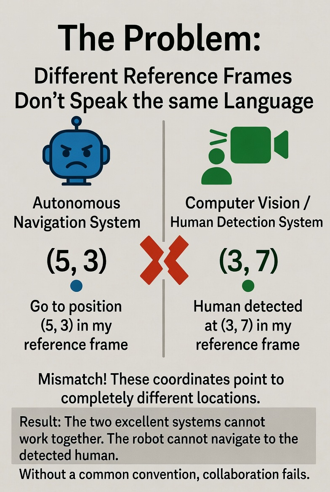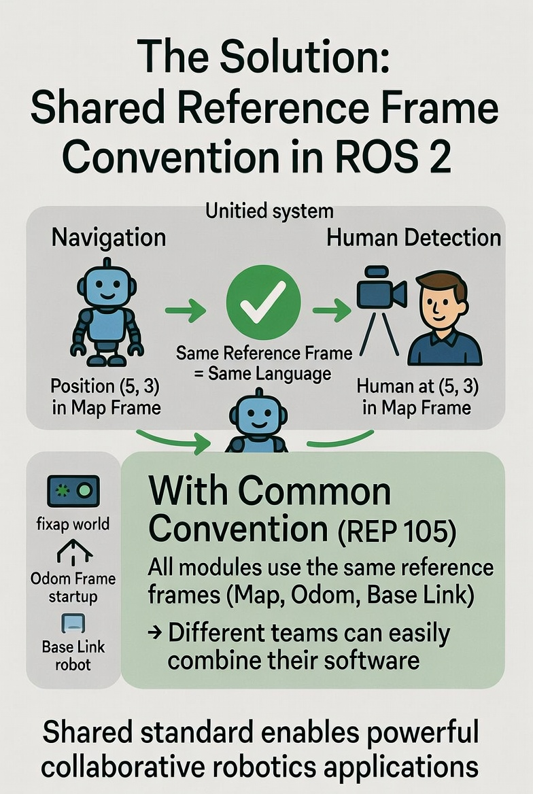
---
---

## Mathematical Representation of a Mobile Robot’s Pose in 2D

**What is the Pose of the Robot?**
   - The pose of the robot is simply the position and orientation of the Robot Frame (R) with respect to the fixed World Frame (W).
   - To fully describe the pose in 2D, we only need three numbers:

      - x → horizontal position of the robot’s center relative to the world origin
      - y → vertical position of the robot’s center relative to the world origin
      - θ (theta) → orientation angle (how much the robot is rotated relative to the world x-axis)

   - So the robot’s pose is represented as:
      - Pose = (x, y, θ)

**Even though the pose has three values, we can split the problem into two independent parts:**

   - Translation (Position)
     - Just the (x, y) coordinates.
     - This answers: “Where is the robot located in the world?”

   - Rotation (Orientation)
     - Just the angle θ.
     - This answers: “In which direction is the robot facing?”
---
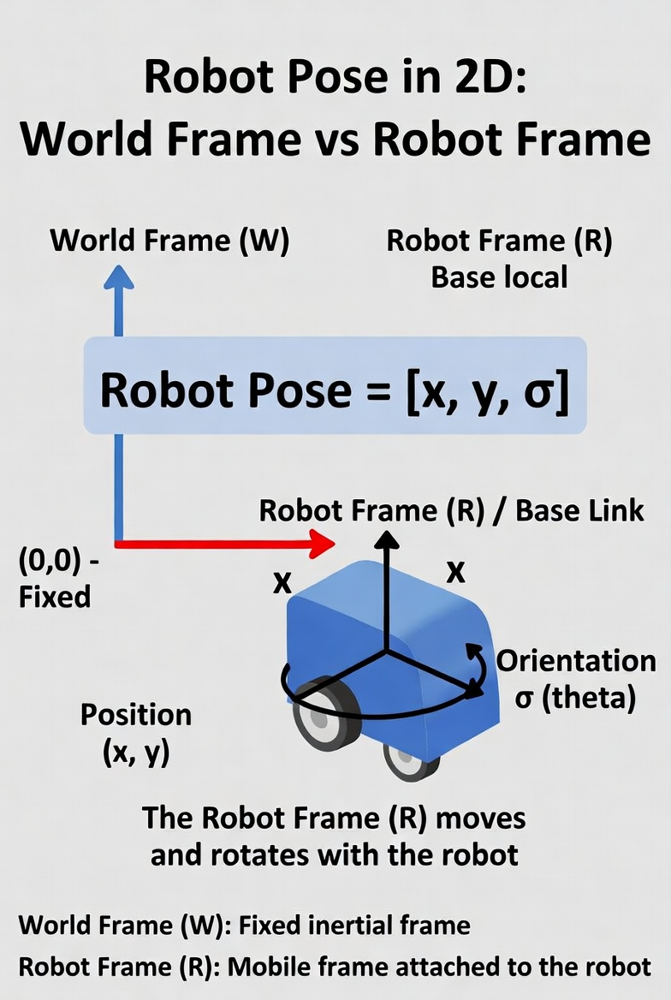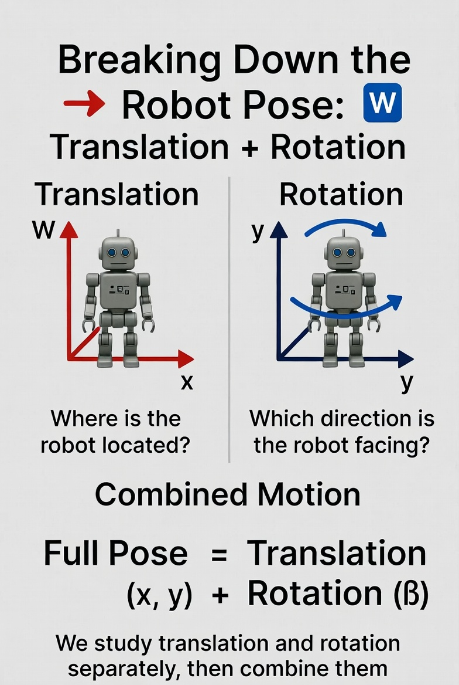
---
---

## Translational Component of Robot Motion in 2D
**That means the robot’s frame R (Base Link) has the same orientation as the fixed World frame W — it only moves left/right and forward/backward, without turning.**

**1. Position of the Robot in the World**
   - We draw a vector t from the origin of the World frame W to the origin of the Robot frame R.
   -  vector t has two components:
      -  position along the x-axis
      -  position along the y-axis

   - So the position of the robot (center of frame R) in the world is simply:
     - Position of R in W = [tₓ, tᵧ]

**2. Real-World Application: Transforming Sensor Measurements**
   - Sensors on the robot (like LiDAR, ultrasonic, or camera) usually give relative measurements — they tell you where an obstacle is with respect to the robot itself, not with respect to the world.
   - Ex: The sensor says: “There is an obstacle 2 meters in front of the robot and 1 meter to the left.”
   - This gives us the coordinates of the obstacle P in the Robot frame R:
      - P in R = [xₚ, yₚ]
   - Question: Where is this obstacle located in the World frame W?

**3. The Simple Solution: Vector Addition**
   - To find the obstacle’s position in the world, we just add two vectors:
      - The position of the obstacle relative to the robot (P in R)
      - The position of the robot itself in the world (translation vector t)

   - Formula:
      - P in W = P in R + t
      - In components:
        - x_world = x_robot + tₓ
        - y_world = y_robot + tᵧ

---
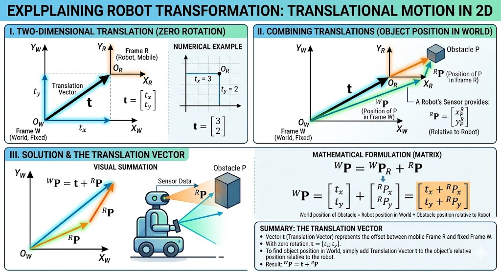
---
---

# Rotation Matrix
**In a 2D world, an object's pose consists of its position ($x, y$) and its rotation ($\theta$).**
**To simplify the math,assumes the robot and the world share the same center point $(0,0)$, focusing entirely on how the rotation affects our measurements.**

   - Frame W (World): The fixed "map" coordinates.
   - 
   - Frame R (Robot): The moving coordinate system attached to the robot.
   - 
   - Point P: An obstacle detected by the robot.
   
## 2. Deriving the Math

   **- Goal: Convert coordinates from a robot's local frame to a global world frame.**
   **- Input: The local coordinates(x', y'),from the robot's sensors and the current rotation angle.**
   **- Output: The global coordinates(x, y) used for mapping and navigation.**
   **- Application: This is the mathematical foundation for how autonomous vehicles "see" an obstacle and remember its location even after the vehicle turns or moves.**

**This is done by projecting the robot's axes onto the world's axes using sine and cosine.**

   1. x = x' \cos(\theta) - y' \sin(\theta)
   2. y = x' \sin(\theta) + y' \cos(\theta)$ 
---
---

# 1. Combining Translation and Rotation
**When a robot is at a position $t = [t_x, t_y]^T with an orientation theta, the position of a point $P$ in the World frame is calculated by first rotating the point from the Robot frame and then adding the translation:**
   - P^W = (R(\theta) * P^R )+ t

## The Homogeneous Transformation Matrix:
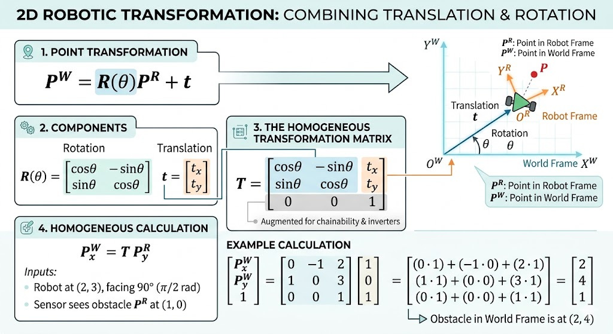

---
**In robotics, we deal with two primary coordinate systems:**
   - World Frame (W): A fixed reference frame (like a map of a room).
   - Robot Frame (R): A moving frame attached to the robot. When the robot moves or turns, this frame moves with it.

**- If a robot's sensor (like a LiDAR or camera) detects an obstacle, it calculates the distance relative to itself (the Robot Frame).**
**- However, to navigate, the robot needs to know where that obstacle is in the World Frame.**
   - Translation (t): How far the robot has moved from the origin of the world.
   - Rotation (theta): Which way the robot is currently facing.

**The Solution: Homogeneous Transformation Matrix:**
   - While you can calculate rotation and translation separately, it is mathematically inefficient. 
   - We combine them into a single Transformation Matrix (T).

   To make the math work , we use Homogeneous Coordinates. This involves adding a "dummy" row (usually [0, 0, 1]) to the bottom of the matrix. This makes the matrix $3*3$, allowing us to solve the transformation in one single step.

## SummaryThe Goal: 
   **- Convert a point $P$ from the Robot's perspective ($P^R$) to the World's perspective ($P^W$).**
   **- The Inputs: The translation vector ($t$), the rotation angle ($\theta$), and the local coordinates of the obstacle.**
   **- The Tool: The Homogeneous Transformation Matrix. It combines the $2*2$ rotation matrix and the $2*1$ translation vector into a single $3*3$ matrix.**
   **- The Result: By multiplying this matrix by the robot-frame coordinates, you get the exact global position of the obstacle.**

   

---
---

## What is DWA?
  **DWA (Dynamic Window Approach) is a real-time motion controller for robots.**
  **A path planner decides where to go; DWA decides how to get there safely, moment by moment.**

## The core loop:
   - Generate hundreds of possible velocity commands (speed + turn combinations)
   - For each command, simulate: "where would the robot end up?"
   - Score each simulated trajectory using a weighted cost function:
      - Collisions → very high cost (highest priority)
      - Straying far from the planned path → moderate cost
      - Moving backward/slowly → minor penalty
   - Pick the command with the lowest total cost and send it to the robot
   - Repeat every control cycle with fresh sensor data
---

## Key strengths:
   - Handles unexpected obstacles the planner never saw
   - Flexible — you can add or tune any criterion you like
   - Lightweight enough to run in real-time

## Its limitation:
**The kinematic model isn't perfect — wheel slip or uneven ground means the real movement can differ slightly from the prediction, which is exactly why the loop keeps repeating.**

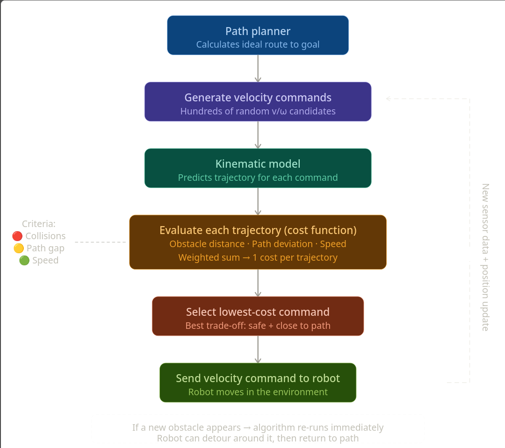

## Summary:
   **The Dynamic Window Approach (DWA) is a significant step up from basic PD (Proportional-Derivative) control.**
   **While a PD controller just tries to minimize the error between the robot and a line, DWA "thinks" ahead by simulating possible futures.**

## 1. The Concept: Planning in "Velocity Space"
   **Instead of just looking at the map, DWA looks at what the robot is physically capable of doing right now.**
   **It creates a Dynamic Window of possible velocities based on:**
   - Physical Limits: How fast can the motors actually spin?
   - Acceleration Limits: How quickly can the robot speed up or slow down within the next time step?

---
## 2. The Process: Predict and Score:
**DWA doesn't just pick a direction; it runs a "What If?" scenario for hundreds of different velocity commands ($\mathbf{v}, \omega$).**

**Step A: Trajectory Rollouts**
  - For every sample velocity, the algorithm uses a kinematic model (a set of math equations) to project where the robot will be in 1, 2, or 5 seconds.

**Step B: The Cost Function (The "Judge")**
   - his is where the flexibility of DWB shines. Each predicted path is given a "penalty score" (cost) based on several criteria:

```table
-------------------------------------------------------------------------------------------------------
Criterion              What it rewards
-------------------------------------------------------------------------------------------------------
Path Alignment         Staying as close as possible to the global path.
-------------------------------------------------------------------------------------------------------
Goal Heading           Pointing the robot toward the final destination.
-------------------------------------------------------------------------------------------------------
Obstacle Distance      "Staying far away from ""lethal"" map cells (walls/furniture)."
-------------------------------------------------------------------------------------------------------
Velocity                Moving at a productive speed (penalizing being stuck or moving backward).
-------------------------------------------------------------------------------------------------------
```
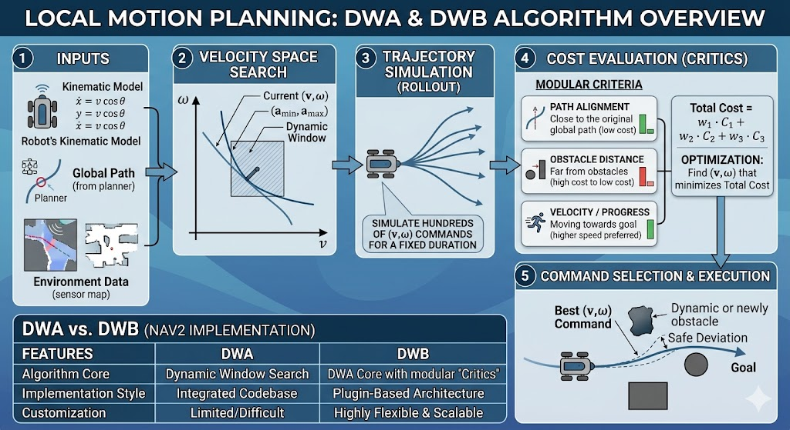

---
---

# Vector Field Histogram (VFH) Algorithm

**The Vector Field Histogram (VFH) is a real-time obstacle avoidance and motion planning algorithm**
**designed specifically for robots operating in dynamic, complex, or tight spaces.**
**Its defining feature is the creation of a local "histogram" map to make navigation decisions rather than relying on a complex global recalculation.**

## How It Works: The Five Key Stages:
   1. Sensor Input and Perception
   2. The Grid-Based Active Window
   3. Probability and Occupancy Grid (Accumulating Costs)
   4. Building the 1D Polar Histogram
   5. Decision Making: Choosing the Heading

```table
---------------------------------------------------------------------------------------------------------------------------------------------------------------------------------
Concept              Explanation
---------------------------------------------------------------------------------------------------------------------------------------------------------------------------------
Active Window        "A limited 2D grid map centered on the robot that moves with it, used for local planning."
---------------------------------------------------------------------------------------------------------------------------------------------------------------------------------
Grid Cell Cost       "A dynamic score assigned to each cell based on how many times sensors have detected an obstacle there, balanced by proximity (closer = higher cost)."
---------------------------------------------------------------------------------------------------------------------------------------------------------------------------------
Polar Histogram      "A 1D visualization generated from the grid data that maps angular directions against obstacle density, showing ""clear"" and ""blocked"" sectors."
---------------------------------------------------------------------------------------------------------------------------------------------------------------------------------
Heuristic Decision   "VFH calculates the robot’s next direction by identifying the ""free sector"" closest to the goal and aiming for its midpoint for maximum safety."
---------------------------------------------------------------------------------------------------------------------------------------------------------------------------------
Iterative Cycle      The process continuously repeats: Sense → Update Grid → Generate Histogram → Calculate Midpoint → Move.
---------------------------------------------------------------------------------------------------------------------------------------------------------------------------------
```

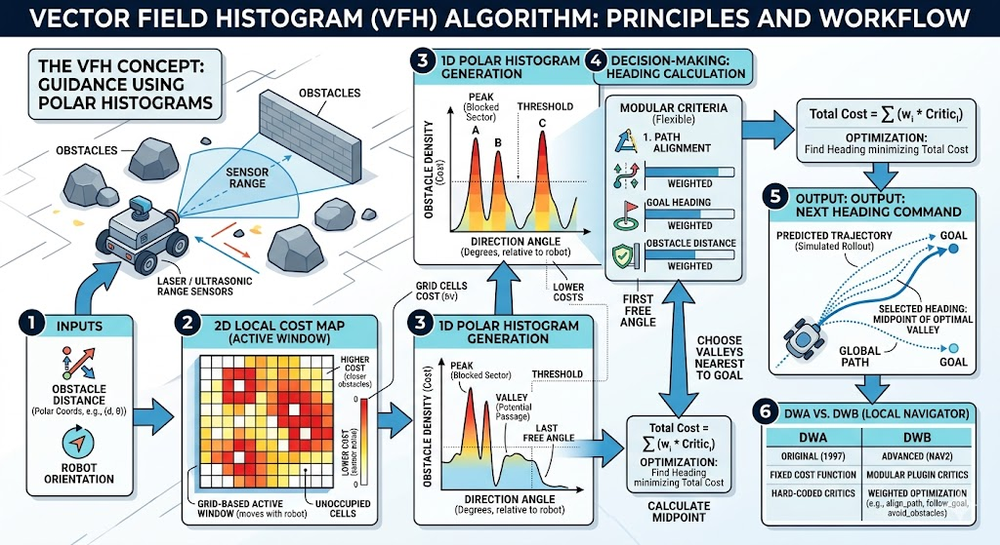

---
---

# Model Predictive Control (MPC)
**MPC: is a sophisticated control strategy that treats motion planning as a continuous optimization problem**
**Unlike simpler controllers that only look at the immediate next step, MPC looks into the future to make the best possible decision right now.**

## 1. The Internal Model (The "Brain")
   - At the heart of MPC is a detailed mathematical model of the robot.
   - This model doesn't just know where the robot is; it understands the robot's physics (kinematics) and the forces acting upon it (dynamics).

**The Goal: To predict exactly how the robot will react to a specific set of inputs over a period of time.**
---

## 2. The Prediction Horizon (Looking Ahead)
  **Instead of calculating a single command (like "turn left 5 degrees"), MPC generates a sequence of commands for a future window of time**
   - Simulation: It "simulates" the robot's future path based on these commands.
   - Comparison: It compares this predicted trajectory against the desired path provided by the global planner.
---

## 3. The Optimization Loop
**MPC doesn't just pick a random path; it uses an Optimizer to refine the command sequences.**
   - Cost Function: The optimizer assigns a "cost" to every potential path. 
      - High costs are given to paths that hit obstacles, involve jerky movements, or stray too far from the target.
   - Refinement: It iteratively adjusts the commands—smoothing out turns and ensuring safety—until it finds the sequence with the lowest possible cost

---

## 4. The Receding Horizon (Why it’s "Predictive")
**This is the most "clever" part of the algorithm:**

   - The optimizer finds the best entire sequence of commands for the future.- 
   - The robot executes only the first command in that sequence.- 
   - The robot then immediately throws away the rest of the plan and re-calculates everything starting from its new position.

---
## Summary:
```table
---------------------------------------------------------------------------------------------------------------------------------------------
Feature        Description
---------------------------------------------------------------------------------------------------------------------------------------------
Core Concept   Solves an optimization problem at every time step to find the best future path.
---------------------------------------------------------------------------------------------------------------------------------------------
Input          A detailed model of robot physics and a desired path.
---------------------------------------------------------------------------------------------------------------------------------------------
Output         A sequence of commands (though only the first is executed).
---------------------------------------------------------------------------------------------------------------------------------------------
Strength       "Handles complex, interdependent variables and produces very smooth, optimal movement."
---------------------------------------------------------------------------------------------------------------------------------------------
Weakness       "Extremely ""computationally expensive"" (requires a lot of processing power)."
---------------------------------------------------------------------------------------------------------------------------------------------
Variant        "MPPI (Model Predictive Path Integral), used in advanced systems like Neptune for self-driving."
---------------------------------------------------------------------------------------------------------------------------------------------
```

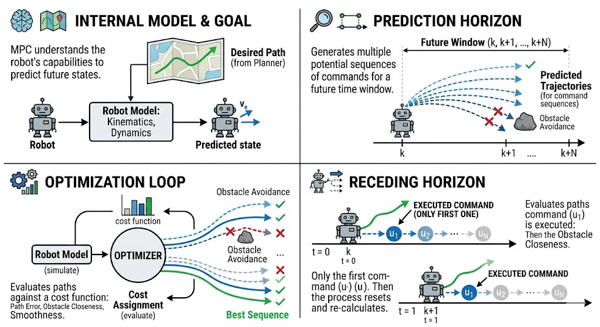

---
---

# Pure Pursuit Controller
**Is a geometric path-tracking algorithm.**
**Pure Pursuit is like a driver simply steering toward a "carrot" on a stick held out in front of the car.**

## 1.The "Carrot" (Lookahead Distance)

**The core concept of Pure Pursuit is the lookahead distance ($L$). This is a set distance that defines how far along the planned path the robot is "looking."**

   - The Goal Point: The algorithm finds a point on the planned path that is exactly $L$ distance away from the robot's current position. Think of this  as a virtual carrot.
   - Dynamic Target: As the robot moves toward the carrot, the carrot moves further down the path, always staying $L$ distance away.

---

## 2. The Geometry (The "Arc")
**Once the goal point (the carrot) is identified, the robot needs to figure out how to get there. It doesn't move in a straight line; it moves along a circular arc.**

   - The Rule: The algorithm assumes the center of this circle must lie on the robot's lateral axis (the y-axis in the robot's local frame).
   - The Calculation: By using the robot's local coordinates $(g_x, g_y)$ for the goal point and the Pythagorean theorem, we can calculate the radius ($r$) of that arc.
   - Curvature: The steering command is based on the curvature ($\kappa$)
   - which is simply: k =(1/r) = [(2Gy) / (l^2)]

---

## 3. Tuning the Behavior
**The lookahead distance ($L$) is the most important parameter to tune:**

   - Small $L$ (Short Stick): The robot is very aggressive and reactive. It follows the path tightly but can become "jittery" or oscillate if it overcorrects.
   - Large $L$ (Long Stick): The robot is much smoother and stable. However, it will "cut corners" and take longer to return to the path if it gets off track.

---

## 4.Regulated Pure Pursuit (RPP)
**The version mentioned, used in modern frameworks like Neptune, adds "regulations" to the basic geometric math:**

   - Obstacle Avoidance: It slows down or stops if the arc intersects with an obstacle.

   - Speed Scaling: It automatically slows the robot down when approaching sharp turns (high curvature) to prevent tipping or sliding.

---
## Pure Pursuit vs. MPC

```table 
-----------------------------------------------------------------------------------------
Feature        Pure Pursuit                        MPC
-----------------------------------------------------------------------------------------
Complexity     Simple Geometry                     Complex Optimization
-----------------------------------------------------------------------------------------
Logic          "Follows a ""carrot"" via an arc"   Predicts multiple future states
-----------------------------------------------------------------------------------------
Computation    Very Low (Fast)                     High (Resource Intensive)
-----------------------------------------------------------------------------------------
Smoothness     Depends on Lookahead distance       Inherently smooth via optimizer
-----------------------------------------------------------------------------------------
Best For       Standard path tracking,"Complex     high-speed, or dynamic tasks"
-----------------------------------------------------------------------------------------

```
---
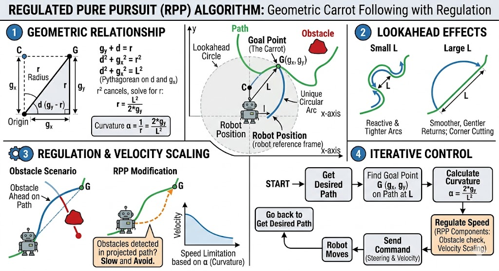

---
---