# Where aw are now!?

**The robot has reached a major milestone:**
   - It creates cost maps — a kind of "smart grid" that represents the environment (free space, obstacles, dangerous areas, etc.).
   - It uses these maps to plan a safe path from the current position to a goal while avoiding obstacles and keeping a safe distance.
   - It can execute (follow) that path by sending commands to the robot’s motors.
   - Result: The robot can now navigate autonomously and safely.

# 2. What’s Next in the Course that we will do in this Section!?

**Instead of adding many brand-new features, the focus shifts to:**

   - Making the existing navigation system more(reliable, less buggy).
   - Making it more flexible (easier to swap algorithms, reconfigure, reuse).

**They will achieve this by properly integrating with Nav2 — the standard navigation framework for ROS 2.**

# 3.Overall Picture

**This section of the course teaches you how to professionalize your navigation stack by:**

   **- Wrapping your algorithms as Nav2 plugins (in C++).**

   **- Configuring and using the Planner Server + Controller Server.**

   **- Leveraging the full power of the Nav2 ecosystem (behavior trees, recovery behaviors, better configuration, monitoring, etc.).**

---

## The Two Main Nav2 Components

**Planner Server**

   **- This is a ROS 2 Action Server.**

   **- Its job: Path Planning — finding a route from point A to point B on the map.**

   **- Key advantage: It provides a standardized interface. Other parts of the system can simply ask “Plan a path to this goal” without caring which algorithm is used internally.**

   **- It supports plugins — different path-planning algorithms can be plugged in (e.g., A*, Dijkstra, NavFn, Theta*, your custom algorithm, etc.).**

   **- What you built earlier (your own path planner) will now become one of these plugins.**

---

**Controller Server [also called the Motion Controller or Local Planner]**

   **- Another ROS 2 Action Server.**

   **- Its job: this server generates actual velocity commands (cmd_vel) to move the robot along that path, while continuously avoiding dynamic obstacles and respecting safety.**

   **- Nav2 uses the word "controller" for what many people call a local planner.**

   **- It also supports plugins, so you can have different control algorithms (e.g., DWB, TEB, MPPI, your custom controller).**

---

## Summary of the two servers:

   **Planner Server → High-level route planning (global path).**

   **Controller Server → Low-level motion execution (velocity commands + local obstacle avoidance).**

---

## Plugins – The Key Concept

**Instead of replacing Nav2’s systems, you extend them:**

   - Your previous C++ (or Python) code becomes plugins.
   - Nav2 loads these plugins at runtime.
   - This gives you the best of both worlds: 
       - you keep your custom logic and gain all the infrastructure, tools, configuration options, and robustness that Nav2 provides.

---
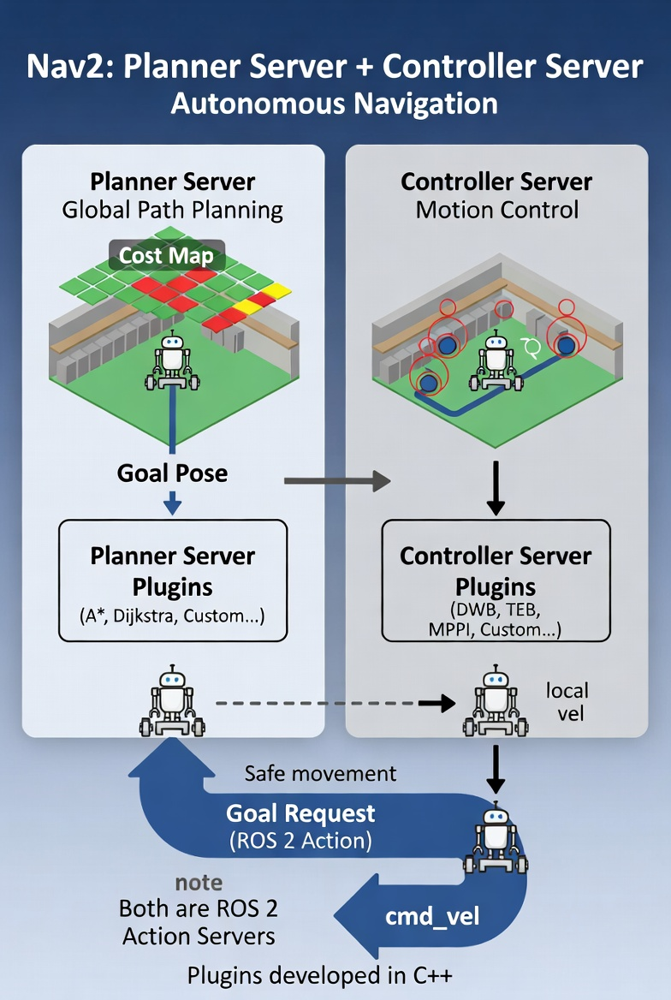

---
---

# Nav2 in ROS 2: Planner Server + Controller Server

**Nav2 (Navigation 2) is the standard navigation stack for ROS 2.**

**It allows robots to move autonomously from one point to another while avoiding obstacles safely.**

## 1. Planner Server (Global Path Planning)

**Role: Finds a long-distance, safe route (global path) from the robot’s current position to the desired goal.**

**Input:**
   - A goal pose (where the robot should go).
   - A Cost Map (a grid that shows which areas are free, occupied by obstacles, or risky).

**How it works:**
   - Uses plugins — different path-planning algorithms such as A*, Dijkstra, NavFn, or your own custom algorithm.

**Output:**
   - global path (usually shown as a blue line on the map).

**Think of it as a GPS route planner — it plans the overall journey.**

---

## Controller Server (Motion Control / Local Planner)

**Role:**
   - Executes the global path by sending real-time velocity commands to the robot’s motors.

**Input:**
   -  The global path from the Planner Server + continuous sensor data (local cost map).

**How it works:**
   - Uses plugins such as DWB, TEB, MPPI, or custom controllers.
   - Continuously adjusts the robot’s movement to follow the path while avoiding dynamic (moving) obstacles and staying safe.

**Output:**
   - velocity commands (cmd_vel) — linear and angular speeds.

**Think of it as the driver — it handles the actual steering and speed control moment by moment.**

---

## Overall Navigation Flow: 

   **- An application (or user) sends a Goal Request using a ROS 2 Action.**

   **- Planner Server calculates the global path.**

   **- Controller Server takes that path and drives the robot toward the goal.**

   **- The robot moves safely, continuously updating its position and reacting to the environment.**

   **- Feedback is sent back during the process (progress, status, etc.).**

---

## Key Advantages of This Architecture

   **- Modular: You can swap algorithms by changing plugins without rewriting the whole system.**

   **- Standardized: Other software can interact with Nav2 without knowing the internal details.**

   **- Extensible: Your custom planners/controllers become plugins.**

   **- Professional & Robust: You get recovery behaviors, behavior trees, lifecycle management, and many advanced features for free.**

---

   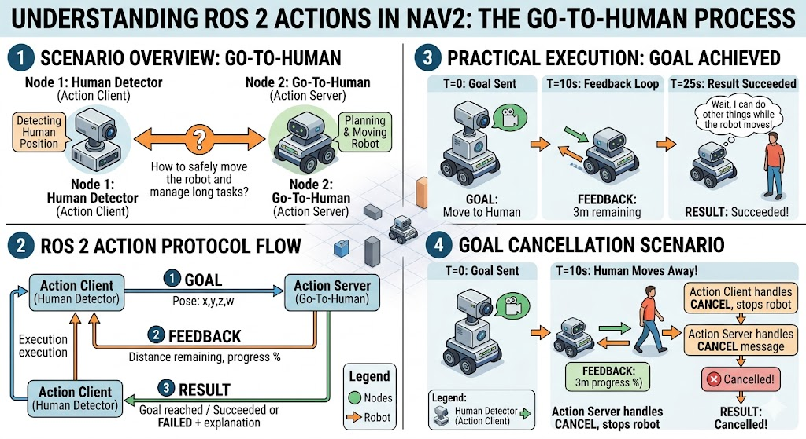

---
---

# The Problem with Custom Path Planners (Dijkstra, A*, etc.)

**When developers first create path planning nodes in ROS 2 (like Dijkstra or A*), they typically build everything from scratch for each algorithm:**

**1.Define the ROS 2 interface for the node:**
   - Subscribe to a goal topic (where the destination is published).
   - Use TF2 to get the robot’s current position (starting point).
   - Subscribe to the map (usually a static occupancy grid from SLAM).

**2. Implement support functions:**
   - Coordinate conversions (robot frame ↔ map grid).
   - Checks if a point is valid on the map.

**3. Run the algorithm (Dijkstra or A*) and publish results:**
   - Path (sequence of poses) on one topic.
   - Visited map (for visualization) on another topic.

**This works for one planner, but it becomes messy when you create multiple planners:**

## This is poor software design: tightly coupled, hard to maintain, and error-prone.Why!?

   **- You duplicate the same boilerplate code (interface, TF2 lookup, map handling, publishers) in every planner node.**

   **- If you want to change something (switch from a static map to a costmap, or add new features), you must update every planner node.**

   **- Other parts of the system (motion controllers, visualization tools) must know exactly which topic each planner publishes to.**

   **- Changing or swapping planners breaks those connections.**

---

## The Solution: Nav2 Planner Server

**Nav2 (Navigation2) provides a standardized, centralized Planner Server that handles all the common parts, so you only need to focus on the actual path-planning logic.**

## How the Planner Server Works

**1. Standardized Interface via ROS 2 Actions (not topics):**
   - It exposes an Action Server.
   - You send a goal (destination) through the action.
   - It returns the result (computed path) through the same action.
   - This is much better than raw topics because actions support feedback, cancellation, and have a clear request-response structure.

**2. Common Functionality Handled Centrally:**
   - Automatically gets the robot’s current pose using TF2.
   - Manages the Global Costmap:The server launches and configures this costmap for you.
   - Handles all data preparation and validation.

**3. Plugins for Algorithms:**
   - Individual path-planning algorithms (Dijkstra, A*, NavFn, Theta*, etc.) are implemented as plugins.
   - You don’t write a full ROS node for each algorithm anymore — just the core planning logic inside a plugin.
   - The Planner Server loads one or more plugins and calls the right one when needed.

**4. Key Advantages:**
   - No duplication: The interface, map handling, TF2, etc., exist in one place (the server).
   - Easy swapping: Change which planner plugin you use without touching other parts of the robot system.
   - Multiple planners at once: You can load several algorithms simultaneously. The server can choose the best one at runtime based on the goal or situation.
   - Decoupling: Motion planners, RViz, or any other node only talk to the Planner Server’s action interface. They don’t care which specific algorithm is running behind the scenes.

---

## From Custom Node to Plugin

```table
-----------------------------------------------------------------------------------------------------------
Aspect                     Custom Node Approach                   Nav2 Planner Server + Plugins
-----------------------------------------------------------------------------------------------------------
Interface                  Custom topics per node                 Standardized Action (one place)
-----------------------------------------------------------------------------------------------------------
Map & TF2 handling         Re-implemented in every node           Handled by the server
-----------------------------------------------------------------------------------------------------------
Code Duplication           High                                   Minimal
-----------------------------------------------------------------------------------------------------------
Changing planners          Breaks other nodes                     Transparent (just change plugin)
-----------------------------------------------------------------------------------------------------------
Multiple algorithms        Difficult                              Supported natively
-----------------------------------------------------------------------------------------------------------
Maintenance                 Painful                               Easy
-----------------------------------------------------------------------------------------------------------
```


---
---

## Bash Seeting to Send Goal

```bash
 ros2 launch robot_bringup simulated_robot.launch.py world_name:=small_house
```

```bash
ros2 run nav2_planner planner_server --ros-args --params-file /home/sara-saad/Graduation_project/ros2_ws/src/robot_navigation/config/planner_server.yaml 
```

```bash
ros2 lifecycle set /planner_server 1
ros2 lifecycle set /planner_server 1
```

```bash
sara-saad@sara-saad-Dell-G15-5511:~/Graduation_project/ros2_ws$ ros2 action send_goal /compute_path_to_pose nav2_msgs/action/ComputePclear                                                                ros2 action send_goal /compute_path_to_pose nav2_msgs/action/ComputePclear                                                                ros2 action send_goal /compute_path_to_pose nav2_msgs/action/ComputePclear                                                                ros2 action send_goal /compute_path_to_pose nav2_msgs/action/ComputePclear                                                                ros2 action send_goal /compute_path_to_pose nav2_msgs/action/ComputePathToPose "goal:
  header:
    stamp:
      sec: 0
      nanosec: 0
    frame_id: 'map'
  pose:
    position:
      x: 4.0
      y: -1.0
      z: 0.0
    orientation:
      x: 0.0
      y: 0.0
      z: 0.0
      w: 1.0
start:
  header:
    stamp:
      sec: 0
      nanosec: 0
    frame_id: ''
  pose:
    position:
      x: 0.0
      y: 0.0
      z: 0.0
    orientation:
      x: 0.0
      y: 0.0
      z: 0.0
      w: 1.0
planner_id: 'GridBased'
use_start: false" 

```
----

## Output at rviz by using nv2 action to send the goal by using Dijkstra planner

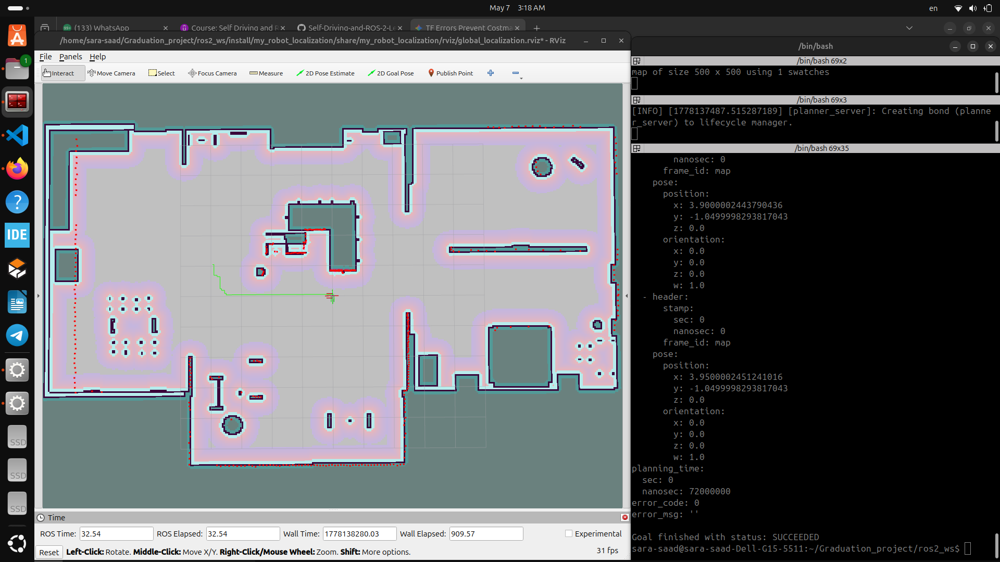

---
---

# Bash Seeting Command to send Goal by AStar Planner

```bash
sara-saad@sara-saad-Dell-G15-5511:~/Graduation_project/ros2_ws$ ros2 action send_goal /compute_path_to_pose nav2_msgs/action/ComputePathToPose "goal:
  header:
    stamp:
      sec: 0
      nanosec: 0
    frame_id: 'map'
  pose:
    position:
      x: 4.0
      y: -1.0
      z: 0.0
    orientation:
      x: 0.0
      y: 0.0
      z: 0.0
      w: 1.0
start:
  header:
    stamp:
      sec: 0
      nanosec: 0
    frame_id: ''
  pose:
    position:
      x: 0.0
      y: 0.0
      z: 0.0
    orientation:
      x: 0.0
      y: 0.0
      z: 0.0
      w: 1.0
planner_id: 'GridBasedFast'
use_start: false" 

```

## Output at rviz by using nv2 action to send the goal by using Asrar Planner

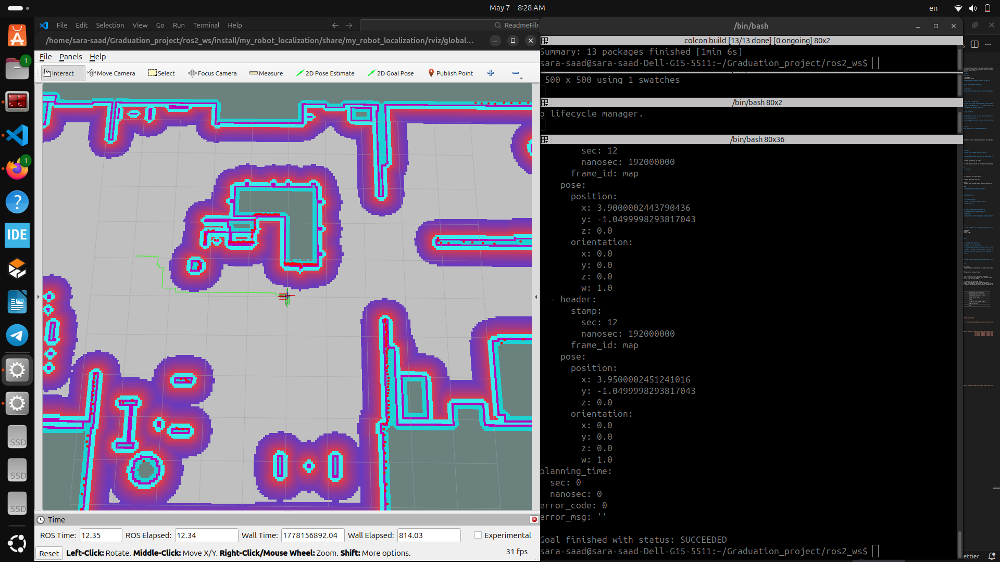

---
---

# What why Did untile Now !? The Planner Server & Plugin System
**In Nav2, the Planner Server acts as a container. Instead of being hardcoded to one algorithm, it loads plugins (e.g., NavFn, Smac Planner, or custom ones).**

   **- Simultaneous Loading: You can load multiple algorithms (like A* and Dijkstra) at once.**

   **- Dynamic Selection: When you send a navigation goal, you specify which plugin to use in the action request.**

**The Problem: Most grid-based planners associate nodes with specific map cells. This results in "jagged" or "zig-zag" paths because the robot is essentially moving from the center of one square to the next.**

---

# The Smoother Server

**To fix jagged paths, Nav2 uses the Smoother Server. Like the Planner Server, it is an abstract wrapper that doesn't "know" how to smooth a path itself—it just manages the process.**

## How it Work

   **1. Standardized Interface: It uses ROS 2 Actions (SmoothPath) to communicate.**
   
   **2. Plugin Delegation: It forwards the raw path to a specific Smoother Plugin (e.g., Simple Smoother or Constrained Smoother).**
   
   **3. Separation of Concerns: Developers can write a new smoothing algorithm (the logic) without rewriting the communication code (the interface).**

---

## The Workflow: Planning to Smoothing

```table
-----------------------------------------------------------------------------------------------------------------
Component                   Action
-----------------------------------------------------------------------------------------------------------------
1 Planner Plugin           "Calculates the raw jagged path from the costmap."
-----------------------------------------------------------------------------------------------------------------
2 Action Client            The Planner (acting as a client) sends the raw path to the Smoother Server.
-----------------------------------------------------------------------------------------------------------------
3 Smoother Server          Receives the request picks the requested smoothing plugin.
-----------------------------------------------------------------------------------------------------------------
4 Smoother Plugin          "Runs the math (e.g., interpolation or optimization) to ""round off"" the corners."
-----------------------------------------------------------------------------------------------------------------
5 Action Result            "The Smoother Server sends the refined curvy path back to the Planner."
-----------------------------------------------------------------------------------------------------------------
6,Final Output             The Planner Server provides this smooth path to the Controller to move the robot.
-----------------------------------------------------------------------------------------------------------------
```

## Benefits

   **1. Modularity: You can swap out a "Simple Smoother" for a "Complex Optimizer" without changing your planning nodes.**

   **2. Performance: By smoothing the path before it reaches the controller, the robot's physical movement becomes fluid and continuous.**

   **3. Flexibility: You can decide at runtime to use a high-precision smoother for tight spaces or a fast, low-computation smoother for open areas.**

---
---

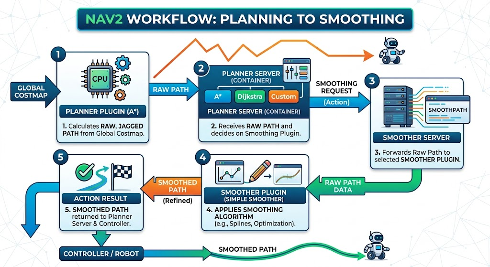

**The Input (Global Costmap): The planner starts with a grid-based map of obstacles.**
 
   **Step 1 - Planner Plugin: The specific algorithm (like A*) generates the initial path. As shown, this path is "raw and jagged" because it must follow grid cells.**

   **Step 2 & 3 - Delegation: The Planner Server sends this jagged path as a request to the Smoother Server.**

   **Step 4 - The Magic: The Smoother Plugin applies algorithms (such as Splines) to round off the sharp corners, converting the path from "jagged" to "curvy and fluid."**

   **Step 5 - The Result: The smooth path is returned to the robot's controller, ensuring movement is continuous rather than jerky.**

---
---

# How to handle the Smoothe_Server.yaml in the bash

```bash
sara-saad@sara-saad-Dell-G15-5511:~/Graduation_project/ros2_ws$ ros2 lifecycle set /smoother_server 1
Transitioning successful
```
```bash
sara-saad@sara-saad-Dell-G15-5511:~/Graduation_project/ros2_ws$ ros2 lifecycle set /smoother_server 3
Transitioning successful
```

```bash
sara-saad@sara-saad-Dell-G15-5511:~/Graduation_project/ros2_ws$ ros2 action list 
/smooth_path
```

```bash
sara-saad@sara-saad-Dell-G15-5511:~/Graduation_project/ros2_ws$ ros2 action list -t
/smooth_path [nav2_msgs/action/SmoothPath]
```

```bash
sara-saad@sara-saad-Dell-G15-5511:~/Graduation_project/ros2_ws$ ros2 interface show nav2_msgs/action/SmoothPath
#goal definition
nav_msgs/Path path
	std_msgs/Header header
		builtin_interfaces/Time stamp
			int32 sec
			uint32 nanosec
		string frame_id
	geometry_msgs/PoseStamped[] poses
		std_msgs/Header header
			builtin_interfaces/Time stamp
				int32 sec
				uint32 nanosec
			string frame_id
		Pose pose
			Point position
				float64 x
				float64 y
				float64 z
			Quaternion orientation
				float64 x 0
				float64 y 0
				float64 z 0
				float64 w 1
string smoother_id
builtin_interfaces/Duration max_smoothing_duration
	int32 sec
	uint32 nanosec
bool check_for_collisions
---
#result definition

# Error codes
# Note: The expected priority order of the errors should match the message order
uint16 NONE=0
uint16 UNKNOWN=500
uint16 INVALID_SMOOTHER=501
uint16 TIMEOUT=502
uint16 SMOOTHED_PATH_IN_COLLISION=503
uint16 FAILED_TO_SMOOTH_PATH=504
uint16 INVALID_PATH=505

nav_msgs/Path path
	std_msgs/Header header
		builtin_interfaces/Time stamp
			int32 sec
			uint32 nanosec
		string frame_id
	geometry_msgs/PoseStamped[] poses
		std_msgs/Header header
			builtin_interfaces/Time stamp
				int32 sec
				uint32 nanosec
			string frame_id
		Pose pose
			Point position
				float64 x
				float64 y
				float64 z
			Quaternion orientation
				float64 x 0
				float64 y 0
				float64 z 0
				float64 w 1
builtin_interfaces/Duration smoothing_duration
	int32 sec
	uint32 nanosec
bool was_completed
uint16 error_code
string error_msg
---
#feedback definition

```

---
---

## Running Smooth server with Pallaner Server

```bash
ros2 launch robot_bringup simulated_robot.launch.py world_name:=small_house

```
```bash
ros2 run nav2_smoother smoother_server --ros-args --params-file /home/sara-saad/Graduation_project/ros2_ws/src/robot_navigation/config/smoother_server.yaml 
ros2 lifecycle set /smooth_server 1
ros2 lifecycle set /smooth_server 3 

```
```bash
 ros2 run nav2_planner planner_server --ros-args --params-file /home/sara-saad/Graduation_project/ros2_ws/src/robot_navigation/config/planner_server.yaml
 ros2 lifecycle set /planner_server 1
 ros2 lifecycle set /planner_server 3 

```
```bash
ros2 action send_goal /compute_path_to_pose nav2_msgs/action/ComputePathToPose "goal:
  header:
    stamp:
      sec: 0
      nanosec: 0
    frame_id: 'map'
  pose:
    position:
      x: 4.0
      y: -1.0
      z: 0.0
    orientation:
      x: 0.0
      y: 0.0
      z: 0.0
      w: 1.0
start:
  header:
    stamp:
      sec: 0
      nanosec: 0
    frame_id: ''
  pose:
    position:
      x: 0.0
      y: 0.0
      z: 0.0
    orientation:
      x: 0.0
      y: 0.0
      z: 0.0
      w: 1.0
planner_id: 'GridBased'
use_start: false"

```
---
## Output by using Smooth Server with Dijkstra Planner

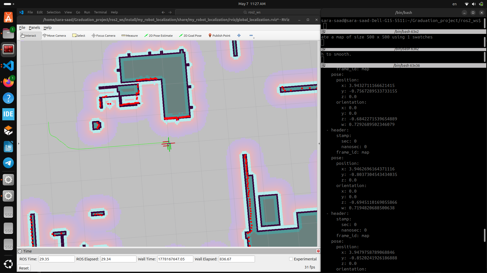

---
---

## Output by using Smooth Server with AStar Planner

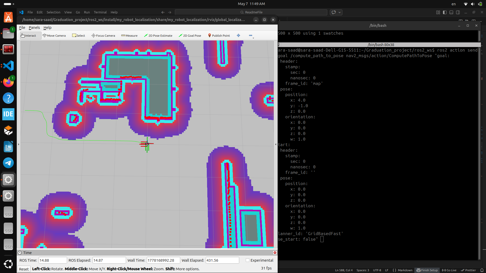

---
---

# Nav2 Controller

## The Old Way: Manual Integration

**When you build a motion planner (like a PID or Pure Pursuit controller) from scratch as a standalone ROS 2 node, you are forced to do the "heavy lifting" for the infrastructure every single time.**

**For every new algorithm, you had to manually implement:**

   **Subscribers:** To get the path from the planner (e.g., A*).

   **TF2 Listeners:** To constantly look up where the robot is in the world.
   
   **Support Logic:** Functions to transform coordinates, limit maximum speeds, and manage the timing of the control loop.
   
   **Publishers:** To send cmd_vel (velocity) commands to the robot.

**The Problem: This leads to code duplication.**
   - **If you want to add a new feature (like using a local costmap for obstacle avoidance), you have to rewrite that logic into every single controller node you've ever built.**

---

## The Nav2 Solution: The Controller Server

**The Nav2 Controller Server acts as a "manager." It handles all the boring, repetitive ROS 2 "plumbing"**
   - so that you can focus purely on the math of your movement algorithm.

**What the Server Handles for You:**

   **Standardized Interface:** It uses a ROS 2 Action called FollowPath. This provides a consistent way to start, stop, and monitor progress.

   **Data Collection:** It automatically retrieves the robot's pose via TF2.
   
   **Local Costmap:** It manages a Local Costmap—a small, high-frequency map centered on the robot—used specifically for avoiding dynamic obstacles.
   
   **Common Utilities:** It handles path transformations and velocity limits internally.

---

## The Plugin System: "Brain" vs. "Body"

**In Nav2, the Controller Server is the body, and the Plugins are the brains.**

```table 

----------------------------------------------------------------------------------------------------------------------------
Feature                 Controller Server (The Body)                      Controller Plugin (The Brain)
----------------------------------------------------------------------------------------------------------------------------
Responsibility          "Communications, TF, Costmaps, Loop timing."      "The specific logic (PID, Pure Pursuit, DWA)."
----------------------------------------------------------------------------------------------------------------------------
Data Flow               Collects data and passes it to the plugin.        "Receives data, calculates the best velocity."
----------------------------------------------------------------------------------------------------------------------------
Output                  Publishes the cmd_vel to the robot motors.        Returns the calculated velocity to the server.
----------------------------------------------------------------------------------------------------------------------------

```

---

## Why this is better:

**Focus:** You only write the algorithm logic inside a C++ class (the plugin).

**Flexibility:** The server can load multiple plugins at once. You can switch from a "Smooth PID" for hallways to a "Precise Pure Pursuit" for docking just by changing a parameter.

**Scalability:** If Nav2 updates how costmaps work, your plugin doesn't need to change—the server handles the update, and your algorithm just keeps receiving the data it needs.

---

## Summary of the Workflow

**Instead of creating a whole new ROS 2 node, you will now:**

   **Take your PID or Pure Pursuit logic.**

   **Wrap it in the Nav2 Plugin API.**

   **Let the Controller Server provide the path and the robot's position.**

   **Return the velocity command to the server, which then drives the robot.**

---

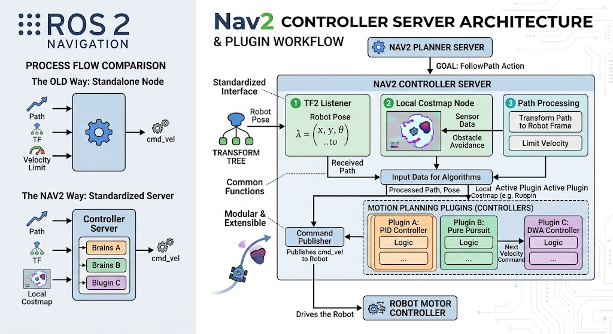

---
---

## Command of running nav2_controller-server
```bash
 ros2 launch robot_bringup simulated_robot.launch.py world_name:=small_house

```

```bash
ros2 run nav2_controller controller_server --ros-args --params-file /home/sara-saad/Graduation_project/ros2_ws/src/robot_navigation/config/controller_server.yaml 

ros2 lifecycle set /controller_server 1

ros2 lifecycle set /controller_server 3
```

```bash
 ros2 action list

 ros2 action list -t

 ros2 interface show nav2_msgs/action/FollowPath
```
---

## Local Cost Map In Rviz by using nav2-controller_server

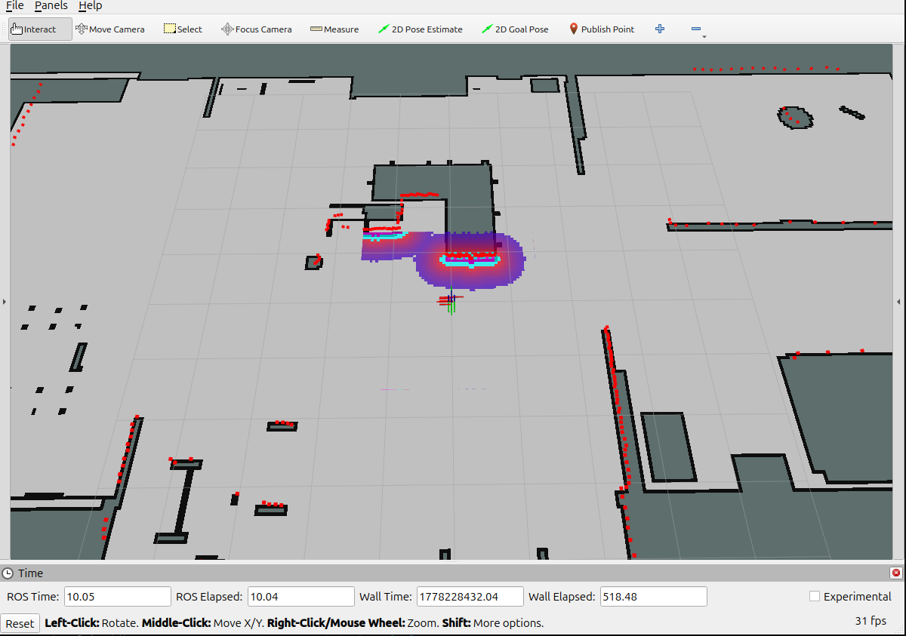

---
---

## Labs Command

```bash
colcon build
. install setup.bash
```
```bash
ros2 launch robot_bringup simulated_robot.launch.py world_name:=small_house

```

```bash
 ros2 run nav2_smoother smoother_server --ros-args --params-file /home/sara-saad/Graduation_project/ros2_ws/src/robot_navigation/config/smoother_server.yaml 
ros2 lifecycle set /smoother_server 1
ros2 lifecycle set /smoother_server 3
```

```bash
ros2 run nav2_planner planner_server --ros-args --params-file /home/sara-saad/Graduation_project/ros2_ws/src/robot_navigation/config/planner_server.yaml 
ros2 lifecycle set /planner_server 1
ros2 lifecycle set /planner_server 3

```

```bash
 ros2 run nav2_controller controller_server --ros-args --params-file /home/sara-saad/Graduation_project/ros2_ws/src/robot_navigation/config/controller_server.yaml 
ros2 lifecycle set /controller_server 1
ros2 lifecycle set /controller_server 3

```

```bash
ros2 action send_goal /compute_path_to_pose nav2_msgs/action/ComputePathToPose "goal:
  header:
    stamp:
      sec: 0
      nanosec: 0
    frame_id: 'map'
  pose:
    position:
      x: 0.8
      y: 0.6
      z: 0.0
    orientation:
      x: 0.0
      y: 0.0
      z: 0.0
      w: 1.0
start:
  header:
    stamp:
      sec: 0
      nanosec: 0
    frame_id: ''
  pose:
    position:
      x: 0.0
      y: 0.0
      z: 0.0
    orientation:
      x: 0.0
      y: 0.0
      z: 0.0
      w: 1.0
planner_id: 'GridBased'
use_start: false" 

```

```bash
ros2 action send_goal /follow_path nav2_msgs/action/FollowPath "path:
  header:
    stamp:
      sec: 0
      nanosec: 0
    frame_id: 'map'
controller_id: "PurePursuit"
```

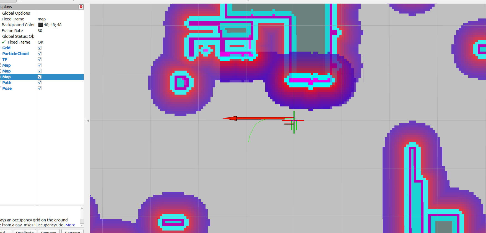
---
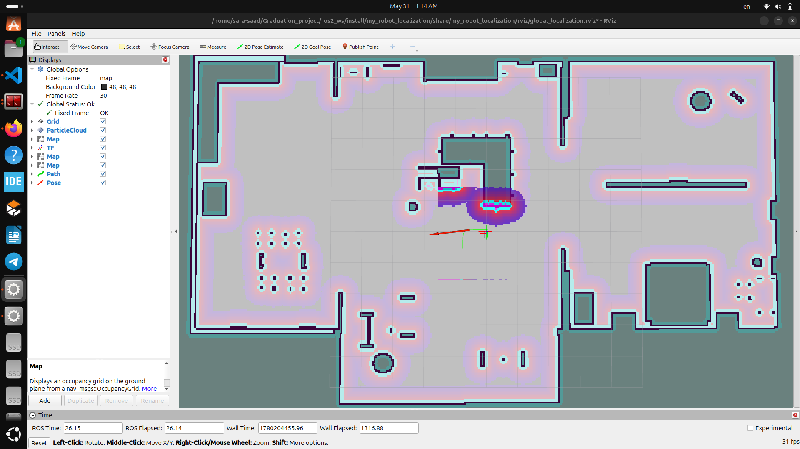

---
---

# LifeCycle Manager

**The Lifecycle Manager acts as a supervisor or "orchestrator." You feed it a list of nodes, and it manages the entire lifecycle process automatically.**

## The Automated Sequence
**The manager follows a strict, two-phase process to ensure your system starts up safely:**

   **1. Configuration Phase: The manager iterates through your provided list in order. It sends a configure request to each node until all nodes are moved into the Inactive state.**

   **2. Activation Phase: Once all nodes are successfully configured, it moves to the second pass, sending an activate request to each node in order until all are in the Active state.**
---

## Key Responsibilities
**Order Enforcement:** By respecting the order of the list provided, it ensures that your core dependencies (e.g., a driver before a sensor, or a sensor before a planner) are satisfied.

**System Integrity (Monitoring):** The manager doesn't just "fire and forget." It continuously monitors the states of the nodes it manages. If a node unexpectedly drops to an Inactive or Unconfigured state, the manager will attempt to bring it back to Active.

**The "All-or-Nothing" Safety Mechanism:** This is the critical trade-off mentioned in your text. The Lifecycle Manager is designed for system reliability. If it fails to activate a node, it assumes the system is in an inconsistent or dangerous state. Consequently, it shuts down all other nodes in its care to prevent the robot from operating with incomplete or broken functionality.

---
---
## Summary
```table
-------------------------------------------------------------------------------------------------------------------
Feature	      Manual Management	                              Lifecycle Manager
-------------------------------------------------------------------------------------------------------------------
Scalability	   Poor (Linear increase in effort)	               High (Handles lists automatically)
-------------------------------------------------------------------------------------------------------------------
Dependency     Handling	Manual/Human-error prone	            Ordered/Programmatic
-------------------------------------------------------------------------------------------------------------------
Recovery	      None	                                          Automatic re-activation attempts
-------------------------------------------------------------------------------------------------------------------
Safety	      Risky (nodes may be partially active)	         Fail-fast (shuts down if recovery fails)
-------------------------------------------------------------------------------------------------------------------
```
---

## Bash Command for Life Cycle Manager 

```bash
ros2 launch robot_bringup simulated_robot.launch.py world_name:=small_house
ros2 launch robot_navigation navigation.launch.py 
ros2 action list
ros2 lifecycle get /smoother_server 
ros2 lifecycle get /planner_server 
ros2 lifecycle get /controller_server

```
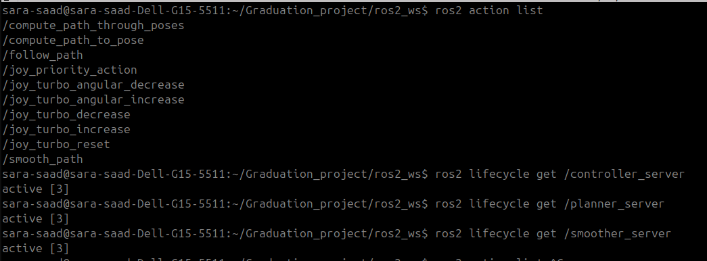

---
---