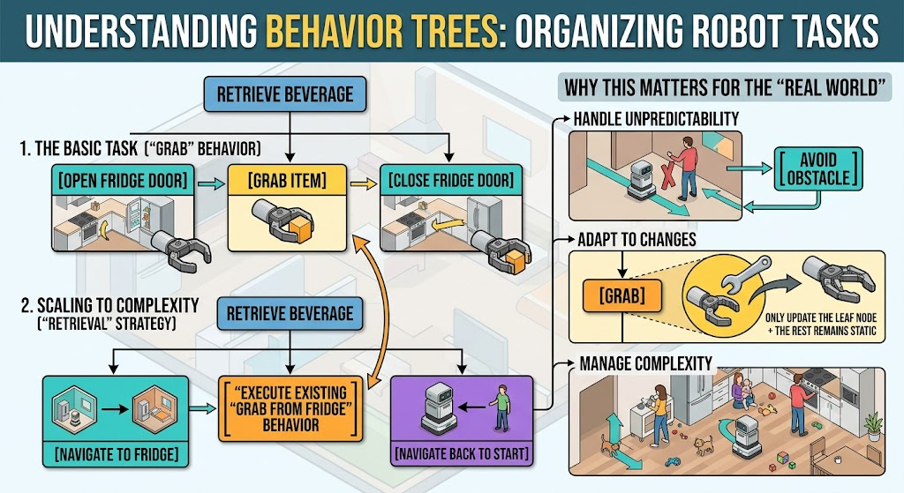
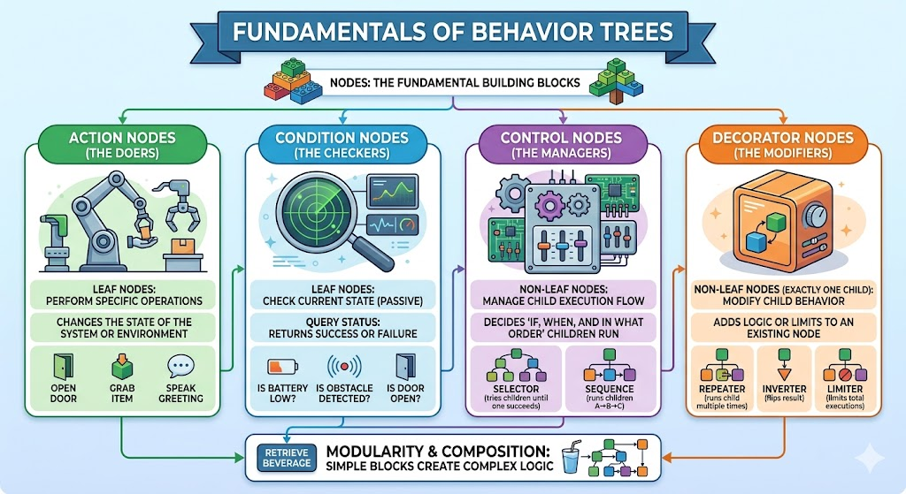
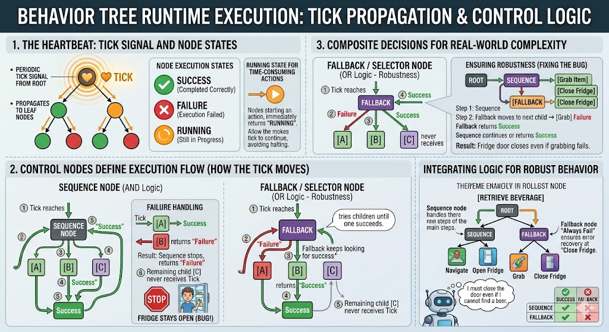
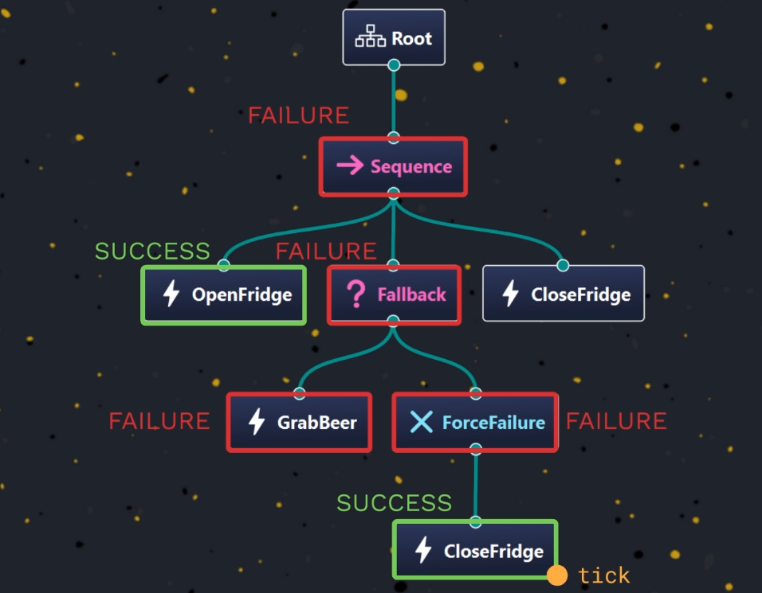
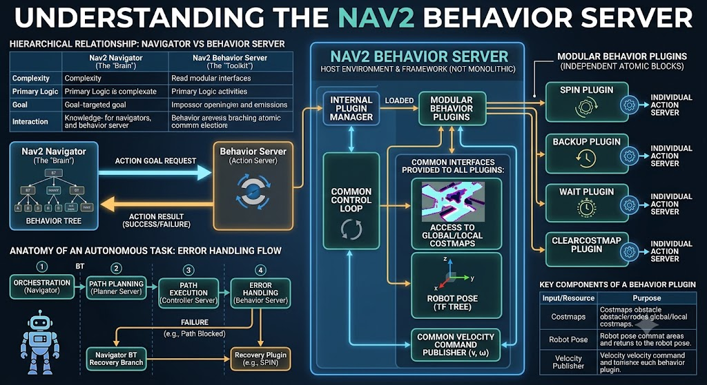

# Behavior Trees

**A Behavior Tree is a mathematical model for organizing tasks. It allows developers to break down complex, high-level goals into a hierarchy of simple, manageable actions.**


## Key characteristics that make them essential for robotics:
**Modularity:** Complex behaviors are built by combining smaller, pre-existing building blocks.

**Reusability:** Once you create a "grab" behavior, you can plug it into any robot system without rewriting code.

**Flexibility:** They allow robots to pivot quickly when the environment changes or when they encounter an obstacle.

## How Behavior Trees Work: A Practical Example
**Imagine you want a robot to retrieve a beverage for you. Instead of writing one massive, rigid script, you build a tree of modular behaviors.**

## 1. The Basic Task (The "Grab" Behavior)

**If the robot is already standing in front of the fridge, its logic is a simple, sequential chain:**

   1. Open the refrigerator door.
 
   2. Grab the item.
 
   3. Close the refrigerator door.

  ## 2. Scaling to Complexity (The "Retrieval" Strategy)

**When the robot is in a different room, you don't need to reinvent the "grab" logic. You simply create a new parent behavior that wraps the previous one:**

   * Step 1: Navigate to the refrigerator (a new, separate behavior).
   * Step 2: Execute the existing "Grab from Fridge" behavior.   
   * Step 3: Navigate back to the starting point to deliver the item.

## Why this matters for the "Real World"
**The strength of the behavior tree lies in its ability to compose. By treating robot logic like building blocks rather than a long list of instructions, developers can:**

**Handle Unpredictability:** If a human blocks the path, the tree can trigger an "Avoid Obstacle" sub-behavior and return to the main task once the path is clear.

**Adapt to Changes:** If you upgrade the robot’s gripper, you only need to update the "Grab" leaf node. The rest of the "Retrieve Beverage" tree remains unchanged.

   - **Manage Complexity:** It allows robots to navigate human environments—which are full of noise, movement, and social nuance—by keeping the underlying decision-making process organized, readable, and robust.Handle Unpredictability: If a human blocks the path, the tree can trigger an "Avoid Obstacle" sub-behavior and return to the main task once the path is clear.
   
   - **Adapt to Changes:** If you upgrade the robot’s gripper, you only need to update the "Grab" leaf node. The rest of the "Retrieve Beverage" tree remains unchanged.
   
   - **Manage Complexity:** It allows robots to navigate human environments—which are full of noise, movement, and social nuance—by keeping the underlying decision-making process organized, readable, and robust.



---
---

**To understand Behavior Trees, it is best to think of them as modular logic blueprints.** 
**Just as you described, the power lies in composition: by assembling simple, single-purpose "blocks" (nodes), you build a robust, intelligent system.**

# Behavior Trees's four fundamental node categories:

## 1. Action Nodes (The "Doers")

**These are the leaf nodes of the tree—they have no children and are where the actual work happens.**

   - Function: They interact with the physical world or perform calculations.

   - Examples: "Open Door," "Move Forward," "Calculate Path," or "Speak Greeting."
   
   - Nature: They change the state of the robot or its environment.

## 2. Condition Nodes (The "Checkers")

**Like Action nodes, these are leaves (no children). However, they are passive observers.**

   - Function: They query the system to return a status (Success or Failure) based on the current environment.   

   - Examples: "Is Battery Low?", "Is Door Open?", or "Is Obstacle Detected?"   

   - Nature: They do not change anything; they provide the data that allows the tree to make a decision.

## 3. Control Nodes (The "Managers")

**These nodes act as the "brains" of the tree. They have one or more children and determine the flow of execution.**

   - Function: They decide if, when, and in what order their children run.
   
   - Decision Logic: They might run children in a sequence (A → B → C) or use a "Selector" to try options until one succeeds (e.g., "Try path A; if it fails, try path B").
   
   - Role: They handle the flow logic, including error handling or retries.

## 4. Decorator Nodes (The "Modifiers")

**These nodes have exactly one child and act as a wrapper to change the child's behavior.**

   - Function: They add "conditions" or "metadata" to the execution of the child node.
   
   - Examples:
    
       - Inverter: Flips a "Success" result into a "Failure" (and vice versa).
    
       - Repeater: Forces the child to run multiple times (e.g., "Keep checking the door until it opens").
   
       - Limiter: Ensures a node only runs a specific number of times.

## Why this structure is so powerful
**The magic of this modularity is that it separates what to do (Action/Condition) from when to do it (Control/Decorator).**

   - Testing: Because every node is isolated, you can test a single "Grab" action or an "Avoid Obstacle" branch in complete isolation.
   
   - Readability: Because the tree structure visually represents the hierarchy, a developer can look at the tree and immediately understand the robot's current state and "thought process."
    
   - Reusability: You can build a library of these nodes. If you create a "Navigate" node, it can be dropped into any robot's tree, regardless of whether it's a warehouse drone or a beverage-fetching arm.

---


---
---

**The execution of a Behavior Tree is not a static process; it is a dynamic, event-driven cycle managed by a signal called the "Tick."**

**Understanding the **"Tick"** is essential because it is the heartbeat of your robot. Here is how that process works.**

---

## 1. The Pulse of the Tree: The Tick

At regular intervals, the root node emits a Tick. This signal propagates downward through the tree branches until it hits the "leaves" (Action or Condition nodes).

**When a node receives a tick, it performs its task and must return one of three states:**

    - Success: The action completed as expected.

    - Failure: The action could not be completed.

    - Running: The action is still in progress (this allows the robot to remain responsive while waiting).

---

## 2. Control Nodes: The "Traffic Controllers"
**Control nodes decide how the Tick propagates to their children. Two of the most important are the Sequence and the Fallback (often called Selector).**

  ## A. The Sequence Node (The "And" Logic)

**The Sequence node executes its children one by one, from left to right.**

      - Logic: It continues to the next child only if the previous child returns Success.
  
      - Failure: If any child returns Failure, the sequence stops immediately. The remaining children are never ticked.
  
      - Use Case: Tasks that must happen in order (e.g., Navigate → Open Fridge → Grab Item).

  ## B. The Fallback/Selector Node (The "Or" Logic)

**The Fallback node is designed for robustness. It tries children one by one, looking for the first one that succeeds.**
    
    - Logic: It ticks the first child. If it fails, it moves to the second child, then the third, and so on.

    - Success: If any child succeeds, the Fallback stops and returns Success to its parent.

    - Use Case: Providing alternatives or error handling (e.g., "Try to Grab Beer; if that fails, at least Close the Fridge").

---

## 3. Handling Complexity: The "Looping" Nature

**It is important to remember that the tree is ticked repeatedly—it is not a one-and-done script.**

    - Partial Completion: If an action returns Running, the tree keeps that state. The next Tick will bypass already-completed nodes and go straight to the Running node to check if it has finished yet.

    - Robustness: By combining Sequence and Fallback nodes, you create "fail-safes." As you noted, if a "Grab" action fails, the logic can be structured to jump to a "Close Fridge" action rather than leaving the door open.

    - Decorators: As you mentioned with the "Always Fail" decorator, you can use these to force a specific state transition, ensuring that even if an error-handling task succeeds, the system recognizes the overall branch as a failure to trigger higher-level recovery behaviors.

---
## Summary Table: The Flow of Logic

```table
---------------------------------------------------------------
Node Type	Logic	Success Condition	    Failure Condition
---------------------------------------------------------------
Sequence    AND	    All children succeed	Any child fails
---------------------------------------------------------------
Fallback    OR	    First child succeeds	All children fail
---------------------------------------------------------------
```

---




---
---

# Ports and BlackBoard

**To understand how Behavior Trees (BTs) manage data, it is helpful to think of Ports as the "gateways" for information, and the Blackboard as the "shared notebook" where that information is stored.**

## 1. Ports: The Gateways

**Ports are specific interfaces defined on a node. They act as the entry and exit points for data.**

**Input Ports:** These act as "parameters." They allow a node to receive configuration values or external data required to perform its task.
    - Example: A "Retry" node has an input port for number_of_attempts (e.g., set to 3).

**Output Ports: These act as "result publishers." After a node completes its logic, it places the result into an output port so other parts of the tree can access it.**
    - Example: A "Math" node outputs the sum of two numbers through its output port.
    
---
## 2. The Blackboard: The Shared Notebook

**If nodes are like individuals in a workspace, the Blackboard is a whiteboard in the middle of the room. It is a memory space shared by every node in the entire tree.**

### How Data is Stored

**When a node wants to save a result to the Blackboard, it uses its output port to assign a value to a key (a unique name).**

    - The Key: The unique identifier (e.g., path).

    - The Type: What kind of data it is (e.g., a list of coordinates).

    - The Value: The actual data (e.g., the calculated path).

---

## 3. Connecting the Pieces: An Example
**Consider a robot navigating to a destination. The workflow uses ports and the blackboard to bridge two separate nodes:**
```table
--------------------------------------------------------------------------------------------
Node	        Action	                Data Flow
--------------------------------------------------------------------------------------------
Compute Path	Calculates the route	Writes path to the Blackboard via an Output Port.
--------------------------------------------------------------------------------------------
Follow Path	    Moves the robot	        Reads path from the Blackboard via an Input Port.
--------------------------------------------------------------------------------------------
```

**By using the same key (path) in both nodes, the system creates an implicit connection between them, even though they are separate pieces of logic.**

---

## Important Rules to Remember

    - Propagation: Because the Blackboard is shared, if one node updates the value of a key, that change is immediately available to every other node in the tree that reads that same key.

    - Lifecycle: The Blackboard is strictly tied to the life of the tree execution. It is initialized when the tree starts and is wiped clean when the execution ends. It cannot be used to save data between two different runs of the behavior tree.

---
---

## In the context of Nav2 (the navigation stack for ROS 2), Behavior Trees (BTs) serve as the "brain" of the autonomous robot. They provide a modular, scalable way to define complex decision-making logic, allowing the robot to handle not just basic movement, but also error recovery and dynamic environmental changes.

# How the BT Navigator acts as the central hub for this intelligence...

**The BT Navigator is a centralized plugin-based server. Its primary responsibility is to bridge the gap between the robot's sensor data and its high-level goals.**

   - **Data Aggregation:** It acts as a central clearinghouse. It constantly retrieves the robot's current pose (via TF) and odometry data, then packages this information so the active navigation plugins can use it to make real-time decisions.
   
   - **Plugin Management:** It hosts "Navigators"—specific plugins designed to achieve distinct tasks.
      -     Navigate to Pose: Moves the robot from point A to a single goal point.
      -     Navigate Through Poses: Moves the robot sequentially through a list of multiple points.

## Why Behavior Trees?
**Unlike a rigid state machine, which can become overly complex to manage as you add more conditions, Behavior Trees are hierarchical. This structure makes them ideal for robotics because:**

   - **1.Modularity:** You can create small, reusable "sub-trees" for specific actions (like "Check for Obstacle" or "Rotate in Place").
   
   - **2. Recovery Behaviors:** BTs excel at defining "what happens if this fails?" logic. If a path planner fails to find a route, the BT can trigger a recovery strategy—such as clearing the costmap or spinning the robot—before retrying the original goal.
   
   - **3. Dynamic Adaptation:** The system can switch between different navigation logic trees at runtime.

---

## Execution Flow: From Goal to Action
**When you send a navigation goal (a target pose or list of poses) to the BT Navigator, the following happens:**
   - **Goal Receipt:** The action server receives the destination coordinates.

   - **Logic Selection:** The server looks at the request to see if a specific behavior tree has been specified. If not, it defaults to a standard navigation BT.
   
   - **Tree Loading:** The selected BT is loaded into the controller.
   
   - **Continuous Execution:** As the robot moves, the BT iterates through its nodes. It evaluates conditions (e.g., "Is the path still clear?") and executes actions (e.g., "Call the controller to move forward").
   
   - **Exception Handling:** If a node returns a "Failure" status, the tree structure automatically dictates which recovery node to execute next, ensuring the robot doesn't simply get stuck when it hits an unforeseen obstacle.

---

## Summary Table: Key Components
```table
-------------------------------------------------------------------------------------------------------------------------
Component	            Function
-------------------------------------------------------------------------------------------------------------------------
BT Navigator	        The central server that manages plugins and provides system state.
-------------------------------------------------------------------------------------------------------------------------
Navigators	            Plugins (like MapsToPose) that define the high-level task.
-------------------------------------------------------------------------------------------------------------------------
Behavior Trees	        The logic structures that decide how to perform the task and how to recover from errors.
-------------------------------------------------------------------------------------------------------------------------
Action Servers	        The interface used by users/applications to send goals to the Navigators.
-------------------------------------------------------------------------------------------------------------------------

```

## What is the Nav2 Behavior Server?
**The Behavior Server acts as a centralized framework for recovery behaviors. It is not a monolithic program that performs the actions itself; rather, it is a host environment that manages, triggers, and provides resources to specific "plugins."**

   - **The Framework:** The server provides the necessary infrastructure, such as access to the global/local costmaps (to avoid collisions) and the robot's current pose (transform tree).
   
   - **The Plugins:** These are modular, atomic blocks of code that define a specific recovery action (e.g., spinning, backing up, or clearing the costmap).

---

## How the Architecture FunctionsModular Plugins: 
**Modular Plugins:** Each behavior (e.g., Spin, Wait, BackUp) is an independent plugin loaded by the server. Because they are independent, you can easily add, remove, or swap behaviors without changing the underlying server logic.Individual 

**Action Servers:** Each loaded plugin exposes its own Action Server. This allows other parts of your navigation system (like the Behavior Tree) to request a specific behavior individually.

**The Control Loop:** Since most recovery behaviors involve moving the robot (e.g., rotating in place or reversing), the server manages a control loop. It provides a common Velocity Command Publisher, ensuring that plugins can send velocity commands ($v, \omega$) at a consistent frequency to keep the robot moving safely and smoothly.

---

## Key Components of a Behavior Plugin

**When you develop a new recovery behavior, you are essentially creating a state machine or a control algorithm that utilizes three main inputs:**

```table
--------------------------------------------------------------------------------------------------------
Input/Resource	            Purpose
--------------------------------------------------------------------------------------------------------
Costmaps	                  Prevents the robot from moving into an obstacle while trying to recover.
--------------------------------------------------------------------------------------------------------
Robot Pose	               Provides the localization data needed to calculate movement.
--------------------------------------------------------------------------------------------------------
Velocity Publisher	      The output interface used to command the robot's motors.
--------------------------------------------------------------------------------------------------------
```

### To master the ROS 2 Navigation stack (Nav2), it is crucial to distinguish between the Navigator (the "Brain") and the Behavior Server (the "Toolkit"). Your analysis correctly identifies that these components form a hierarchical, modular architecture.

## 1. The Core Distinction: Navigator vs. Behavior Server

```table
------------------------------------------------------------------------------------------------------------------
Feature	      Nav2 Navigator (The "Brain")	                        Nav2 Behavior Server (The "Toolkit")
------------------------------------------------------------------------------------------------------------------
Complexity	   High (Manages overall mission state)	               Low (Atomic, task-specific actions)
------------------------------------------------------------------------------------------------------------------
Primary Logic	Behavior Trees	                                       Plugin-based action servers
------------------------------------------------------------------------------------------------------------------
Goal	         Achieve complex goals (e.g., "Navigate to Pose")	   Perform simple maneuvers (e.g., "Spin," "Wait")
------------------------------------------------------------------------------------------------------------------
Interaction	   Acts as an Action Client	                           Acts as an Action Server
------------------------------------------------------------------------------------------------------------------
```

   - **The Navigator** owns the Behavior Tree. It is the orchestrator. When you set a target in RViz, the Navigator decides whether to plan a path, follow it, or—if the robot gets stuck—trigger a recovery behavior.
   - 
   - **The Behavior Server** is the library of atomic "skills." It doesn't know why it is spinning or backing up; it simply executes the command requested by the Navigator.

---

## 2. The Anatomy of an Autonomous Task

   - 1. **Orchestration (Navigator):** Receives the MapsToPose request and initiates the Behavior Tree.

   - 2. **Path Planning (Planner Server):** The tree calls the Planner Server to compute a global path. If required, the Path Smoother server refines this path for smoother motion.

   - 3. **Path Execution (Controller Server):** The Navigator sends the path to the Controller Server. The Controller uses its motion algorithms (plugins) to translate that path into actual velocity commands ($\omega, v$) sent to the robot's base.

   - 4. **Error Handling (Behavior Server):** If the Controller returns a failure (e.g., the path is blocked by a dynamic obstacle), the Behavior Tree switches to the "Recovery" branch. It then calls the Behavior Server to execute a recovery plugin (e.g., Spin or ClearCostmap).

---

## Summary of Data Flow

**The interaction follows a pattern of Requests and Responses:**

   - **The Behavior Tree acts as the glue.**

   - **It sends Action Goals to various servers.**

   - **It receives Action Results (success, failure, or feedback).**

   - **It uses Costmaps (provided by the Server) to make informed decisions at every step of the process.**

---



---
---