# Avoiding Obticals 

**After the last section finished we have some problem that we didn't solve**

## 1. The Problem: The "Point" Robot Fallacy
**In your previous algorithms, the robot was treated as a dimensionless point. This is dangerous because:**
   - **Narrow Passages**: A point can fit through a 1cm gap, but your robot might be 50cm wide.
 
   - **Collision Course**: Without accounting for the Footprint (the robot's actual shape), the planner will think it’s safe to skim the edge of a wall, leading to a physical crash.
---
## 1. The Solution: Obstacle Inflation
   - **How it works**: We take every obstacle on the map and "stretch" its boundaries outward by the radius of the robot.

   - **The Result**: We can go back to treating the robot as a point. If the point stays out of the "inflated" zones, the physical robot is guaranteed to be safe.

---
---
## 2. The Second Problem: Static vs. Dynamic World
**A static map is just a snapshot of the past. It doesn't know about:**
- 
    - **New Obstacles**: A box someone left in the hallway.

    - **Dynamic Obstacles**: People walking, other robots, or opening doors.

- If your planner only looks at the static map, it will blindly drive into a person because "the map says the floor is empty."
---
## 2. The Solution: Enter the Costmap

**A Costmap is a 2D grid where every cell is assigned a "cost" value (usually from 0 to 255). It acts as a multi-layered brain for the robot’s navigation.**

**How a Costmap Layers Information:**

   ```table
   -----------------------------------------------------------------------------------------------------------
   Layer               Function
   -----------------------------------------------------------------------------------------------------------
   1. Static Layer        The permanent map (walls, pillars).
   -----------------------------------------------------------------------------------------------------------
   2. Obstacle Layer      Real-time data from sensors (LiDAR/Cameras) that detects new or moving objects.
   -----------------------------------------------------------------------------------------------------------
   3. Inflation Layer     Adds a ""buffer zone"" around obstacles to keep the robot at a safe distance.
   -----------------------------------------------------------------------------------------------------------
   ```
---

## How it Changes the Planner
**Instead of just finding a path that is "not black" (binary: hit or miss)**
**The planner now looks for the path with the lowest cumulative cost.**
   - Lethal Cost: The robot is definitely hitting something.
   
   - Inscribed Cost: The robot's center is safe, but its outer edge will hit.
   
   - Free Space: The robot can move freely.

**This makes your robot not just "autonomous," but context-aware.**
---
---
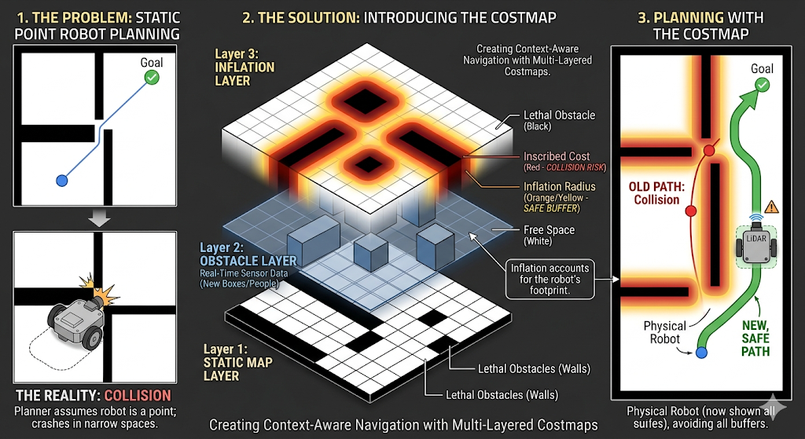

---
---

## Why is the Cost map is  Better Than a Simple Map? (Beyond Occupancy Grids)
**Until now, we often used Occupancy Grids. These grids are very binary (0 to 100):**

    100: Definitely an obstacle (wall). Can't pass.

    0: Definitely free space (floor). Can pass.

**This is too simple. A real-world environment isn't just "wall" or "not wall."**

**A Costmap expands this range dramatically (from 0 to 255). This extra range allows the robot to understand nuance.**
**It's not just "occupied" or "free"; now the robot can understand concepts like "dangerous," "restricted," or "preferred."**

```table
----------------------------------------------------------------------------------------------------------------------------------------
Cost Value          Meaning to the Robot,Analogy
----------------------------------------------------------------------------------------------------------------------------------------
255 (Max Cost)      Lethal Obstacle. A physical wall or object detected by sensors.,Solid Rock
----------------------------------------------------------------------------------------------------------------------------------------
~200-254            Inscribed Obstacle. Too close to a lethal obstacle for comfort. The robot's outer edge might hit.,Slippery Slope
----------------------------------------------------------------------------------------------------------------------------------------
~128                "High Cost (Avoid). A ""keep-out"" zone (like a restricted room) or a messy area (like a cluttered hallway) 
----------------------------------------------------------------------------------------------------------------------------------------
0                   "Free Space. Clean, safe, and preferred for navigation.",Clear Pavement
----------------------------------------------------------------------------------------------------------------------------------------
```
---

## How a Costmap is Built: The Power of "Layers"
**The magic of the costmap is that it merges different types of information into one single "unified" view.**
**It does this using Layers, just like layers in Photoshop.**

## Layer 1: The Static Map (What We Know)

   - **This is the pre-loaded blueprint of the building (the occupancy grid). It marks the static, permanent features like walls and pillars as lethal (Max Cost)**


## Layer 2: The Obstacle Layer (What We See Right Now)
**This layer uses live data from sensors (like LiDAR or cameras). It adds temporary obstacles to the grid in real-time.**

   - If a box is left in the hallway (which wasn't on the static map), the Obstacle Layer marks that area with high cost.

   - If a person walks past, this layer dynamically updates the grid to block their position.


## Layer 3: The Inflation Layer (What is Safe)

**This layer takes all the obstacles (both static and dynamic) and inflates them by a safety margin. This buffer zone represents the size of the robot (its footprint).**

   - It ensures the robot doesn't just skim a wall; it aims for the center of a doorway.

---

## In Summary: The Navigation Process
**All of these layers are merged into one final unified 2D Costmap.**
- 
    - The Planner (the brain) analyzes this costmap topography.

    - The Path is calculated not by finding the shortest distance, but by finding the trajectory that results in the lowest cumulative cost (avoiding lethal obstacles, staying away from inflated buffers, and ignoring keep-out zones)

  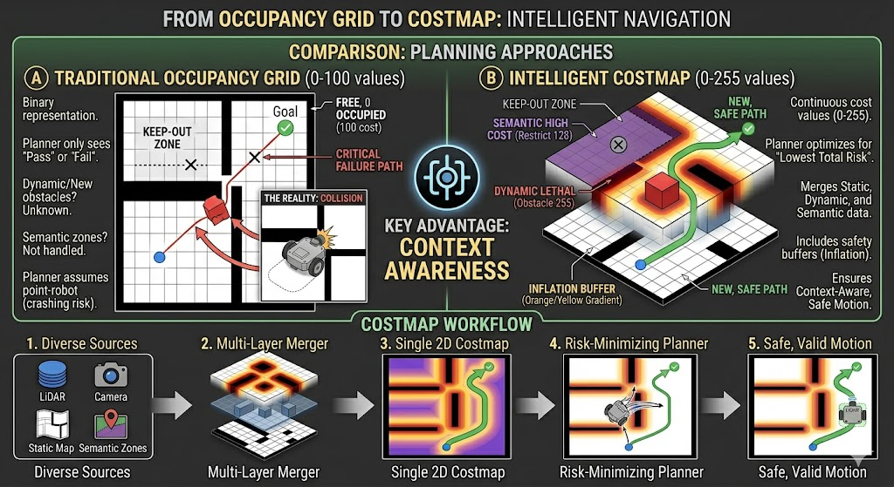

---
---

## The Robot's "Color Cheat Sheet" (Understanding Cost)

**The final costmap communicates the "risk" of any location using a color scale (or "cost" value) that path planners and motion planners use to make safe decisions.**

   **- WHITE: Free Space (Cost 0). Safe to move freely.**

   **- GRAY: Unknown Space. No sensor data exists yet (behind closed doors).**

   **- LIGHT BLUE: Lethal Obstacles. (Static Walls + New Objects + Safety Margin Inflation). If the robot’s center point hits light blue, it means the robot’s physical body will collide. Collision is certain.**

   **- PINK: Semantic Keep-Out Zones. Not physical obstacles, but forbidden regions the robot must avoid by rule.**

   **- PINK-TO-PURPLE Gradient: Recommended "Stay-Away" Zone. (FREE space very close to obstacles). The robot can technically traverse this area, but it's risky. The path planner should prefer wide routes through white cells, using the gradient zones only if no alternative path exists (e.g., in very narrow hallways).**

   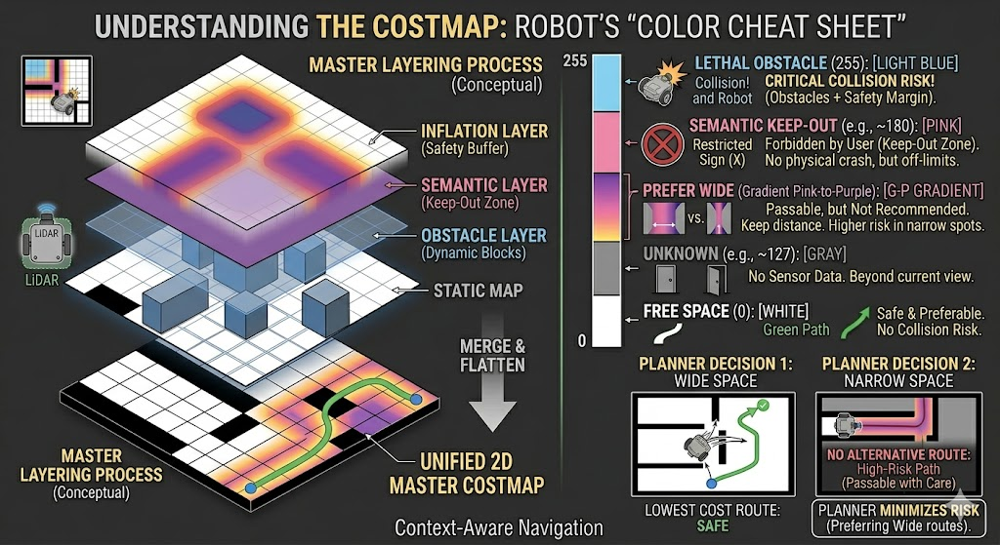

---
---

## The Two Essential Costmaps (Global vs. Local)

```table
----------------------------------------------------------------------------------------------------------------------------------------------------------
Feature           GLOBAL Costmap                                              LOCAL Costmap
----------------------------------------------------------------------------------------------------------------------------------------------------------
Primary Use       Path Planning (Long-distance)                               "Motion Planning (Short-distance, Reactive)"
----------------------------------------------------------------------------------------------------------------------------------------------------------
Role              Figuring out how to get from A to B across the whole map.   Figuring out how to execute the immediate next meter safely.
----------------------------------------------------------------------------------------------------------------------------------------------------------
View/Scope        Complete representation of the entire environment.          "Local view of the robot's immediate surroundings (e.g., 2–3 meter window)."
----------------------------------------------------------------------------------------------------------------------------------------------------------
Size              Size increases with the scale of the environment.           Fixed window size around the robot.
----------------------------------------------------------------------------------------------------------------------------------------------------------
Update Frequency  "Updated infrequently. Computationally expensive."          "Updated frequently (e.g., 10+ times/sec). Computationally cheap."
----------------------------------------------------------------------------------------------------------------------------------------------------------
Key Advantage     Handles long-distance logic.                                "Ideal for avoiding fast-moving/dynamic obstacles (people, other robots)."
----------------------------------------------------------------------------------------------------------------------------------------------------------
```

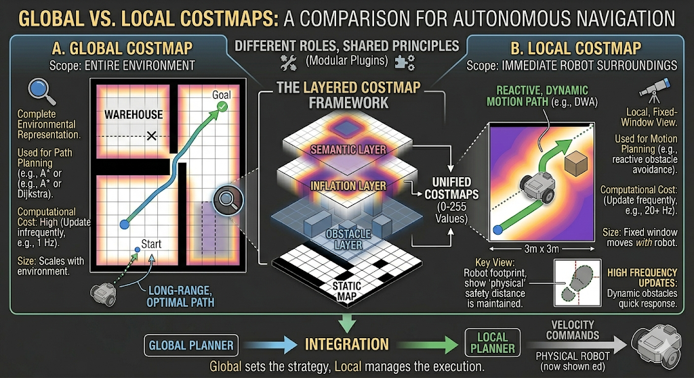

---
---

# First Layer of CostMap: Static Layer
**Think of the Static Layer as the foundation of the robot’s situational awareness.**

## 1. Why Convert a Map to a Costmap?
**A standard map, made by SLAM (Simultaneous Localization and Mapping) using LiDAR and sensors, is typically an Occupancy Grid. This is very basic (Binary):**

   - 0: Floor (Passable)

   - 100: Wall (Blocked)

   - -1: Unknown

**Navigation algorithms, like path planners, need more nuance. They need a gradient of risk.**

The Static Layer converts this binary grid into a Costmap Grid with a range of 0 to 255:

   - 0 (White): Free Space.

   - 255 (Light Blue): Lethal Obstacle.

---

## 2. The Dynamic Workflow (Mapping Mode)
**How does this static layer stay up-to-date while the robot is actively building the map?**

   - SLAM runs in real-time, building the occupancy grid as the robot moves.

   - SLAM publishes the updated map to a communication channel (a ROS topic) called map.

   - The Static Layer is a subscriber to the map topic.

   - Whenever SLAM updates the blueprint, the Static Layer instantly re-converts the new data, ensuring the foundation costmap is always accurate to that moment.

**This allows a robot to use autonomous navigation functionalities even while it is exploring an unknown area.**

---

## 3. Preserving the Map: Map Saver & Map Server

**Once a building is fully mapped, you don't need to run SLAM (which is computationally "expensive") every time the robot wakes up. You save the blueprint.**

```table
----------------------------------------------------------------------------------------------------------------------------------------------------------
Component     Function                   Process
----------------------------------------------------------------------------------------------------------------------------------------------------------
Map Saver     Saves the map data.        Listen to the map topic → Save the occupancy grid message as a file on the robot's computer.
----------------------------------------------------------------------------------------------------------------------------------------------------------
Map Server    Reloads the saved map.     Load the map file from the computer → Convert it back to an occupancy grid message → Publish it on the map topic.
----------------------------------------------------------------------------------------------------------------------------------------------------------
```
---

## 4. The Separation of Concerns (Mapping vs. Localization)
**This architecture creates a vital separation. The Static Layer does not care how the occupancy grid arrives on the map topic.**

**It functions exactly the same way in two different scenarios:**

   **Mapping Mode**: The occupancy grid on map is coming from a live SLAM algorithm that is actively exploring.

   **Localization Mode**: The occupancy grid on map is being provided by the Map Server (a static file).
   - In this mode, localization algorithms (like particle filters) are running to place the robot correctly on this pre-saved map.

### By separating the "map source" from the "map conversion", the robot can use all of its autonomous navigation capabilities (path planning, motion planning, safety inflation) seamlessly.

---

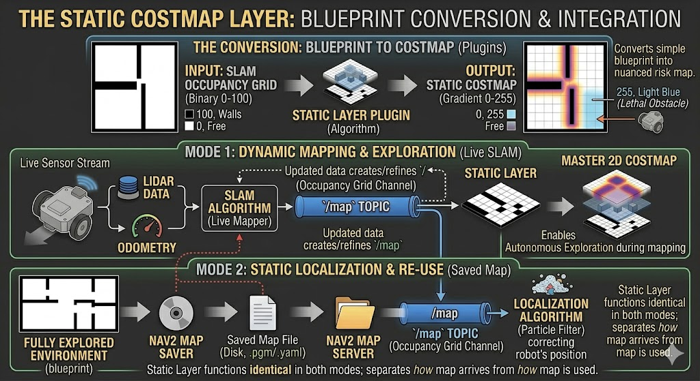
---
---

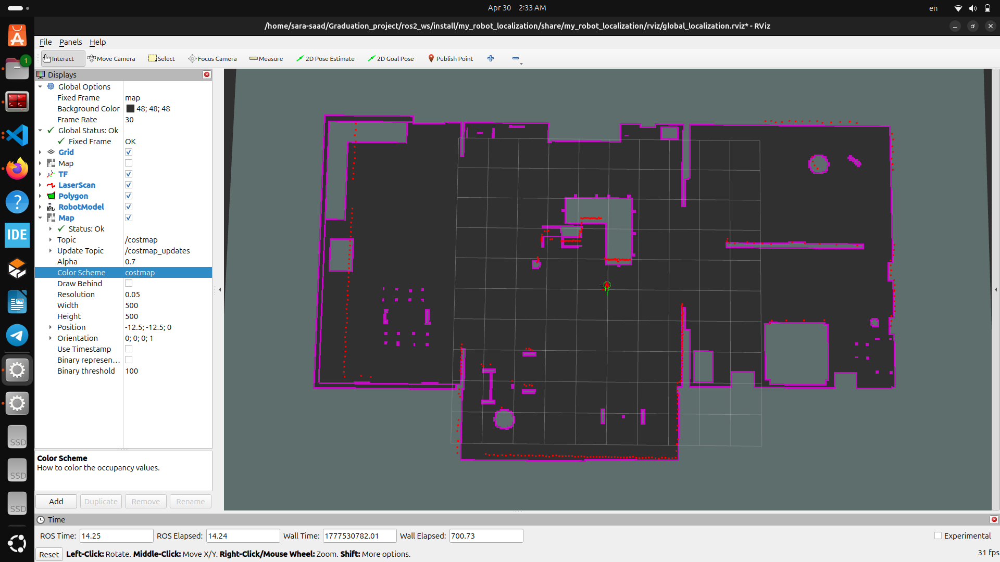

---
---

# 2. Second Layer: Obstical Layer
**Think of the Obstacle Layer as the robot's short-term memory for dangerous objects.**

**While the Static Layer handles the permanent, blueprint view of the building (the walls, the hallways), the Obstacle Layer handles everything that can change—like a rolling office chair, a new box in the hallway, or a person walking past.**

**Its sole purpose is to convert real-time sensor data into a map that path-planning algorithms can use.**

---

## Step 1: Diverse Sensors, Diverse Data
**To function, the Obstacle Layer must be extremely versatile. It reads incoming data from different sensors (the "eyes" of the robot):**

   **1. 2D LiDARs**: Imagine a laser pointer that spins rapidly in a horizontal circle. It sends out a beam, and if it hits something, it measures how long the reflection takes to bounce back.
   -  This calculates the distance and creates a flat, 2D "scan" of obstacles on a single plane.

   **2. 3D Sensors (RGB-D Cameras, 3D LiDARs)**: These work on the same principle as 2D LiDAR, but they scan many different horizontal planes simultaneously. 
   - They look at the world "in 3D," capturing not just a circle, but an entire "point cloud" that represents the volume of objects.

**These sensors publish their readings many times per second (tens or hundreds) on specific communication channels (topics) called laser_scan or point_cloud.**

---

## Step 2: The Core Challenge (Marking Freespace)
**The Obstacle Layer listens to these topics and must interpret the readings.**

**Here is the puzzle:**

   - **If the beam hits an obstacle**, the sensor says, "Obstacle detected 2 meters away." It is easy for the robot to calculate the coordinates of that cell on the grid and mark it as Occupied (a "Lethal Obstacle").

   - However, this beam provides another crucial piece of information. The sensor also knows, "The beam traversed through all the empty space between me and that obstacle without hitting anything."

**If the robot only marked obstacles, its entire map would be filled with dangerous dots, but it wouldn't know where it could drive safely. The planner would be confused**.

**The robot must use the sensor data to infer Free Space.**

---

## Step 3: Ray Tracing (How We Mark Freespace)

**This problem—calculating which grid cells were traversed by a laser beam—is called Ray Tracing.**

**It is a fundamental concept used in robotics, computer graphics (video games), and computer vision.**

**To solve this efficiently, we use a classic computer science algorithm called the Bresenham Algorithm.**

**How the Bresenham Algorithm works for Ray Tracing:**

   - Given the emission point (the sensor) and the detection point (the obstacle), define a straight line.

   - The algorithm mathematically calculates exactly which cells in the 2D grid are traversed by that line.

   - All of these traversed cells are now marked as Free Space (Cost 0). 

   - They are guaranteed to be empty because the laser beam traveled through them without obstruction.

---

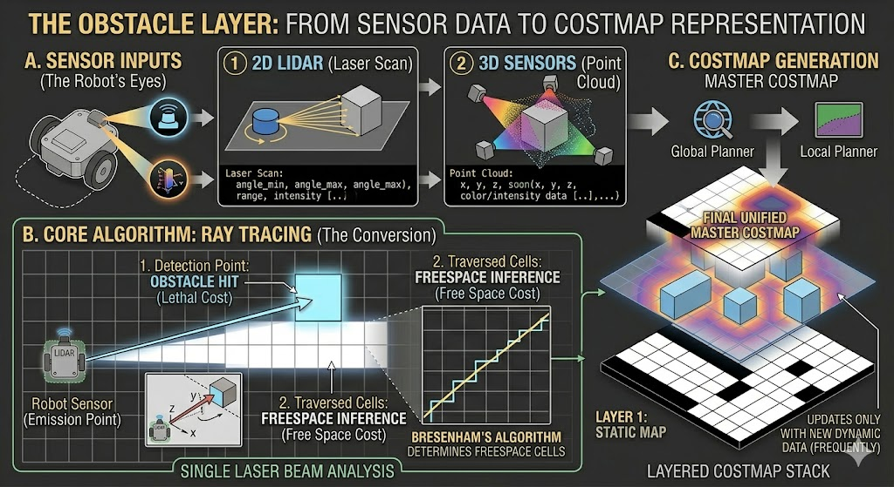

---
---

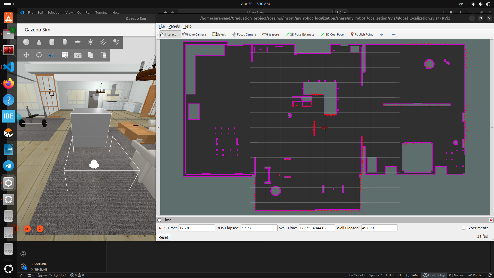

---
---

# 2.Third Layer: Inflation Layer

**In an autonomous robot's layered costmap, the Inflation Layer has one crucial job: It doesn't add new objects; it creates a "safety buffer" around the objects that are already there.**

**Think of it as adding a "personal space" requirement to every wall, chair, or person the robot detects.**

---

## Why is Inflation Critical?

**The robot’s primary job is to get from A to B. It uses a Path Planner (like A* or Dijkstra) to find the shortest route. However, planners are often mathematical algorithms that treat the robot as a single, dimensionless "point."This shows a robot center point following a path, but the actual robot footprint hits the wall because the point is too close.**

   - **The Problem**: In the physical world, the robot has a body (a footprint). If its center point is skimming a wall, its body will physical crash.
   
   - **The Solution (Inflation)**: We expand every obstacle outward, making them look bigger in the costmap. 
     - Now, when the path planner calculates the path for the "point robot," it maintains a safe distance from the inflated object, which guarantees the physical robot body will not hit the actual obstacle.

---

## How the Inflation Algorithm Works (The Nuance of Cost)

**The Inflation Layer does more than make walls look bigger. It creates nuanced "not recommended" zones.*

**Instead of just turning floor (Free Space, cost 0) into obstacle (Lethal Cost, cost 255), the inflation layer applies an exponential decay function to create a graded topography of risk.**

**We can visualize this clearly as a 3D bar chart (Cost on the vertical Y-axis, distance from the obstacle on the X-axis).**

---
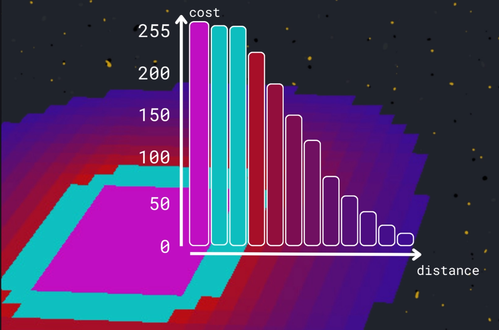
---

**Imagine a 3D bar chart showing distance from the wall:**
   - **Zone 1**: Lethal Buffer (Radius $\leq$ Robot Footprint):Visualization: Talle st columns.
   - **Cost**: 255 (Lethal).Meaning: These cells are physically off-limits. 
      - Navigating here means collision. Both the path planner and motion planner treat this as a solid wall.
      
   - **Zone 2**: Discouraged Area (Radius > Robot Footprint, and $\leq$ Inflation Radius):Visualization: Columns with a rapidly decreasing height (exponential decay).
   - **Cost**: 1 to 254 (Gradient of Pink to Purple).Meaning: These cells are physically traversable. 
      - The robot can go here. However, navigation here is discouraged. 
      - The path planner understands "high cost" and will prefer routes through lower-cost cells.

---
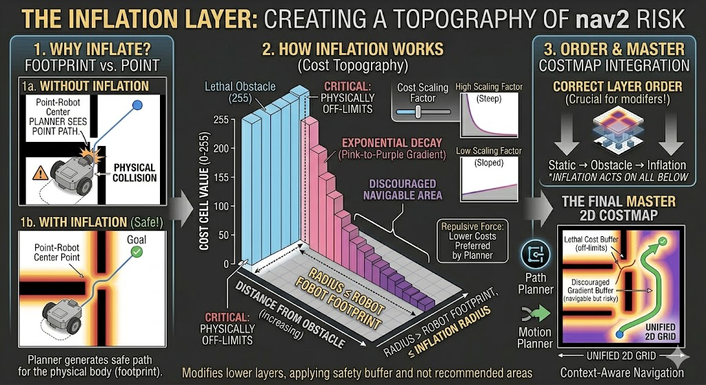

---
---

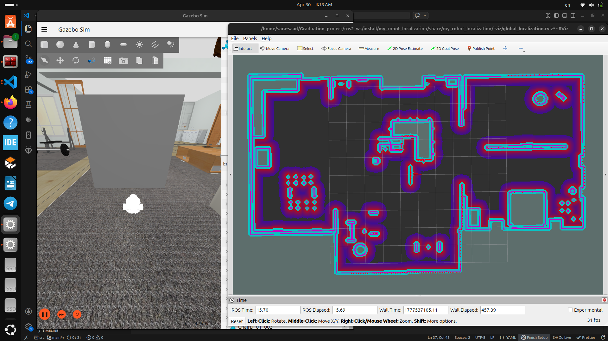

---
---

# Comparing between the Old , New Path planning
**1. Old Way to get the Path Planning: Think of this like navigating a maze using a pencil blueprint. You know where the physical walls are (the static obstacles, marked in black on the grid).**

**New Way to get the path Planning: A Costmap is not just a binary (hit/miss) grid. It uses a range of "cost" values to describe the topography of danger or difficulty in the environment.**
  
   - **The key component making this happen is the Inflation Layer. This layer takes every detected object and "inflates" it—stretching its danger zone outward by a configurable safety radius. This generates a gradual topography of risk (represented by colors or cost values).**

---

## Here is a side-by-side comparison of how the two planners think about movement:

```table
----------------------------------------------------------------------------------------------------------------------------------------------------------
Feature           OLD Path Planner (Binary Grid)                        UPGRADED Path Planner (Costmap)
----------------------------------------------------------------------------------------------------------------------------------------------------------
View of the World Static blueprint: walls (black) and floor (white)."   Layered context: static walls, live obstacles (LiDAR/Camera data), and safety    
                                                                        buffers (cost topography)."
--------------------------------------------------------------------------------------------------------------------------------------------------------- Definition"       Shortest geometric distance.                          ,Lowest cumulative cost. Traverses a path with the lowest sum of all edge costs 
                  Traverses the fewest grid nodes                       (equivalent to a graph with varied edge costs).
                  (equivalent to a graph where all edgeshave unitary cost).
----------------------------------------------------------------------------------------------------------------------------------------------------------
Preference        Skims absolute edges and corners                      Stays in the center of open spaces. Maintains a safe buffer distance from objects.
                  (often leading to collision).
----------------------------------------------------------------------------------------------------------------------------------------------------------
Handling Size     "Dimensionless ""point robot"" (collision risk)."     Accounts for the physical footprint via obstacle inflation (safe navigation).
----------------------------------------------------------------------------------------------------------------------------------------------------------
Result            Shortest path but dangerous.                          "Slightly longer path in meters, but the trade-off is guaranteed safety."
----------------------------------------------------------------------------------------------------------------------------------------------------------
```
---
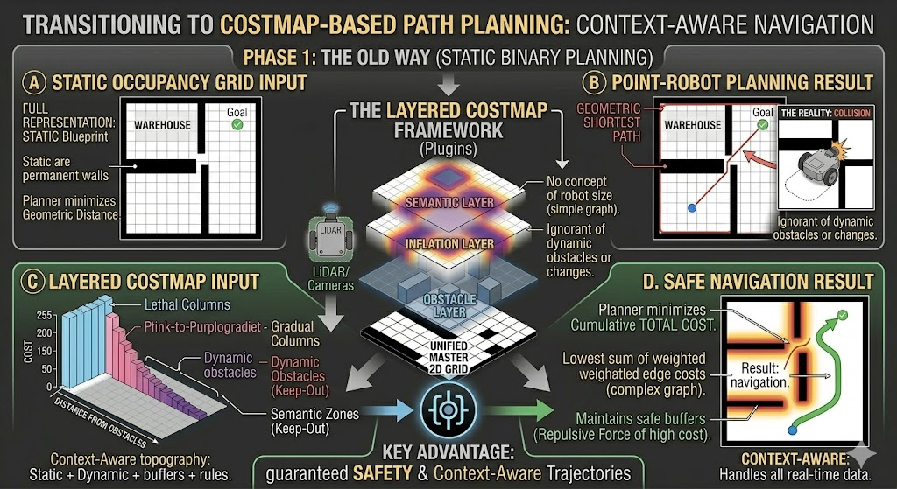

---
---

## Dijkstra Planner
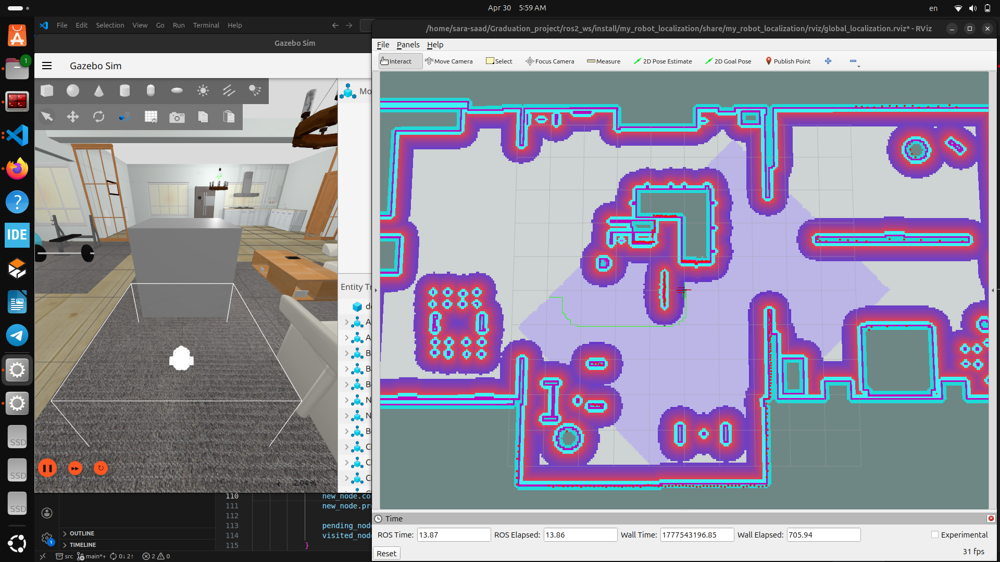

---

## AStar Planner

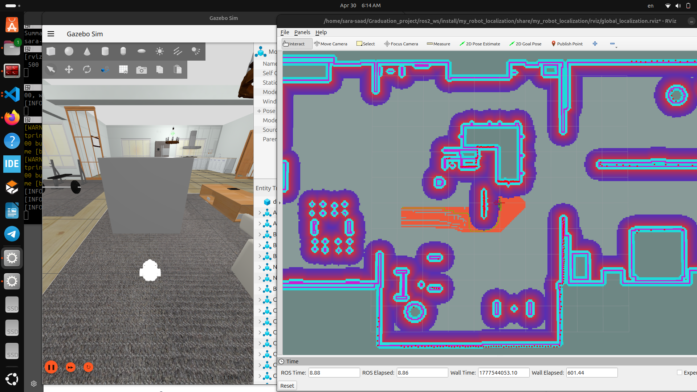

---

